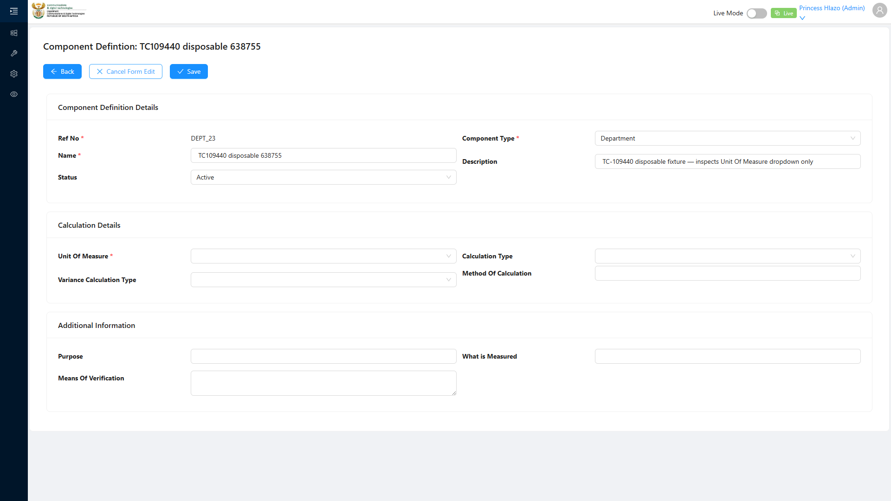
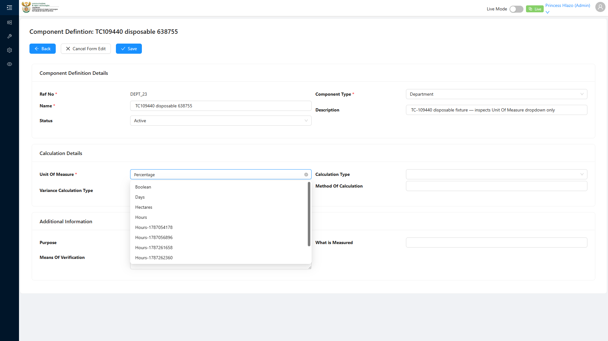
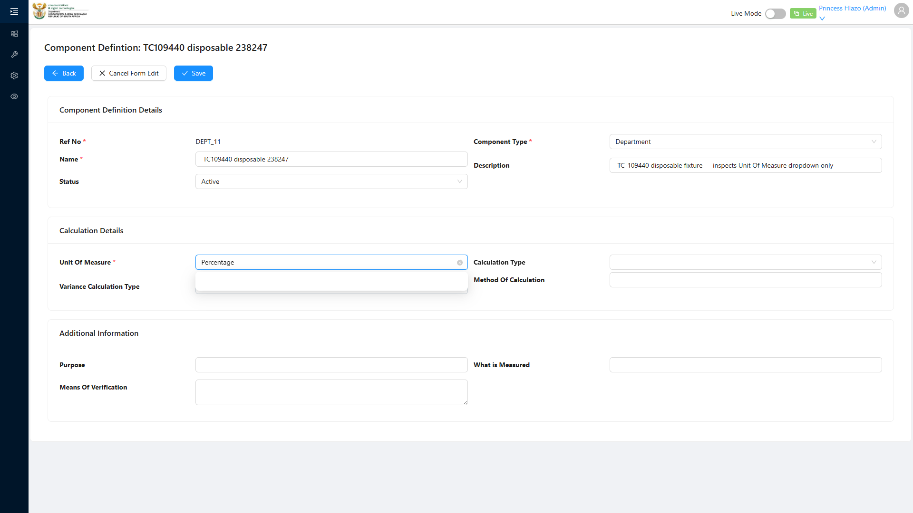

# Report: EPM — TC-109440 Unit of Measure in Component Definition dropdown (INTEGRATION)

**Date:** 2026-08-12 10:05 UTC
**Plan:** test-plans/foundation-reference-data/epm-component-definition-uom-dropdown.md
**Spec:** test-plans/foundation-reference-data/epm-component-definition-uom-dropdown.spec.ts
**Cases:** TC-109440
**Execution Mode:** playwright-script (headed, bundled Chromium 148.0.7778.96)
**Result:** PASSED
**Duration:** 18.4s (test body) · 19.9s wall
**Verdict:** both ADO steps and both expected results met · reference data reaches the consumer form · 0 defects · precondition fixture had to be seeded

**ADO:** org `boxfusion` · project **PD-Epm** · plan **108745** (*EPM-QA — Functional Test Plan v2.0*) ·
suite **109506** · case **109440** · point **31274** · tags `EPM-Redesign-2026-08-11; integration`
**Environment:** QA — `https://pd-epm-adminportal-qa.shesha.app` · API `https://pd-epm-api-qa.shesha.app`
**Login:** admin.PrincessH / 123qwe → **Princess Hlazo** (`creatorUserId 13`)
**Navigation:** Epm › **Adminstration** › Component Definition → `/dynamic/Epm/component-definition-table` → **+ Add**
**Form:** modal *Add New Record* → section *Calculation Details* → **Unit Of Measure** dropdown

Only test case 109440 was executed — it is the sole test in its own spec, so no `--grep` is needed.
TC-109437 and TC-109439 were not re-run.

## Summary

| Total Assertions | Passed | Failed | Skipped |
|------------------|--------|--------|---------|
| 12 | 12 | 0 | 0 |

## Precondition required seeding — `"Percentage"` did not exist

The ADO precondition is *'A Unit of Measure "Percentage" exists'*. **It did not.** Before this run QA held
five Units of Measure — `Emmanuel`, `Princess`, `Hours`, `Hours-spec-1786525954`,
`Hours-chromium-1786526263` — and no `Percentage`.

`Percentage` was therefore **created as fixture setup** via
`POST /api/dynamic/Epm/UnitOfMeasure/Crud/Create` → **HTTP 200**,
`id 9447a42b-8883-460c-90ed-3bf39ec4e046` (`PCT` / `pct`). This is setup, not an assertion: the case tests
whether an existing unit *surfaces in the consumer dropdown*, so the fixture must exist first. The spec
seeds it only when absent and logs which path it took — on this run it reported
`"Percentage" already existed, not seeded`, because the discovery pass minutes earlier had created it.

> Worth raising with whoever owns the suite: **three of the four cases in 109506 assume seed data that QA
> does not ship.** TC-109437 creates `Hours`, TC-109439 depends on `Hours` existing, and TC-109440 depends
> on `Percentage` existing. There is no seeding step in ADO and no teardown, so the suite is order-dependent
> and only passes cleanly on a database that previous runs have already populated.

## Step Results

### STEP 1 — Open a Component Definition create form
- [PASS] `Component Definition` menu item resolves to `/dynamic/Epm/component-definition-table`
- [PASS] List page rendered (5 existing definitions: `QLKPI_1`, `SUB_PROG_1`, `DEPT_1`, `QKPI_1`, `PROG_1`)
- [PASS] **+ Add** opens the create modal — title **"Add New Record"**
- **[PASS] EXPECTED: Calculation Details section is visible** — all three sections render:
  `["Component Definition Details","Calculation Details","Additional Information"]`
- [PASS] The **Unit Of Measure** form item is present and visible

Section layout observed:

| Section | Fields |
|---|---|
| Component Definition Details | Ref No\*, Name\*, Component Type\*, Description\* |
| **Calculation Details** | **Unit Of Measure**, Variance Calculation Type, Calculation Type, Method Of Calculation |
| Additional Information | Purpose, Means Of Verification, What Measured |

Containment was verified rather than assumed — the smallest ancestor holding the *Calculation Details*
header also holds the **Unit Of Measure** label, and holds neither sibling section header:
`containment: inside-calculation-details`. So the dropdown really is the *Calculation Details* one named
in the case title, not a similarly-labelled field elsewhere on the form.



### STEP 2 — Open the Unit of Measure dropdown
- [PASS] Dropdown opens on click, rendering **6** options
- **[PASS] EXPECTED: "Percentage" appears as a selectable option**

Full option list, exactly the six Units of Measure that `UnitOfMeasure/Crud/GetAll` returns, sorted
alphabetically:

```
["Emmanuel", "Hours", "Hours-chromium-1786526263", "Hours-spec-1786525954", "Percentage", "Princess"]
```

"Selectable" was proven three ways, not just by presence:
- [PASS] the option is visible in the list
- [PASS] it carries neither `ant-select-item-option-disabled` nor `aria-disabled="true"`
- [PASS] clicking it actually selects: the control then reads **`Percentage`**

The dropdown is a searchable antd select whose options render in a portal attached to `body`, **outside**
`.ant-modal-content` — they have to be queried at page level.




## No Component Definition created

The case inspects the dropdown only, so after proving the selection the modal is **cancelled**. Verified:
`modal cancelled, no Component Definition created` — the list still holds its original 5 definitions. The
only QA write attributable to this case is the `Percentage` fixture.

## Note on the first run's log

The first execution passed but logged `dropdown options: []` while simultaneously finding and clicking
`Percentage`. That contradiction was an artefact of the spec, not the app: the panel becomes visible
*before* its options are populated, so a one-shot `evaluateAll` snapshot captured an empty list, while the
subsequent Playwright assertion auto-waited and found the option. The spec now waits for the first option
before enumerating, and the re-run reported all 6. The option list quoted above is from that corrected
run — the earlier empty array was never evidence that the dropdown was empty.

## Azure DevOps publication — BLOCKED (unchanged)

| Call | Result |
|---|---|
| `GET /_apis/wit/workitems/109440` | **200** |
| `POST /PD-Epm/_apis/test/runs` | **401 Unauthorized** |

Same read-only PAT as the previous two runs. Point **31274** cannot be set to **Passed** until the token is
reissued with **Test Management: Read & write** (`vso.test_write`). All three executed cases (31271, 31273,
31274) are then ready to publish with step-level detail.

## Suite 109506 — coverage after this run

| ADO ID | Point | Case | Result |
|---|---|---|---|
| 109437 | 31271 | Create Unit of Measure with all 4 fields | ✅ PASSED |
| 109439 | 31273 | Duplicate name rejected by unique constraint | ✅ PASSED |
| 109440 | 31274 | Appears in Component Definition dropdown | ✅ PASSED |

The suite is now fully executed. None of the three revealed an application defect.
