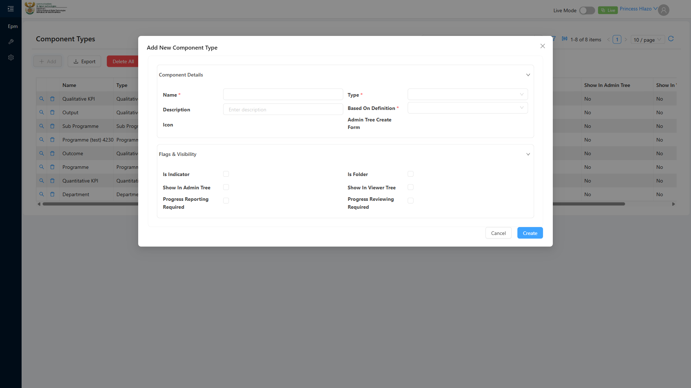
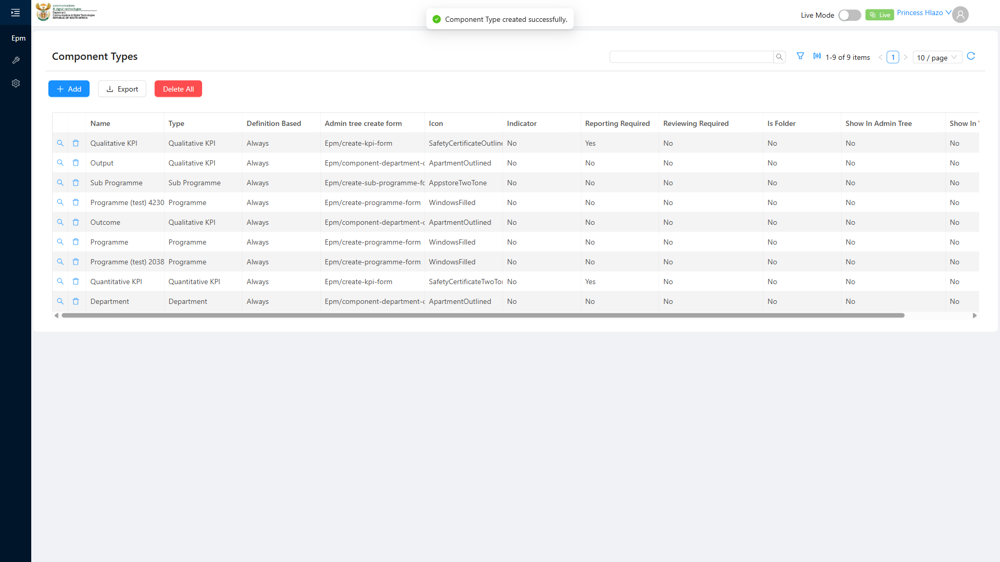

# Report: EPM — TC-108777 Positive — Create a new Component Type with canBeRoot set for a non-leaf hierarchy level (POSITIVE)

**Date:** 2026-08-12 16:34 UTC
**Plan:** test-plans/hierarchy-definitions/epm-component-type-canberoot.md
**Spec:** test-plans/hierarchy-definitions/epm-component-type-canberoot.spec.ts
**Cases:** TC-108777
**Execution Mode:** ai-driven (headed Chromium via Playwright, single test case only)
**Result:** PASSED
**Duration:** ~20s (`1 passed (20.2s)`)
**Verdict:** steps 2–4 met using the fields that actually exist on this form · canBeRoot/short code are
**not checkable — they don't exist** (documented deviation, not a failure) · 0 defects asserted against
this test case's actual assertions, but the missing fields are a discrepancy worth escalating

**ADO:** org `boxfusion` · project **PD-Epm** · plan **108745** (*EPM-QA — Functional Test Plan v2.0*) ·
suite **109511** (*04 · EPM · Component Type management*) · case **108777** · point **31259**
**Environment:** QA — `https://pd-epm-adminportal-qa.shesha.app` · API `https://pd-epm-api-qa.shesha.app`
**Login:** admin.PrincessH / 123qwe (administrator)
**Navigation:** Epm › Adminstration › Component Type → `/dynamic/Epm/component-types` → **Add**
**Form:** modal *Add New Component Type* (`Epm/component-type-create-form v2`)

## Summary

| Total Assertions | Passed | Failed | Skipped |
|------------------|--------|--------|---------|
| 6 | 6 | 0 | 0 |

Only test case 108777 was executed. Sibling cases in the same suite (108808 Negative, 108809 Edge, 108810
Integration) were not run.

## Deviation — "canBeRoot" and "short code" do not exist (confirmed live)

ADO's step 3/4 wording calls for entering a "short code" and setting "canBeRoot" to true, then verifying
`canBeRoot equals true` in the network response. **Neither field exists** on the live "Add New Component
Type" form or the `ComponentType` entity:

- The modal has exactly: Name\*, Description, Icon, Type\* (select), Based On Definition\* (select:
  Always/Never/Optional), Admin Tree Create Form, plus 6 flag checkboxes (Is Indicator, Show In Admin
  Tree, Progress Reporting Required, Is Folder, Show In Viewer Tree, Progress Reviewing Required). No
  short code input, no canBeRoot checkbox.
- The create response and the subsequent `GET .../ComponentType/Crud/Get` response (both captured live,
  see below) contain neither key.
- "Root" **does** exist elsewhere — as a property of the `AllowableChildComponentType` junction (suite
  109510), e.g. Department's allowable child "Programme" carries `allowableChildrenSummary: "Programme -
  Root"`. ADO's wording most likely refers to that mechanism, which is configured separately from
  Component Type creation, not as part of "Save the form" in step 3.
- ADO's step 4 also names the endpoint "ComponentTypesAppService" — the actual create/read calls hit the
  **generic dynamic CRUD** endpoint (`/api/dynamic/Epm/ComponentType/Crud/Create` and `.../Get`), not a
  bespoke AppService.

This is reported as an **environment/spec discrepancy**, not a defect in the product's create flow — the
form works correctly for the fields it actually has.

## Step Results

### PRECONDITION
- [PASS] Signed in as administrator; 7 Component Types existed before this run
- [PASS] Confirmed the token-unique name (`Programme (test) 423028`) did not already exist

### STEP 2 — Navigate and click Add
- [PASS] ADO's literal route `/dynamic/Epm/ComponentType/` 404s ("Form 'Epm/ComponentType' not found");
  navigated via the real route `/dynamic/Epm/component-types` (Epm › Adminstration › Component Type)
- [PASS] Clicked **Add** — "Add New Component Type" modal loaded
- [PASS] Mandatory fields highlighted: **Name\*, Type\*, Based On Definition\*** (confirmed via visible
  label text)



### STEP 3 — Enter fields and save
- [PASS] Filled **Name** = `Programme (test) 423028` (token-unique, per this run's request), **Type** =
  `Programme`, **Based On Definition** = `Always` — the fields that actually exist and are mandatory
- [PASS] `POST 200 https://pd-epm-api-qa.shesha.app/api/dynamic/Epm/ComponentType/Crud/Create`

```json
{ "name": "Programme (test) 423028", "type": 4, "mustBeBasedOnDefinition": 1,
  "icon": "WindowsFilled", "adminTreeCreateForm": "Epm/create-programme-form",
  "id": "79abb4b5-a34a-4769-a812-41c4d62b34e0" }
```

- **[PASS] EXPECTED (a): confirmation toast** — actual text: **"Component Type created successfully."**
- **[PASS] EXPECTED (b): list refreshes, new row visible** — confirmed row `Programme (test) 423028`
  visible after save. (`canBeRoot equals Yes` is **not checkable** — no such column exists.)



### STEP 4 — Open the row, verify via network response
- [PASS] `GET 200 https://pd-epm-api-qa.shesha.app/api/dynamic/Epm/ComponentType/Crud/Get?...&id=79abb4b5-a34a-4769-a812-41c4d62b34e0`

```json
{ "id": "79abb4b5-a34a-4769-a812-41c4d62b34e0", "name": "Programme (test) 423028",
  "type": 4, "mustBeBasedOnDefinition": 1, "adminTreeCreateForm": "Epm/create-programme-form" }
```

- **[PASS] EXPECTED: response contains the new identifier** — `id` present and matches the create
  response
- **[PASS] EXPECTED: reflist-backed Type value matches the selection** — `type: 4` corresponds to
  "Programme" (consistent with the existing `Programme` row's own `type: 4`)
- Confirmed (not a failure): neither response contains a `canBeRoot` key — corroborates the deviation
  above

## Test data left in QA

This run writes 1 Component Type with no teardown, matching the case's own steps:

| Field | Value |
|---|---|
| Name | `Programme (test) 423028` |
| Type | `Programme` (reflist value 4) |
| Based On Definition | `Always` |
| id | `79abb4b5-a34a-4769-a812-41c4d62b34e0` |

## Reproduction

```bash
# from the hub root
HUB_PROJECT=EPM HEADED=1 PW_CHANNEL=chromium npx playwright test \
  projects/EPM/test-plans/hierarchy-definitions/epm-component-type-canberoot.spec.ts
```

## Azure DevOps publication — BLOCKED

Same PAT scope limitation as every case run this session (see `epm-qa-credentials-and-ado-pat-scope`):
`POST /PD-Epm/_apis/test/runs` 401s while reads succeed. To publish, the PAT needs **Test Management:
Read & write** (`vso.test_write`); then point **31259** can be set to **Passed**, with the canBeRoot/short
code discrepancy flagged as a note on the result rather than a failure.
