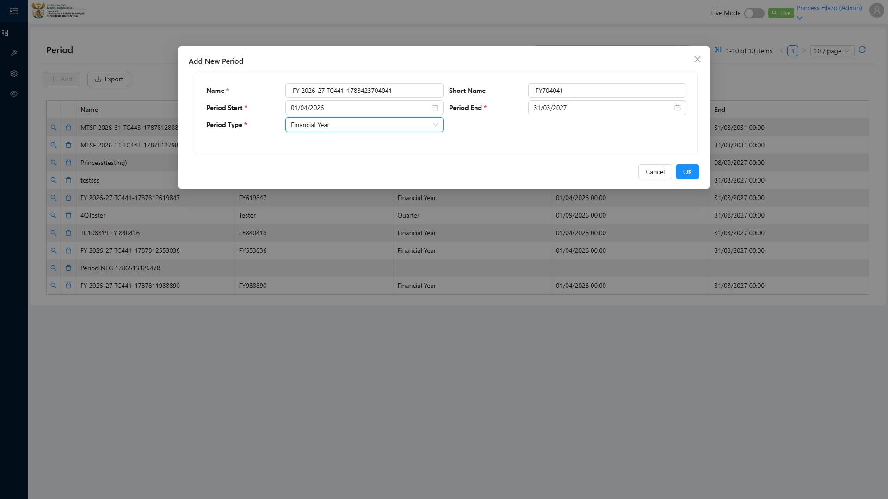
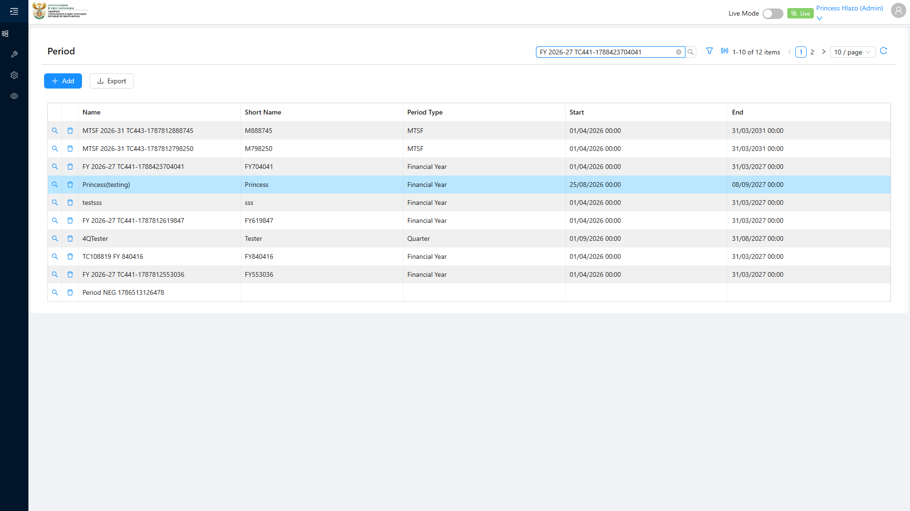
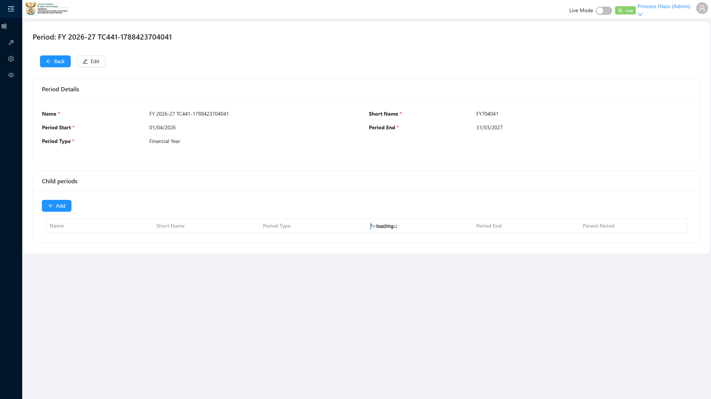
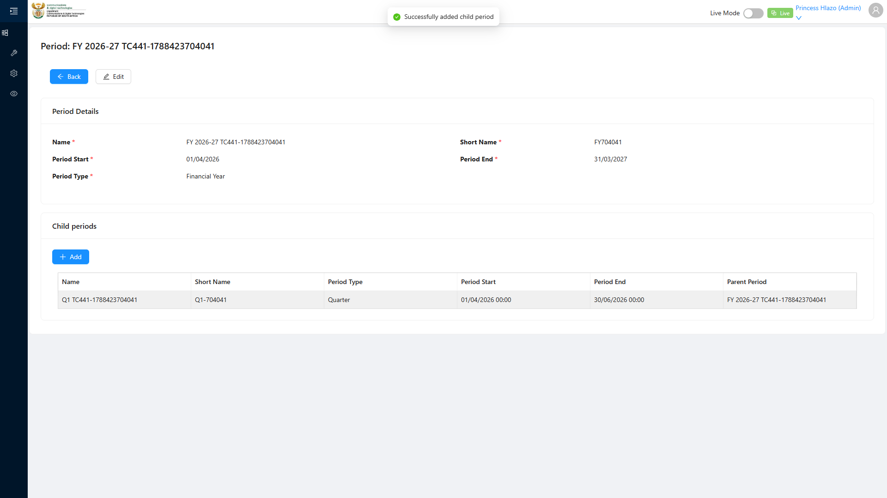
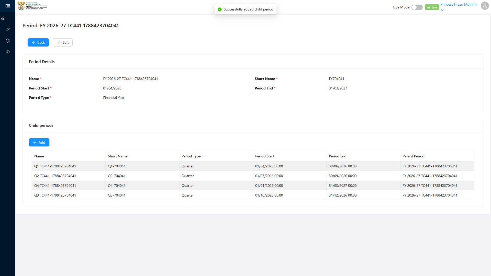

# Report: EPM — TC-109441 Financial Year Period with child Quarters (POSITIVE)

**Date:** 2026-08-12 10:16 UTC
**Plan:** test-plans/period-management/epm-period-financial-year-quarters.md
**Spec:** test-plans/period-management/epm-period-financial-year-quarters.spec.ts
**Cases:** TC-109441
**Execution Mode:** playwright-script (headed, bundled Chromium 148.0.7778.96)
**Result:** PASSED
**Duration:** 49.2s (test body) · 50.3s wall
**Verdict:** all 3 ADO steps and all 3 expected results met · recursive parent/child Period model works · 0 application defects · 2 spec races found and fixed

**ADO:** org `boxfusion` · project **PD-Epm** · plan **108745** (*EPM-QA — Functional Test Plan v2.0*) ·
suite **109505** (*02 · EPM · Period management*) · case **109441** · point **31267** · tags
`EPM-Redesign-2026-08-11; Positive`
**Environment:** QA — `https://pd-epm-adminportal-qa.shesha.app`
**Login:** admin.PrincessH / 123qwe → **Princess Hlazo**
**Navigation:** Epm › **Adminstration** › Period → `/dynamic/Shesha.Enterprise/period` → **+ Add**
**Run token:** `TC441-1786529749170`

Only test case 109441 was executed — it is the sole test in its own spec. Suite 109505's other cases
(109443 recursion, 109444 Performance Report Template dropdown) were **not** run.

## Summary

| Total Assertions | Passed | Failed | Skipped |
|------------------|--------|--------|---------|
| 29 | 29 | 0 | 0 |

## Unique inputs — the ADO literals were already taken

The case dictates Name `"FY 2026-27"`, but QA already held **`Financial Year 2026/2027`** / `FY 2026/27`
(id `bb939bfa-f516-4f6b-af46-21da4c275ae5`) **with Q1–Q4 children already attached**. Re-using those
literals would have collided with — or been indistinguishable from — that record, so each run stamps a
token into the Name and Short Name. **Dates were left exactly as specified**, since they carry the business
meaning under test rather than uniqueness.

| Record | Name | Short Name | Type | Start | End |
|---|---|---|---|---|---|
| Parent | `FY 2026-27 TC441-1786529749170` | `FY749170` | Financial Year | 01/04/2026 | 31/03/2027 |
| Child | `Q1 TC441-1786529749170` | `Q1-749170` | Quarter | 01/04/2026 | 30/06/2026 |
| Child | `Q2 TC441-1786529749170` | `Q2-749170` | Quarter | 01/07/2026 | 30/09/2026 |
| Child | `Q3 TC441-1786529749170` | `Q3-749170` | Quarter | 01/10/2026 | 31/12/2026 |
| Child | `Q4 TC441-1786529749170` | `Q4-749170` | Quarter | 01/01/2027 | 31/03/2027 |

## Step Results

### STEP 1 — Click + Add; fill Name, Short Name, Start, End, Period Type "Financial Year"; click OK
- [PASS] `Period` menu item resolves to `/dynamic/Shesha.Enterprise/period`
- [PASS] **+ Add** opens the modal titled **"Add New Period"** with fields Name\*, Short Name, Period
  Start\*, Period End\*, Period Type\* and buttons **Cancel** / **OK**
- [PASS] Period Type dropdown offers `Financial Year`, `MTSF`, `Month`, `Quarter` — `Financial Year` selected
- [PASS] Dates accepted as typed `dd/MM/yyyy` (`01/04/2026`, `31/03/2027`), committed with Enter
- **[PASS] EXPECTED: Row appears in list** — located after filtering the grid by name:

```
FY 2026-27 TC441-1786529749170 | FY749170 | Financial Year | 01/04/2026 00:00 | 31/03/2027 00:00
```

Every column was asserted, not just the name: short name, Period Type, and both dates round-tripped
exactly as entered.




### STEP 2 — Open the row via search icon; Child Periods + Add; fill Q1 with Parent auto-populated
- [PASS] The row "search icon" is the row link in the first cell → `/dynamic/Shesha.Enterprise/period-details?id=7dd7c6c9-f195-497c-9b8f-3d38f74a1f8e`
- [PASS] Detail view opens with heading **"Period: FY 2026-27 TC441-1786529749170"** and sections
  **Period Details** + **Child Periods**
- **[PASS] Parent auto-populated** — the *Add child period* modal's read-only **Parent Period** field
  resolves to `FY 2026-27 TC441-1786529749170` before anything is typed
- **[PASS] EXPECTED: Q1 row appears in Child Periods table** — toast *"Successfully added child period"*:

```
Q1 TC441-1786529749170 | Q1-749170 | Quarter | 01/04/2026 00:00 | 30/06/2026 00:00 | FY 2026-27 TC441-1786529749170
```




### STEP 3 — Repeat for Q2, Q3, Q4
- [PASS] Q2, Q3, Q4 each created through the same child form, each with **Parent Period auto-populated**
  to the Financial Year before saving
- **[PASS] EXPECTED: Four Quarter Periods are children of FY 2026-27** — the Child Periods grid holds
  **exactly 4** rows carrying this run's token, all `Period Type = Quarter`, all with
  `Parent Period = FY 2026-27 TC441-1786529749170`:

| Name | Short Name | Type | Start | End | Parent Period |
|---|---|---|---|---|---|
| Q1 TC441-1786529749170 | Q1-749170 | Quarter | 01/04/2026 | 30/06/2026 | FY 2026-27 TC441-1786529749170 |
| Q2 TC441-1786529749170 | Q2-749170 | Quarter | 01/07/2026 | 30/09/2026 | FY 2026-27 TC441-1786529749170 |
| Q3 TC441-1786529749170 | Q3-749170 | Quarter | 01/10/2026 | 31/12/2026 | FY 2026-27 TC441-1786529749170 |
| Q4 TC441-1786529749170 | Q4-749170 | Quarter | 01/01/2027 | 31/03/2027 | FY 2026-27 TC441-1786529749170 |

The four quarters tile the financial year exactly — 01/04/2026 → 31/03/2027 with no gap or overlap.
The grid returns them in non-chronological order (Q4, Q2, Q3, Q1), so the count and per-row assertions are
order-independent by design.



## Two spec races found and fixed — neither was an application defect

Both are recorded because each one *looked* like a defect at first.

**1. Two-level flyout hover (120s stall).** The run died with `locator.hover` timing out for the full
action timeout on the *Adminstration* item. The failure screenshot showed the sidebar fully collapsed: the
flyout had closed between "is the item visible?" and "hover it", and antd had unmounted the popup, so the
hover waited on a detached node. Fixed by retrying the **whole path** (hover Epm → hover Adminstration →
click the item) as one unit with short per-action timeouts, so a stale element fails fast and the path
re-opens. This supersedes the two-separate-hovers pattern used in the suite-109506 specs.

**2. "Parent Period unknown" — read too early.** The next run failed asserting the child form's parent
field, which reported `"Parent Period unknown"`. That reads exactly like a real defect (parent not
auto-populated). It is not: the field renders the placeholder **`unknown`** while the referenced entity
loads, then resolves to the parent's name — the failure screenshot caught the modal mid-animation already
displaying `Parent Period  FY 2026-27 TC441-1786529749170`. The single `innerText()` read sampled the
placeholder. Fixed with an auto-retrying `toContainText`, and all four children now report the parent
populated. **No defect was raised**, because the app was behaving correctly.

The same early-read also explains why the first attempt logged "child form exposes no Parent field" for Q1:
the Shesha form had not rendered its fields yet when `count()` ran. The spec now waits for the form before
inspecting it.

## Test data left in QA

**5 records per successful run, and there is no teardown** — the ADO case specifies none.

| From | Records | State |
|---|---|---|
| This passing run (`TC441-1786529749170`) | `FY 2026-27 TC441-1786529749170` + Q1–Q4 | complete, 5 records — the evidence for this result |
| Earlier failed attempt (`TC441-1786529609654`) | `FY 2026-27 TC441-1786529609654` + **Q1 only** | **partial, 2 records** — the run died on Q2; safe to delete |

The `TC441-1786529609654` parent and its lone Q1 are orphaned leftovers of the diagnostic failure, not
evidence of anything. Say the word and I will remove them, along with the two `Hours-*` verification rows
still outstanding from suite 109506.

## Observations (not defects against TC-109441)

| # | Severity | Observation |
|---|---|---|
| 1 | Low | **Short Name is optional in the create modal but mandatory on the detail form** (`Short Name *`). A Period created without one would open into a form that immediately fails its own validation. Not exercised here — the spec always supplies one. |
| 2 | Info | The Child Periods grid returns rows in non-chronological order (Q4, Q2, Q3, Q1) with no apparent sort. Harmless for this case, but a reader of the UI cannot rely on quarter order. |
| 3 | Info | The API cold-start issue recorded against TC-109437 still applies. The API was warmed with a single `curl` before this run, which is why it completed in 49s. |

## Azure DevOps publication — BLOCKED (unchanged)

| Call | Result |
|---|---|
| `GET /_apis/wit/workitems/109441`, `GET .../Suites/109505/TestCase` | **200** |
| `POST /PD-Epm/_apis/test/runs` (pointIds `[31267]`) | **401 Unauthorized** |

Same read-only PAT as the three previous runs. Point **31267** cannot be set to **Passed** until the token
is reissued with **Test Management: Read & write** (`vso.test_write`).

## Cumulative ADO coverage

| Suite | ADO ID | Point | Case | Result |
|---|---|---|---|---|
| 109506 | 109437 | 31271 | Create Unit of Measure with all 4 fields | ✅ PASSED |
| 109506 | 109439 | 31273 | Duplicate name rejected by unique constraint | ✅ PASSED |
| 109506 | 109440 | 31274 | Appears in Component Definition dropdown | ✅ PASSED |
| **109505** | **109441** | **31267** | **Financial Year with child Quarters** | ✅ **PASSED** |

Four cases executed, no application defects found in any of them.
