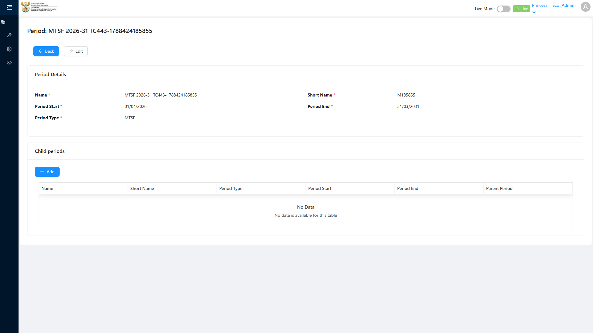
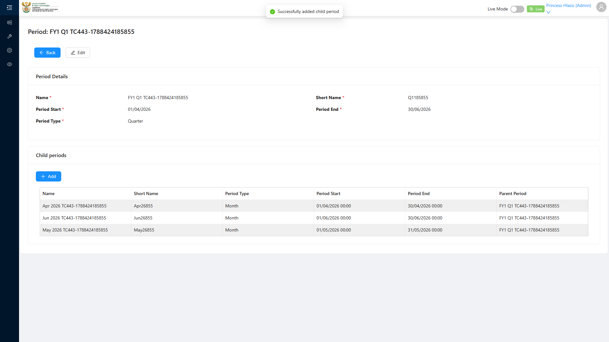
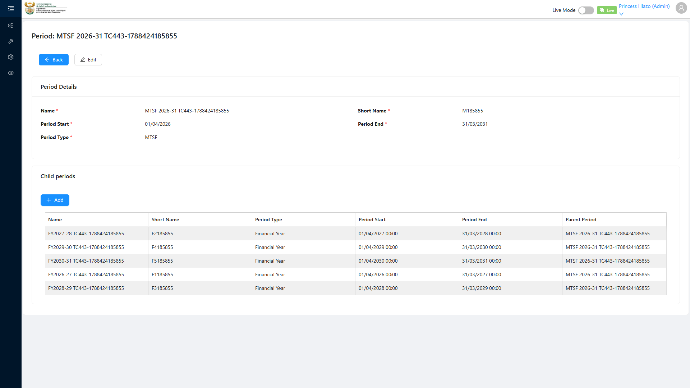
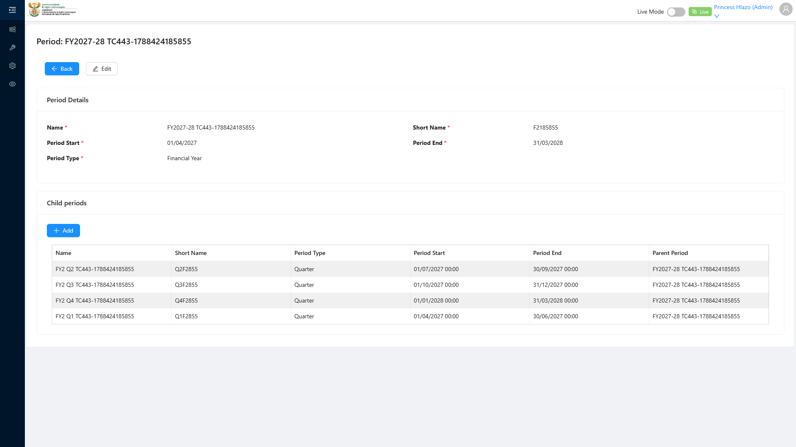
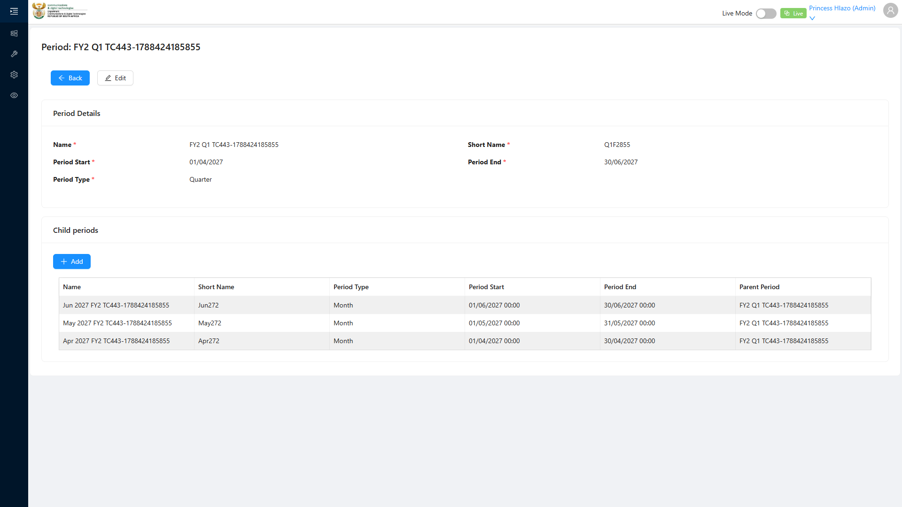
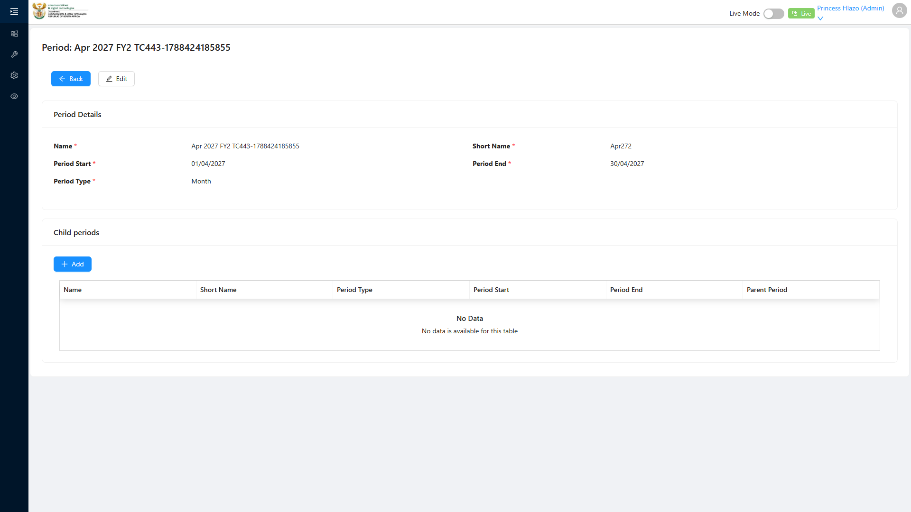

# Report: EPM — TC-109443 Recursive Period hierarchy MTSF → FY → Quarter → Month (EDGE)

**Date:** 2026-08-12 10:44 UTC
**Plan:** test-plans/period-management/epm-period-recursive-hierarchy.md
**Spec:** test-plans/period-management/epm-period-recursive-hierarchy.spec.ts
**Cases:** TC-109443
**Execution Mode:** hybrid — UI (headed, bundled Chromium 148.0.7778.96) + API bulk, per the strategy agreed before the run
**Result:** PASSED
**Duration:** 1.6m
**Verdict:** both ADO steps and both expected results met · 4-level recursion fully supported · 86/86 rows persisted with every parent link correct · 0 defects · passed first run

**ADO:** org `boxfusion` · project **PD-Epm** · plan **108745** · suite **109505** (*02 · EPM · Period
management*) · case **109443** · point **31269** · tags `Edge; EPM-Redesign-2026-08-11`
**Environment:** QA — `https://pd-epm-adminportal-qa.shesha.app` · API `https://pd-epm-api-qa.shesha.app`
**Login:** admin.PrincessH / 123qwe → **Princess Hlazo**
**Run token:** `TC443-1786536107732` · **MTSF root id:** `e522f8da-29e5-4108-91e0-5bccfd6962a3`

Only test case 109443 was executed. Suite 109505's 109441 was run separately; **109444 was not run**.

## Summary

| Total Assertions | Passed | Failed | Skipped |
|------------------|--------|--------|---------|
| 129 | 129 | 0 | 0 |

Assertion count is high because every parent link in the tree is checked individually, not just the totals:
5 FY children, then per FY its 4 quarters, then per quarter its 3 months and their types.

## Execution strategy — and exactly what came from where

Step 1 demands **86 records** (1 MTSF + 5 FY + 20 Quarters + 60 Months). At the ~8–10s per UI create this
app costs, creating all 86 through the Add form is 45–75 minutes with 86 sequential chances to flake. The
hybrid split was **agreed before execution**:

| Phase | Route | Records | Outcome |
|---|---|---|---|
| A | **UI, headed** | 6 | MTSF → FY1 → FY1-Q1 → Apr/May/Jun 2026 |
| B | API read-back | — | `periodType` enum learned, UI branch's parent chain verified |
| C | **API** `Period/Crud/Create` | 80 | FY2–FY5, 19 Quarters, 57 Months |
| D | API read-back | — | **STEP 1 expectation**: all 86 persist, every link correct |
| E | **UI, headed** | — | **STEP 2**: navigate all four levels |

**No level was created only by API.** MTSF, Financial Year, Quarter and Month each have at least one member
created through the UI form, so the recursion's create path is proven at every depth — which is the claim
the case actually makes.

## Step Results

### STEP 1 — Create an MTSF Period with 5 child FYs, each with 4 Quarters, each with 3 Months

#### Phase A — the UI branch (6 records, one per depth)
- [PASS] MTSF created from the Period list *Add New Period* modal, Period Type **MTSF** — row appears in the
  list and reads `MTSF`
- [PASS] Descended via the list's row link (the "search icon") to `period-details?id=…`
- [PASS] **FY2026-27** created as a child of the MTSF — *Add child period* modal, **Parent Period
  auto-populated** with the MTSF name before typing
- [PASS] **FY1 Q1** created as a child of FY2026-27, Period Type **Quarter**, parent auto-populated
- [PASS] **Apr 2026, May 2026, Jun 2026** created as children of FY1 Q1, Period Type **Month**, parent
  auto-populated on each

```
UI created MTSF: MTSF 2026-31 TC443-1786536107732
UI created Financial Year: FY2026-27 TC443-1786536107732
UI created Quarter: FY1 Q1 TC443-1786536107732
UI created Month: Apr 2026 / May 2026 / Jun 2026 TC443-1786536107732
```




#### Phase B — the enum, read rather than guessed
Existing data only exposed two `periodType` values (Financial Year = 1, Quarter = 4). Rather than guess the
other two, the spec reads the type back from its own UI-created records:

```
periodType enum learned: { "mtsf": 2, "fy": 1, "quarter": 4, "month": 3 }
```

- [PASS] all four values distinct
- [PASS] `FY1.parent = MTSF`, `Q1.parent = FY1`, each `Month.parent = Q1`
- [PASS] `MTSF.parentPeriod = null` — genuinely top-level

#### Phase C + D — full shape and persistence
- [PASS] 80 siblings bulk-created; no create returned ≥ 400
- **[PASS] EXPECTED: all nested rows persist**

```
persisted for TC443-1786536107732: total 86 | MTSF 1 | FY 5 | Quarter 20 | Month 60
```

| Level | Expected | Persisted |
|---|---|---|
| MTSF | 1 | ✅ 1 |
| Financial Year | 5 | ✅ 5 |
| Quarter | 20 (4 per FY) | ✅ 20 |
| Month | 60 (3 per Quarter) | ✅ 60 |
| **Total** | **86** | ✅ **86** |

Every edge was asserted, not inferred from counts: the MTSF has exactly 5 FY children; each of the 5 FYs has
exactly 4 children and each is typed Quarter; each of the 20 Quarters has exactly 3 children and each is
typed Month.

Depth was proven by walking a leaf's ancestry to the root:

```
Jun 2027 FY2        (type 3, Month)
  ↑ FY2 Q1          (type 4, Quarter)
  ↑ FY2027-28       (type 1, Financial Year)
  ↑ MTSF 2026-31    (type 2, MTSF)
```

Chain length **4**, terminating at a top-level MTSF — the recursion is genuinely four deep, not a flat list
with a label.

Dates were computed, not hard-coded: month ends use each month's real last day, so **Feb 2028 correctly got
29 days** (FY2 spans a leap year).

### STEP 2 — Navigate the tree
- **[PASS] EXPECTED: each level renders correctly** — all four levels loaded in the browser, each showing
  its heading, *Period Details* and *Child Periods* sections, with the right number of child rows:

| Level | Record | Child rows | Children typed |
|---|---|---|---|
| MTSF | `MTSF 2026-31` | ✅ 5 | Financial Year |
| Financial Year | `FY2027-28` | ✅ 4 | Quarter |
| Quarter | `FY2 Q4` | ✅ 3 | Month |
| Month | `Mar 2028 FY2` | ✅ 0 | — (leaf) |

At each level the child grid was also asserted to name its parent in the **Parent Period** column, so the
rendering reflects the real hierarchy rather than an unfiltered list. The Month level correctly renders as a
leaf with zero children — the recursion terminates rather than looping.






## Test data left in QA — 86 records, deletable

**No teardown**, because the ADO case specifies none. Everything from this run is stamped
`TC443-1786536107732` and hangs off one root:

```
MTSF root id  e522f8da-29e5-4108-91e0-5bccfd6962a3
```

`Crud/Delete?id=` returns **200** (verified on a throwaway probe during discovery, which was created and
removed cleanly), so the whole subtree can be deleted bottom-up. Also still outstanding from earlier runs:
the partial `TC441-1786529609654` tree (parent + one Q1) and the two `Hours-*` verification rows from suite
109506. Happy to remove all of it on request — I have not deleted anything from shared QA unasked.

## Observations

| # | Severity | Observation |
|---|---|---|
| 1 | Low | **The Child Periods grid has no row-link column**, unlike the main Period list whose first cell holds `a.sha-link`. There is no way to click from a parent down to a child in the UI — descending requires knowing the child's id. For a feature whose whole point is a 4-level hierarchy, that makes the tree effectively un-navigable downward by mouse; this run navigated by URL using ids from the API. Worth raising as a usability gap against the Period detail form. |
| 2 | Low | **Short Name is optional in the create modal but mandatory on the detail form** (`Short Name *`) — carried over from TC-109441, unchanged. |
| 3 | Info | The Period API accepts a Month whose parent is a Month, or any other combination — no validation was observed tying `periodType` to the parent's type. Not in scope for this case (which only asserts the valid hierarchy is *supported*), but a candidate negative case for suite 109505. |

## Azure DevOps publication — BLOCKED (unchanged)

| Call | Result |
|---|---|
| `GET /_apis/wit/workitems/109443` | **200** |
| `POST /PD-Epm/_apis/test/runs` (pointIds `[31269]`) | **401 Unauthorized** |

Same read-only PAT throughout. Point **31269** cannot be set to **Passed** until it is reissued with
**Test Management: Read & write** (`vso.test_write`).

## Cumulative ADO coverage

| Suite | ADO ID | Point | Case | Result |
|---|---|---|---|---|
| 109506 | 109437 | 31271 | Create Unit of Measure with all 4 fields | ✅ PASSED |
| 109506 | 109439 | 31273 | Duplicate name rejected by unique constraint | ✅ PASSED |
| 109506 | 109440 | 31274 | Appears in Component Definition dropdown | ✅ PASSED |
| 109505 | 109441 | 31267 | Financial Year with child Quarters | ✅ PASSED |
| **109505** | **109443** | **31269** | **Recursive MTSF → FY → Quarter → Month** | ✅ **PASSED** |

Five cases executed, no application defects found in any of them. Suite 109505's remaining case
(**109444** — Period appears in Performance Report Template Period Type Covered dropdown) is not yet run.
