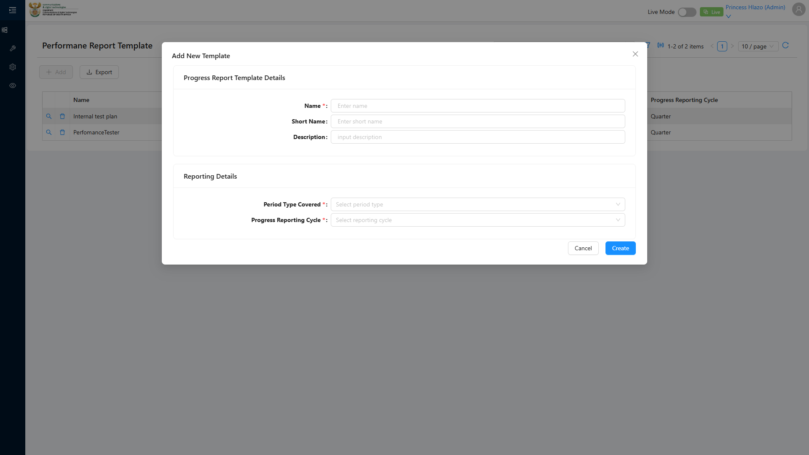
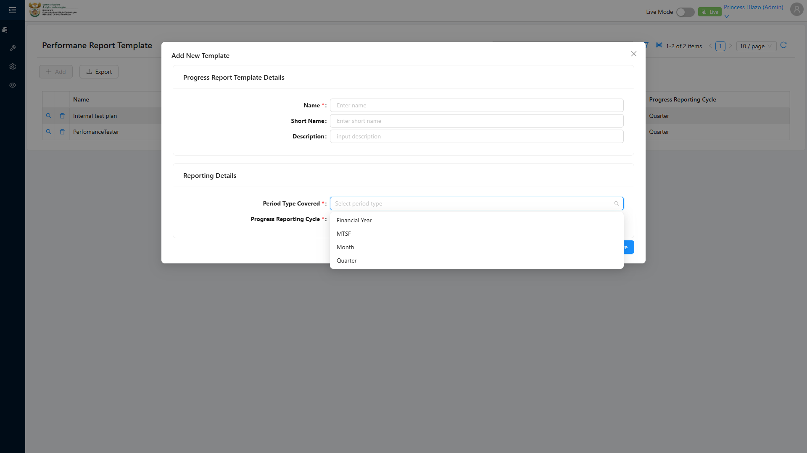
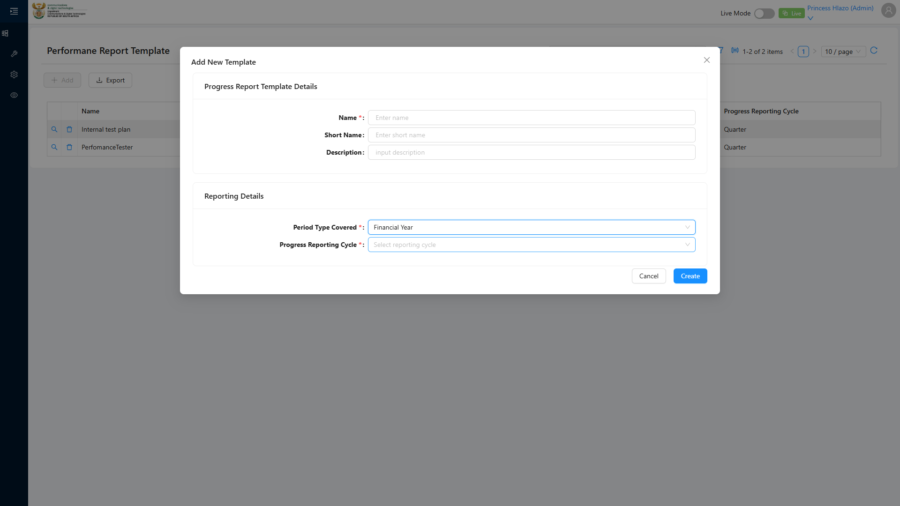

# Report: EPM — TC-109444 Period Type Covered dropdown on Performance Report Template (INTEGRATION)

**Date:** 2026-08-12 11:03 UTC
**Plan:** test-plans/period-management/epm-prt-period-type-covered-dropdown.md
**Spec:** test-plans/period-management/epm-prt-period-type-covered-dropdown.spec.ts
**Cases:** TC-109444
**Execution Mode:** playwright-script (headed, bundled Chromium 148.0.7778.96)
**Result:** PASSED
**Duration:** 34.7s (test body) · 36.3s wall
**Verdict:** both ADO steps and both expected results met · 0 defects · 0 records written · passed first run · one test-case wording issue raised

**ADO:** org `boxfusion` · project **PD-Epm** · plan **108745** · suite **109505** (*02 · EPM · Period
management*) · case **109444** · point **31270** · tags `EPM-Redesign-2026-08-11; integration`
**Environment:** QA — `https://pd-epm-adminportal-qa.shesha.app` · API `https://pd-epm-api-qa.shesha.app`
**Login:** admin.PrincessH / 123qwe → **Princess Hlazo**
**Navigation:** Epm › **Adminstration** › Performance Report Template → `/dynamic/Epm/perfomance-report-template` → **+ Add**
**Form:** modal *Add New Template* → section *Reporting Details* → **Period Type Covered**

Only test case 109444 was executed — the sole test in its own spec. This completes suite 109505.

## Summary

| Total Assertions | Passed | Failed | Skipped |
|------------------|--------|--------|---------|
| 14 | 14 | 0 | 0 |

## The dropdown is type-based — Step 2's wording is misleading

Step 2 says *"Confirm the created Financial Year is selectable"*, which reads as though the **Period record**
created earlier in the suite should appear in the list. **It does not, and should not.** The field lists
**Period Types**, exactly as the case's own Step 1 expectation states:

```
Period Type Covered options (4): ["Financial Year","MTSF","Month","Quarter"]
```

Three independent signals confirm this is correct behaviour, not a bug:

1. The field is literally labelled **"Period Type Covered"**.
2. These are precisely the four values the **Period form's own** *Period Type* selector offers — the same
   enum whose integer values TC-109443 read back as `{ mtsf: 2, fy: 1, quarter: 4, month: 3 }`.
3. The Performance Report Template list grid heads its column **`PeriodType Covered`**, and the one existing
   template (`Emmanuel_template`) shows `Financial Year` in it — a type, not a record name.

So Step 2 is satisfied by the **`Financial Year` type option** being selectable. It is asserted that way, and
flagged rather than silently reinterpreted — **the test case text should be corrected in ADO**, because as
written a tester would look for a `Financial Year 2026-27` row and report a false defect when the field is
behaving correctly.

## Precondition — asserted in substance, nothing seeded

The stated precondition is *A Period "Financial Year 2026-27" exists*. The exact literal does **not** exist
in QA:

```
8 Financial Year period(s) exist
  names: ["FY2030-31 TC443-…","FY2027-28 TC443-…","FY 2026-27 TC441-…","FY 2026-27 TC441-…",
          "FY2028-29 TC443-…","FY2026-27 TC443-…","Financial Year 2026/2027","FY2029-30 TC443-…"]
  exact literal "Financial Year 2026-27" present: false
```

- [PASS] At least one Period of type *Financial Year* exists — **8 do**, including the pre-existing
  `Financial Year 2026/2027` (slash rather than hyphen) and the records created by TC-109441 and TC-109443.

**Nothing was seeded.** Because the dropdown is type-based, no Period record can alter its contents, so
creating a redundant `Financial Year 2026-27` row would have added clutter to shared QA for exactly zero
effect on any assertion. Unlike TC-109440 — where `Percentage` genuinely had to exist for the record to
appear in a record-based dropdown — seeding here would be theatre.

## Step Results

### STEP 1 — Open PRT create form
- [PASS] `Performance Report Template` menu item resolves to `/dynamic/Epm/perfomance-report-template`
- [PASS] List page renders (1 existing template, `Emmanuel_template`)
- [PASS] **+ Add** opens the modal titled **"Add New Template"**, sections *Progress Report Template Details*
  and *Reporting Details*, fields Name\*, Short Name, Description, **Period Type Covered\***, Progress
  Reporting Cycle\*, buttons **Cancel** / **Create**
- **[PASS] EXPECTED: Period Type Covered dropdown lists Period Types** — exactly the four, no more and no
  fewer (asserted as a set equality against `["Financial Year","MTSF","Month","Quarter"]`, so a missing or
  spurious option would fail)




### STEP 2 — Confirm the created Financial Year is selectable
- **[PASS] EXPECTED: Selectable option** — proven three ways rather than by presence alone:
  - [PASS] `Financial Year` is listed in the dropdown
  - [PASS] it carries neither `ant-select-item-option-disabled` nor `aria-disabled="true"`
  - [PASS] clicking it actually selects — the control then reads **`Financial Year`**



## No records written

The case only opens a form and inspects a dropdown, so after proving the selection the modal was
**cancelled**: `modal cancelled, no Performance Report Template created`. This case is safe to re-run
indefinitely and leaves QA untouched.

## Observations (not defects against TC-109444)

| # | Severity | Observation |
|---|---|---|
| 1 | Low | **Test case wording.** Step 2's "the created Financial Year" implies a record-based dropdown. It is type-based. Recommend rewording to "Confirm the *Financial Year* Period Type is selectable" so the case cannot be mis-executed. |
| 2 | Low | **Spelling defects around this feature.** The route is `/dynamic/Epm/perfomance-report-**template**` (missing *r* in "performance"); the page heading reads **"Performane Report Template"** (missing *c*); the grid column reads **"PeriodType Covered"** (missing space) while the form label reads "Period Type Covered". The sidebar's **"Adminstration"** typo, logged against TC-109437, is still present. |
| 3 | Info | The API cold-start issue recorded against TC-109437 still applies; the API was warmed with a single `curl` before this run. |

## Azure DevOps publication — BLOCKED (unchanged)

| Call | Result |
|---|---|
| `GET /_apis/wit/workitems/109444` | **200** |
| `POST /PD-Epm/_apis/test/runs` (pointIds `[31270]`) | **401 Unauthorized** |

Same read-only PAT throughout the campaign. Point **31270** cannot be set to **Passed** until the token is
reissued with **Test Management: Read & write** (`vso.test_write`).

## Campaign coverage — both suites now complete

| Suite | ADO ID | Point | Case | Result |
|---|---|---|---|---|
| 109506 | 109437 | 31271 | Create Unit of Measure with all 4 fields | ✅ PASSED |
| 109506 | 109439 | 31273 | Duplicate name rejected by unique constraint | ✅ PASSED |
| 109506 | 109440 | 31274 | Appears in Component Definition dropdown | ✅ PASSED |
| 109505 | 109441 | 31267 | Financial Year with child Quarters | ✅ PASSED |
| 109505 | 109443 | 31269 | Recursive MTSF → FY → Quarter → Month | ✅ PASSED |
| **109505** | **109444** | **31270** | **Period Type Covered dropdown** | ✅ **PASSED** |

**6 of 6 executed cases pass. No application defect was found in any of them.** Everything raised is either
cosmetic (spelling), a usability gap (no row link in the Child Periods grid), a test-data gap (suites assume
seed data QA does not ship), or test-case wording.
