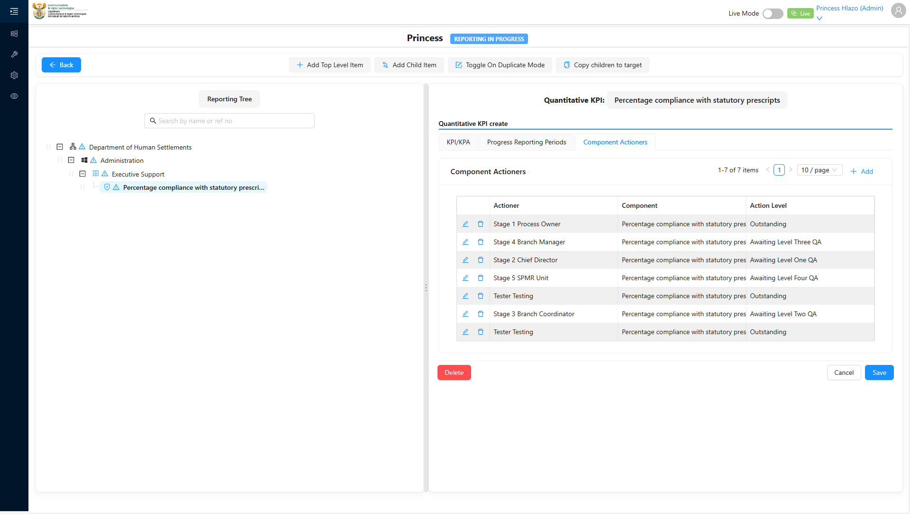
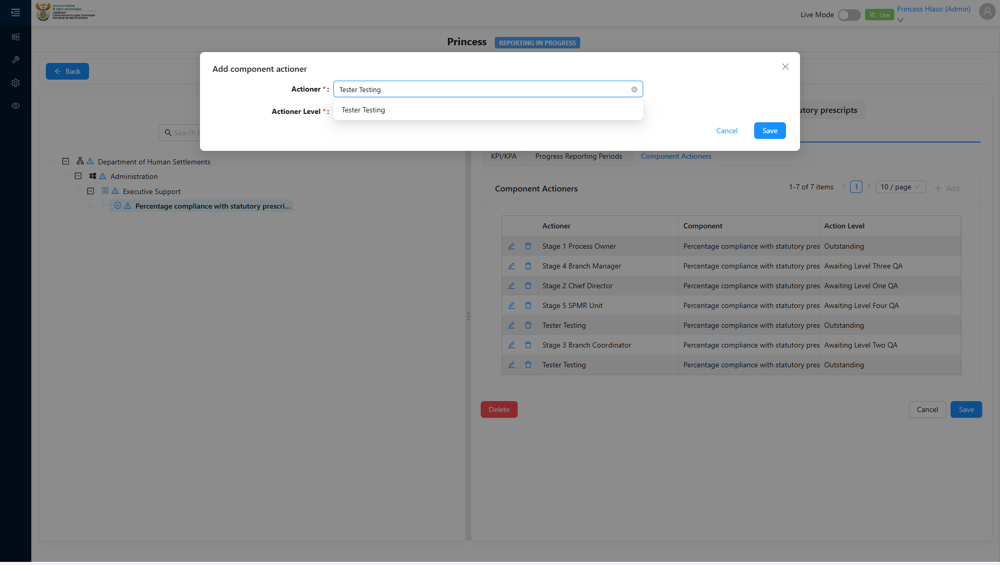
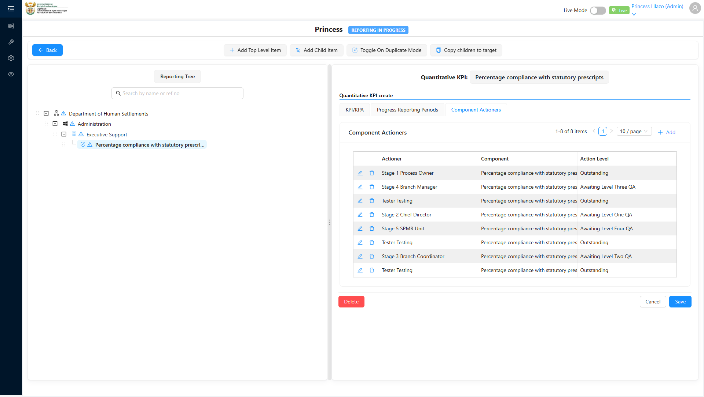

# Report: EPM — TC-109448 New User can be assigned as a Component Actioner (Stage 1..5) immediately after registration (INTEGRATION)

**Date:** 2026-08-12 15:19 UTC
**Plan:** test-plans/user-management/epm-register-new-user-component-actioner.md
**Spec:** test-plans/user-management/epm-register-new-user-component-actioner.spec.ts
**Cases:** TC-109448
**Execution Mode:** ai-driven (headed Chromium via Playwright, single test case only)
**Result:** PASSED
**Duration:** ~90s (`1 passed (1.4m)`)
**Verdict:** both ADO steps and their expected results met · 0 defects against this test case

**ADO:** org `boxfusion` · project **PD-Epm** · plan **108745** (*EPM-QA — Functional Test Plan v2.0*) ·
suite **109504** (*03 · EPM · User Management*) · case **109448** · point **31266**
**Environment:** QA — `https://pd-epm-adminportal-qa.shesha.app` · API `https://pd-epm-api-qa.shesha.app`
**Login:** admin.PrincessH / 123qwe (administrator)
**Navigation (QA-supplied):** Manage Performance Report › Open report › View Tree › expand tree fully ›
click **Emmanuel_QKPI** › **Component Actioners** tab › **Add** › search username in **Actioner** ›
**Actioner Level: Outstanding** (Stage 1 / action level 20) › **Save**

## Summary

| Total Assertions | Passed | Failed | Skipped |
|------------------|--------|--------|---------|
| 10 | 10 | 0 | 0 |

Only test case 109448 was executed — the last of the four cases in suite 109504 (109445–109448), all now
covered across this session's runs.

## Navigation discovery (this case required more than the ADO steps alone)

ADO's steps ("Open a Key Performance Indicator Component and add a Component Actioner row") don't name a
menu path. QA supplied the concrete click path (Manage Performance Report › Open report › View Tree ›
expand › click the KPI component › Component Actioners tab › Add › search username › Actioner Level:
Outstanding › Save), which the spec follows exactly, with one adaptation:

- No "Manage Performance Report" list page was found in the sidebar menu. The Epm sidebar's "Report on
  progress" (`/dynamic/Epm/kpi-component-progress-report-v3`) is a personalised inbox-style view and
  showed **0 items** for this account. Since QA's only Performance Report ("Emmanuel_Test_Report") was
  confirmed via the API, the spec navigates directly to
  `/dynamic/Epm/performance-report-details-view?id=<its id>` — functionally equivalent to "Open report,"
  and from there **View Tree** works exactly as described.
- Confirmed live: **"Component" (the reporting-tree instance) is a distinct entity from "Component
  Definition"** (the Adminstration-menu admin grid) — same display names (`Emmanuel_QKPI`, refNo
  `QKPI_1`) but different ids. The Component Actioner grid references the **Component** instance, reached
  only via the reporting tree, not the Component Definition admin grid.
- Confirmed live: **Actioner Level 20 (Stage 1) is labelled "Outstanding"** in the select — matches the
  existing two rows already at that level (`lvl outstanding`, `Bonolo Nthejane`), so multiple actioners at
  the same level is not a conflict.

## Step Results

### SETUP — "A user has just been created."
- [PASS] Register New User modal opened, filled and submitted
- [PASS] `POST 200 https://pd-epm-api-qa.shesha.app/api/services/app/UserManagement/Create` — user
  `tc448_4481786547849237` (TC448 User849237) created

### STEP 1 (implicit) — Open the KPI Component's Component Actioners tab
- [PASS] Navigated to the Performance Report ("Emmanuel_Test_Report") and clicked **View Tree**
- [PASS] Reporting tree expanded fully: `Emmanuel_Department → Emmanuel_Prog → Emmanuel_Sub_Prog →
  Emmanuel_QKPI`
- [PASS] Clicked **Emmanuel_QKPI** — opened its form with tabs **KPI/KPA · Progress Reporting Periods ·
  Component Actioners**
- [PASS] **Component Actioners** tab clicked — grid showed 10 pre-existing rows



### STEP 2 — Open a KPI Component and add a Component Actioner row
- [PASS] Clicked **Add** — modal "Add component actioner" opened with **Actioner\*** and **Actioner
  Level\*** selects
- [PASS] Clicked Actioner select and typed the newly-created **username**
  (`tc448_4481786547849237`) into the search box

- **[PASS] EXPECTED: User dropdown includes the newly-created user** — exactly one option returned:
  `"TC448 User849237"` (the linked Person's display name) — confirming the Actioner search matches
  against the **username**, not just the displayed name



- [PASS] Selected the option — Actioner field now reads `"TC448 User849237"`

### STEP 3 — Assign the user at Stage 1 (action level 20)
- [PASS] Clicked Actioner Level select — chose **"Outstanding"** (confirmed = action level 20 / Stage 1)
- [PASS] Clicked **Save** — `POST 200 https://pd-epm-api-qa.shesha.app/api/dynamic/Epm/ComponentActioner/Crud/Create`

```json
{ "actionLevel": 20,
  "actioner": { "_displayName": "TC448 User849237", "id": "7f414fc8-e3e0-4859-bb3b-16ea7d59c50e" },
  "component": { "_displayName": "Emmanuel_QKPI", "id": "3972b011-7078-4dec-851f-0e3ea7d279f1" },
  "id": "1546f4b5-11e5-46e3-9635-0fc2050befe9" }
```

- **[PASS] EXPECTED: Component Actioner row saved with the new user** — modal closed, new row
  `"TC448 User849237"` visible in the Component Actioners grid
- [PASS] Corroborated via `GET .../ComponentActioner/Crud/GetAll`: 3 rows now hold action level 20 for
  `Emmanuel_QKPI` — the two pre-existing (`lvl outstanding`, `Bonolo Nthejane`) plus the new one



## Fix applied during this run

The registration setup step initially timed out clicking **Register New User** — Playwright's trace
showed a stale hover-flyout link (`User Management`, from the just-completed Administration navigation)
still overlapping the button and intercepting the click for the full 120s timeout. Added a
`mouse.move` + short wait before the click to let the flyout fully close; the retry succeeded cleanly.
This is now in the spec (`epm-register-new-user-component-actioner.spec.ts`) but not yet ported back to
the sibling TC-109445/446/447 specs, which have not hit this race in their runs so far.

## Azure DevOps publication — BLOCKED

Same PAT scope limitation as TC-109446/109447/109437 (see `epm-qa-credentials-and-ado-pat-scope`):

| Call | Result |
|---|---|
| `GET /_apis/wit/workitems/109448`, `GET /_apis/test/Plans/108745/Suites/109504/points` | **200** |
| `POST /PD-Epm/_apis/test/runs` (api-version 7.1) | **401 Unauthorized**, `WWW-Authenticate: Basic`, empty body |

To publish, the PAT needs **Test Management: Read & write** (`vso.test_write`); then point **31266**
can be set to **Passed** with the step-level detail above.

## Test data left in QA

This run writes 1 user (plus its linked Person) and 1 ComponentActioner row, with no teardown, matching
the case's own steps:

| Field | Value |
|---|---|
| Username | `tc448_4481786547849237` |
| Person / Actioner display name | `TC448 User849237` |
| ComponentActioner row id | `1546f4b5-11e5-46e3-9635-0fc2050befe9` (level 20, component `Emmanuel_QKPI`) |

## Reproduction

```bash
# from the hub root
HUB_PROJECT=EPM HEADED=1 PW_CHANNEL=chromium npx playwright test \
  projects/EPM/test-plans/user-management/epm-register-new-user-component-actioner.spec.ts
```
