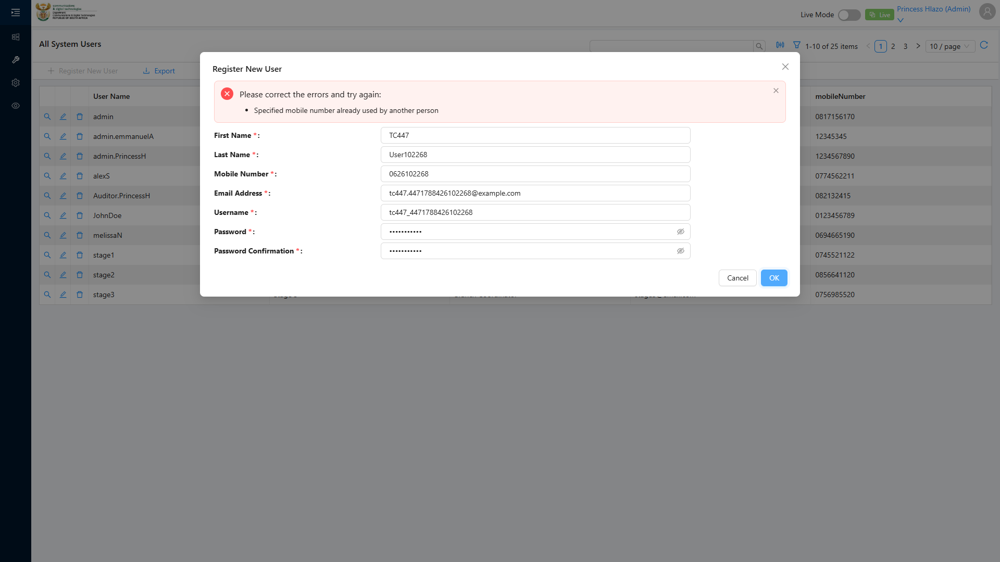
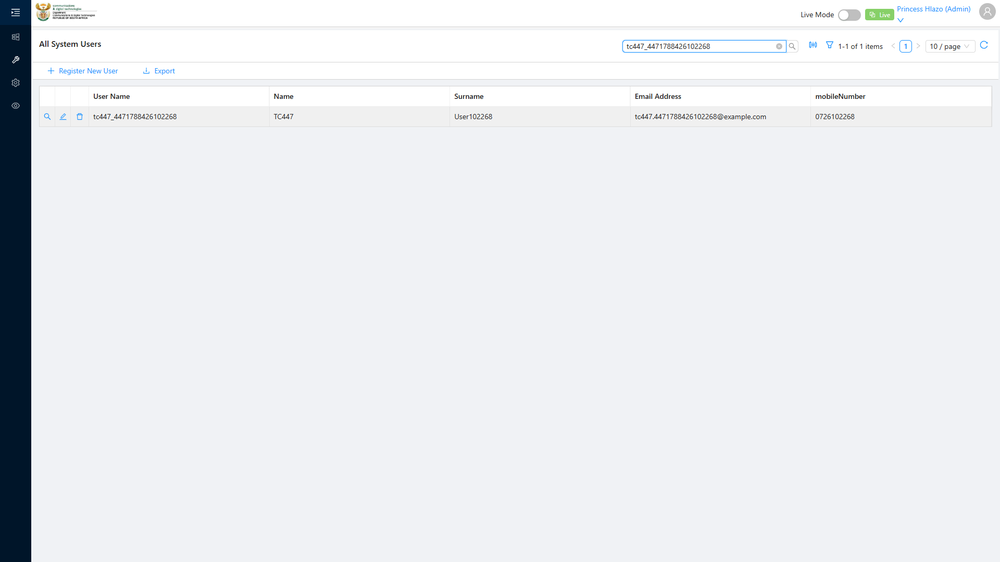

# Report: EPM — TC-109447 Mobile number uniqueness enforced at server — duplicate rejected (EDGE)

**Date:** 2026-08-12 14:11 UTC
**Plan:** test-plans/user-management/epm-register-new-user-mobile-uniqueness.md
**Spec:** test-plans/user-management/epm-register-new-user-mobile-uniqueness.spec.ts
**Cases:** TC-109447
**Execution Mode:** ai-driven (headed Chromium via Playwright, single test case only)
**Result:** PASSED
**Duration:** ~174s (`1 passed (2.9m)`)
**Verdict:** both ADO steps and their expected results met · 0 defects against this test case

**ADO:** org `boxfusion` · project **PD-Epm** · plan **108745** (*EPM-QA — Functional Test Plan v2.0*) ·
suite **109504** (*03 · EPM · User Management*) · case **109447** · point **31265**
**Environment:** QA — `https://pd-epm-adminportal-qa.shesha.app` · API `https://pd-epm-api-qa.shesha.app`
**Login:** admin.PrincessH / 123qwe (administrator)
**Navigation:** **Administration** › User Management → `/dynamic/shesha/users` → **Register New User**
**Form:** modal *Register New User*

## Summary

| Total Assertions | Passed | Failed | Skipped |
|------------------|--------|--------|---------|
| 9 | 9 | 0 | 0 |

Only test case 109447 was executed. Sibling cases 109445, 109446 and 109448 in the same suite were
covered in separate earlier runs (109445, 109446) or not run (109448) in this session.

## Deviation from ADO's literal precondition

ADO's precondition reads "A user exists with mobile `0821234567`." That literal mobile did not exist in
QA at the time of writing (checked via `Person/Crud/GetAll` — 22 records, none holding it), and hardcoding
it would make the case non-repeatable: the second run would fail *creating* the baseline user with the
same "mobile already used" error the case is trying to test, before ever reaching step 2. The spec instead
creates its own token-unique baseline user as a setup step, then reuses that mobile for step 2 — same
intent (register against an already-taken mobile), reproducible on every run. See the `.md`'s
Preconditions note.

## Step Results

### SETUP — baseline user (satisfies "a user exists with mobile X")
- [PASS] Register New User modal opened, filled and submitted for a baseline user
- [PASS] `POST 200 https://pd-epm-api-qa.shesha.app/api/services/app/UserManagement/Create` — baseline
  user `tc447base_4471786543689986` created with mobile `0643689986`
- [PASS] Modal closed on success

### STEP 2 — Attempt to Register New User with the same mobile
- [PASS] Second Register New User modal opened and filled with different First Name / Last Name / Email /
  Username but the **same mobile** (`0643689986`) as the baseline — confirmed the mobile field value
  matched before submitting
- **[PASS] EXPECTED: Server rejects with unique-constraint error** — actual response:

```json
{ "success": false,
  "error": { "message": "Your request is not valid!",
             "details": "The following errors were detected during validation.\r\n - Specified mobile number already used by another person\r\n",
             "validationErrors": [{ "message": "Specified mobile number already used by another person" }] } }
```

  `POST 400 .../UserManagement/Create` — a genuine HTTP 400 with a field-level validation error, not just
  a 200-wrapped failure.
- [PASS] Corroborated via API: `Person/Crud/GetAll` shows exactly **1** person holding mobile
  `0643689986` (the baseline) — the duplicate attempt did not persist



### STEP 3 — Change the mobile and retry
- [PASS] Mobile field changed to `0743689986` (all other fields unchanged from the failed step-2 attempt)
- [PASS] `POST 200 https://pd-epm-api-qa.shesha.app/api/services/app/UserManagement/Create`

```json
{ "userName": "tc447_4471786543689986", "firstName": "TC447", "lastName": "User689986",
  "mobileNumber": "0743689986", "emailAddress": "tc447.4471786543689986@example.com",
  "userId": 20, "id": "58725e8a-4c6e-43ad-97b0-d88a2edd53a4" }
```

- **[PASS] EXPECTED: Save succeeds** — modal closed; no toast rendered within 5s (best-effort check
  only, per the known toast unreliability documented in `epm-register-new-user.md`), so verification used
  the user list's **search bar**: filtering by `tc447_4471786543689986` returned the new row
- [PASS] `GET 200 .../Shesha/User/Crud/GetAll` confirms the record persists (`userId 20`)



## Azure DevOps publication — BLOCKED

Same PAT scope limitation as TC-109446 and TC-109437 (see `epm-qa-credentials-and-ado-pat-scope`):

| Call | Result |
|---|---|
| `GET /_apis/wit/workitems/109447`, `GET /_apis/test/Plans/108745/Suites/109504/points` | **200** |
| `POST /PD-Epm/_apis/test/runs` (api-version 7.1) | **401 Unauthorized**, `WWW-Authenticate: Basic`, empty body |

To publish, the PAT needs **Test Management: Read & write** (`vso.test_write`); then point **31265**
can be set to **Passed** with the step-level detail above.

## Test data left in QA

This run writes 2 users (plus their linked Persons) with no teardown, matching the case's own steps:

| Role | Username | User id | Mobile |
|---|---|---|---|
| Baseline (setup) | `tc447base_4471786543689986` | 19 (inferred) | `0643689986` |
| Successful retry | `tc447_4471786543689986` | 20 | `0743689986` |

## Reproduction

```bash
# from the hub root
HUB_PROJECT=EPM HEADED=1 PW_CHANNEL=chromium npx playwright test \
  projects/EPM/test-plans/user-management/epm-register-new-user-mobile-uniqueness.spec.ts
```
