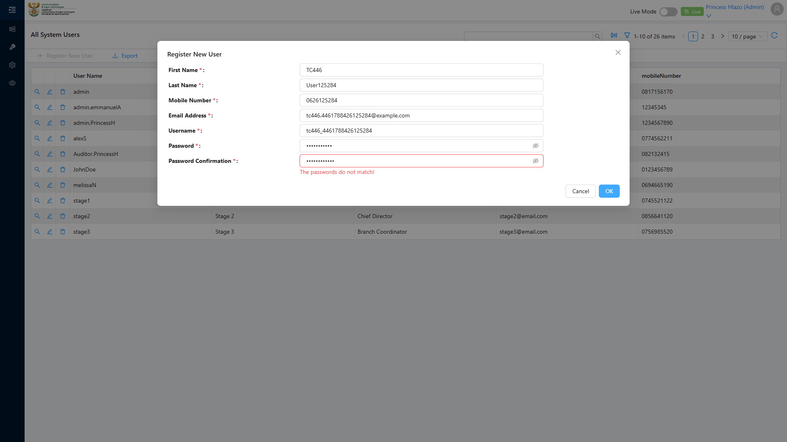
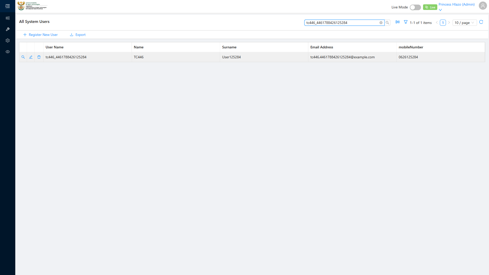

# Report: EPM — TC-109446 Reject Register New User when the two Password fields do not match (NEGATIVE)

**Date:** 2026-08-12 14:00 UTC
**Plan:** test-plans/user-management/epm-register-new-user-password-mismatch.md
**Spec:** test-plans/user-management/epm-register-new-user-password-mismatch.spec.ts
**Cases:** TC-109446
**Execution Mode:** ai-driven (headed Chromium via Playwright, single test case only)
**Result:** PASSED
**Duration:** ~84s (`1 passed (1.4m)`)
**Verdict:** both ADO steps and their expected results met · 0 defects against this test case

**ADO:** org `boxfusion` · project **PD-Epm** · plan **108745** (*EPM-QA — Functional Test Plan v2.0*) ·
suite **109504** (*03 · EPM · User Management*) · case **109446** · point **31264**
**Environment:** QA — `https://pd-epm-adminportal-qa.shesha.app` · API `https://pd-epm-api-qa.shesha.app`
**Login:** admin.PrincessH / 123qwe (administrator)
**Navigation:** **Administration** › User Management → `/dynamic/shesha/users` → **Register New User**
**Form:** modal *Register New User*

## Summary

| Total Assertions | Passed | Failed | Skipped |
|------------------|--------|--------|---------|
| 9 | 9 | 0 | 0 |

Only test case 109446 was executed. Sibling cases 109445, 109447 and 109448 in the same suite were
**not** run in this session (109445 was covered in a separate earlier run — see
`epm-register-new-user.md`).

## Step Results

### Preconditions
- [PASS] Signed in as administrator, bearer token recovered from `localStorage`
- [PASS] Register New User modal opened via **Administration** › **User Management**
- [PASS] First Name, Last Name, Mobile Number, Email Address and Username filled with unique values:

| Field | Value |
|---|---|
| First Name | `TC446` |
| Last Name | `User019660` |
| Mobile Number | `0643019660` |
| Email Address | `tc446.4461786543019660@example.com` |
| Username | `tc446_4461786543019660` |

### STEP 2 — Enter different values in Password and Password Confirmation
- [PASS] Password field filled `Test@019660`, Password Confirmation filled `Test@019660X` — confirmed
  the two field values differ before proceeding
- [PASS] Clicked **OK** — no `POST` to `User`/`Person`/`Register` observed within 5s (submission was
  blocked client-side)
- **[PASS] EXPECTED: client-side validation rejects with "passwords must match"** — actual message
  observed: **"The passwords do not match!"** (same substance, different exact wording from the ADO
  step text — logged, not treated as a defect)
- [PASS] Modal remained open after the blocked submit attempt



### STEP 3 — Correct the confirmation
- [PASS] Password Confirmation corrected to `Test@019660`, both fields now read back equal
- [PASS] Clicked **OK** — `POST 200 https://pd-epm-api-qa.shesha.app/api/services/app/UserManagement/Create`

```json
{ "userName": "tc446_4461786543019660", "firstName": "TC446", "lastName": "User019660",
  "mobileNumber": "0643019660", "emailAddress": "tc446.4461786543019660@example.com",
  "userId": 18, "id": "ef2dc56e-0e7a-4d13-8add-380f9ab1ece9" }
```

- **[PASS] EXPECTED: Submit succeeds** — modal closed; no toast rendered within 5s (best-effort check
  only, per the known toast unreliability documented in `epm-register-new-user.md`), so verification
  used the user list's **search bar**: filtering by `tc446_4461786543019660` returned the new row
- [PASS] `GET 200 .../Shesha/User/Crud/GetAll` confirms the record persists (`userId 18`)



## Azure DevOps publication — BLOCKED

The run result could **not** be published back to ADO. The supplied PAT is **read-only** for test writes
(same scope limitation as the previously documented PAT — see `epm-qa-credentials-and-ado-pat-scope`):

| Call | Result |
|---|---|
| `GET /_apis/wit/workitems/109446`, `GET /_apis/test/Plans/108745/Suites/109504/points` | **200** |
| `POST /PD-Epm/_apis/test/runs` (api-version 7.1) | **401 Unauthorized**, `WWW-Authenticate: Basic`, empty body |

To publish, the PAT needs **Test Management: Read & write** (`vso.test_write`); then point **31264**
can be set to **Passed** with the step-level detail above.

## Test data left in QA

This run writes 1 user (plus its linked Person) with no teardown, matching the case's own steps (no
teardown specified):

| Field | Value |
|---|---|
| Username | `tc446_4461786543019660` |
| User id | `18` / `ef2dc56e-0e7a-4d13-8add-380f9ab1ece9` |
| Email | `tc446.4461786543019660@example.com` |

## Reproduction

```bash
# from the hub root
HUB_PROJECT=EPM HEADED=1 PW_CHANNEL=chromium npx playwright test \
  projects/EPM/test-plans/user-management/epm-register-new-user-password-mismatch.spec.ts
```
