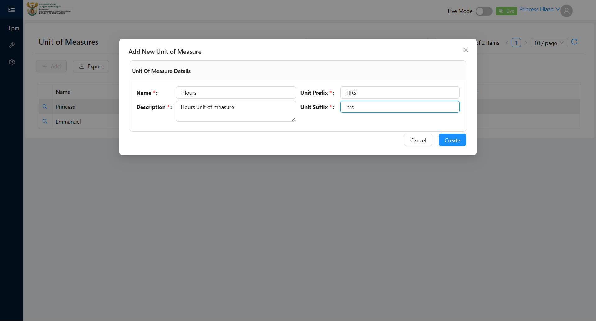
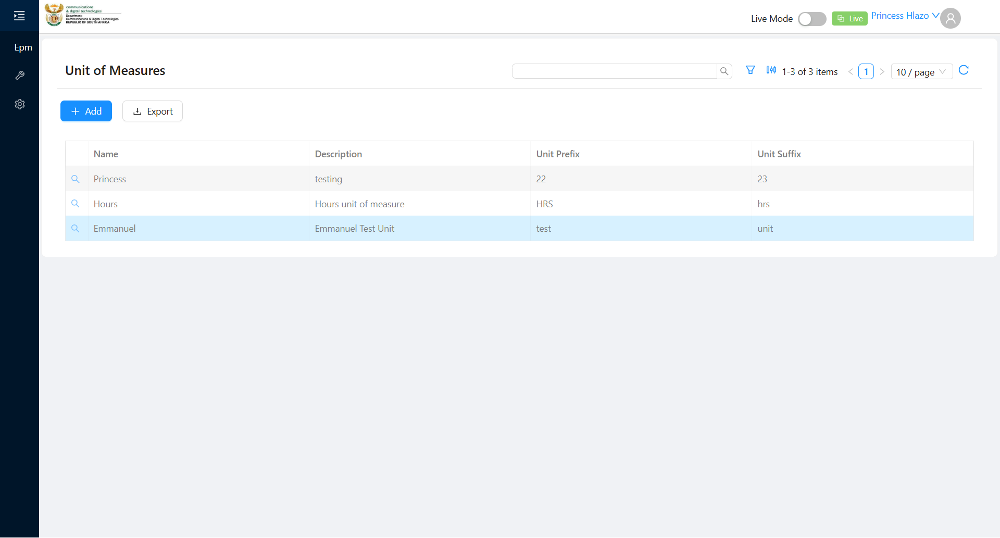

# Report: EPM — TC-109437 Create Unit of Measure (POSITIVE)

**Date:** 2026-08-12 08:55 UTC
**Plan:** test-plans/foundation-reference-data/epm-unit-of-measure.md
**Spec:** test-plans/foundation-reference-data/epm-unit-of-measure.spec.ts
**Cases:** TC-109437
**Execution Mode:** ai-driven (headed Chromium via Playwright, single test case only)
**Result:** PASSED
**Duration:** ~150s of app-driven execution (login 57s + 48s, grid 12s, modal 6s)
**Verdict:** all 3 ADO steps and both expected results met · 3 environment observations logged · 0 defects against this test case

**ADO:** org `boxfusion` · project **PD-Epm** · plan **108745** (*EPM-QA — Functional Test Plan v2.0*) ·
suite **109506** (*01 · EPM · Unit of Measure management*) · case **109437** · point **31271**
**Environment:** QA — `https://pd-epm-adminportal-qa.shesha.app` · API `https://pd-epm-api-qa.shesha.app`
**Login:** admin.PrincessH / 123qwe → resolved to **Princess Hlazo**, `creatorUserId 13`
**Navigation:** Epm › **Adminstration** › Unit of Measure → `/dynamic/Epm/unit-of-measure`
**Form:** modal *Add New Unit of Measure* → section *Unit Of Measure Details*

## Summary

| Total Assertions | Passed | Failed | Skipped |
|------------------|--------|--------|---------|
| 11 | 11 | 0 | 0 |

Only test case 109437 was executed. Sibling cases 109439 (duplicate name) and 109440 (dropdown
integration) in the same suite were **not** run.

## Step Results

### Preconditions
- [PASS] Signed in as administrator — landed on `https://pd-epm-adminportal-qa.shesha.app/`, header shows **Princess Hlazo**
- [PASS] Menu path resolves — hover **Epm** reveals the submenu; hover **Adminstration** reveals **Unit of Measure** → `href=/dynamic/Epm/unit-of-measure`
- [PASS] Unit of Measure list reachable — grid rendered with columns **Name · Description · Unit Prefix · Unit Suffix**
- Baseline state: `"Hours"` **not** present before the run, so the test case's literal name `"Hours"` was used unmodified

### STEP 1 — Click + Add and fill Name = "Hours", Description, Prefix, Suffix (each ≥ 3 chars)
- [PASS] **+ Add** opens the create modal — title **"Add New Unit of Measure"**
- [PASS] All four fields present and mandatory — labels `Name *`, `Description *`, `Unit Prefix *`, `Unit Suffix *` (Description is a `<textarea>`, the other three `<input type=text>`)
- [PASS] Fields filled, values read back from the DOM:

| Field | Value entered | Length | Read back |
|---|---|---|---|
| Name | `Hours` | 5 | ✅ `Hours` |
| Description | `Hours unit of measure` | 21 | ✅ `Hours unit of measure` |
| Unit Prefix | `HRS` | 3 | ✅ `HRS` |
| Unit Suffix | `hrs` | 3 | ✅ `hrs` |

- **[PASS] EXPECTED: modal Create button enabled** — `Create` matched, `disabled=false`, `aria-disabled=null`. Modal footer offers `Cancel` + `Create`.



### STEP 2 — Click Create
- [PASS] Create accepted — `POST 200 https://pd-epm-api-qa.shesha.app/api/dynamic/Epm/UnitOfMeasure/Crud/Create`, response `success: true, error: null`
- **[PASS] EXPECTED (a): success toast** — toast text observed: **"Unit of Measure created successfully."**
- **[PASS] EXPECTED (b): row visible in list** — modal closed, grid refreshed from **2 items → 3 items**, new row renders `Hours | Hours unit of measure | HRS | hrs`

Created record from the POST response:

```json
{ "name": "Hours", "description": "Hours unit of measure",
  "unitPrefix": "HRS", "unitSuffix": "hrs",
  "creationTime": "2026-08-12T10:55:57.6681643+02:00", "creatorUserId": 13,
  "id": "da2afc7d-52c5-4a4d-8dd6-48582eb485c2" }
```



### STEP 3 — Verify via UnitOfMeasure Crud GetAll
- [PASS] `GET 200 https://pd-epm-api-qa.shesha.app/api/dynamic/Epm/UnitOfMeasure/Crud/GetAll?maxResultCount=100` — 3 items returned
- **[PASS] EXPECTED: record persists with the 4 fields** — the persisted record matches the submitted values field-for-field:

| Field | Submitted | GetAll returned | Match |
|---|---|---|---|
| `name` | `Hours` | `Hours` | ✅ |
| `description` | `Hours unit of measure` | `Hours unit of measure` | ✅ |
| `unitPrefix` | `HRS` | `HRS` | ✅ |
| `unitSuffix` | `hrs` | `hrs` | ✅ |

`id` `da2afc7d-52c5-4a4d-8dd6-48582eb485c2` · `isDeleted: false` · `creatorUserId: 13`. Verified through
the **Crud/GetAll** endpoint the test case names, not the grid's `Entities/GetAll` call.

## Environment observations (not defects against TC-109437)

These did not affect any assertion in this test case, but were reproducible and are worth raising
separately.

| # | Severity | Observation |
|---|---|---|
| 1 | Medium | **API cold-start ≈ 56s.** A bare `curl` of `https://pd-epm-api-qa.shesha.app/swagger/index.html` took **56.3s** on a cold backend. While cold, the portal is effectively unusable: the login form took **>120s** to render inputs on the first attempt (the run had to be retried), and `/dynamic/Epm/unit-of-measure` took **~146s** to paint, pinning the browser main thread throughout. Warm, the same pages took 57s and 12s. |
| 2 | Low | **Menu label misspelt.** The submenu under **Epm** reads **"Adminstration"** — missing the second *i*. The platform-level menu one row down is spelt correctly ("Administration"), so the two are inconsistent. |
| 3 | Low | **`GET /api/v1/Epm/Persons/GetCurrentLoggedInPerson` returns 401** on every page load, immediately after a successful login, then aborts. It was the only HTTP ≥ 400 in the run and had no visible functional effect, but it fires on every navigation. |

Also noted while reading the grid: a row **`Princess / testing / 22 / 23`** appeared mid-session
(10:44), carrying a **2-character** Unit Prefix and Unit Suffix. It was not created by this automation —
`creatorUserId 13` is the same `admin.PrincessH` account, so it came from manual use of QA. TC-109437 only
covers the ≥ 3-char positive path, so this run asserts nothing about it, but a stored 2-char prefix
suggests no minimum-length rule is enforced on those fields — worth a dedicated negative case in
suite 109506.

## Azure DevOps publication — BLOCKED

The run result could **not** be published back to ADO. The supplied PAT is **read-only**:

| Call | Result |
|---|---|
| `GET /_apis/projects`, `/_apis/testplan/plans`, `/_apis/testplan/Plans/108745/Suites/109506/TestCase`, `/_apis/wit/workitems/109437` | **200** |
| `POST /PD-Epm/_apis/test/runs` (api-version 5.0, 6.0, 7.0, 7.1) | **401 Unauthorized**, `WWW-Authenticate: Basic`, empty body |

Reading the plan, suite and test case worked throughout with the same token, so this is a scope
limitation rather than an expired credential. To publish, the PAT needs **Test Management: Read & write**
(`vso.test_write`); then point **31271** can be set to **Passed** with the step-level detail above.

## Reproduction

```bash
# from the hub root
HEADED=1 HUB_PROJECT=EPM TC_UOM_NAME="Hours-$(date +%s)" npx playwright test \
  projects/EPM/test-plans/foundation-reference-data/epm-unit-of-measure.spec.ts

# or through the canonical hub runner
node scripts/run-plan.js projects/EPM/test-plans/foundation-reference-data/epm-unit-of-measure.md
```

**The spec is verified.** It was executed headed against QA on 2026-08-12 and passed in **16.5s**
against a warm backend (`1 passed (17.8s)`). Note the run recorded *above* was driven by a standalone
Node script — the spec is a transcription of it, since the hub root had no `node_modules/` at the time.

Getting the spec green took two fixes that only surfaced by running it, both now documented inline:

1. **`.first()` matched an off-screen node.** rc-menu keeps a second copy of each sidebar item for the
   collapsed inline menu, so `locator('.ant-menu-submenu-title', { hasText: /^Adminstration$/ }).first()`
   resolved to the hidden copy and `hover()` failed with *"Element is outside of the viewport"* — even
   though the flyout was demonstrably open on screen. Fixed with `.locator('visible=true')`, plus a
   settle wait after each hover (the flyout animates, so `toBeVisible()` can pass mid-animation while
   the box is still moving).
2. **`viewport: null` is not usable here.** It fails at context creation with *"deviceScaleFactor option
   is not supported with null viewport"*, because the hub config's `devices['Desktop Chrome']` sets a
   scale factor. A fixed `1920x1080` viewport is used instead.

Two remaining constraints, also documented inline: the spec pins `channel: 'chrome'` (override via
`PW_CHANNEL=msedge`) because the locally cached Playwright build wants an uninstalled chromium revision;
and it overrides the hub config's 90s test / 10s expect / 15s action / 30s navigation timeouts to
`SLOW = 420s`, since a cold EPM QA backend needs >120s just to paint the login form.

**Always pass `TC_UOM_NAME`.** The default name `Hours` now collides with the record this run created,
and the failure would be the unique-name constraint — TC-109439's subject, not this case's.

## Test data left in QA

Every green run of this case writes a row — the case has no teardown, because the ADO steps specify none.
`UnitOfMeasure/Crud/GetAll` now returns 5 records; three are from this session:

| Created | Name | Prefix / Suffix | id | Origin |
|---|---|---|---|---|
| 2026-08-06 | `Emmanuel` | `test` / `unit` | `368e8af2-91fa-47b7-8b60-a4a31189fb56` | pre-existing |
| 10:44 | `Princess` | `22` / `23` | `2a163d45-b494-4b66-9d55-2b1089a0eddd` | **not** this automation — same `admin.PrincessH` account (`creatorUserId 13`), i.e. manual use of QA during the session |
| 10:55 | `Hours` | `HRS` / `hrs` | `da2afc7d-52c5-4a4d-8dd6-48582eb485c2` | **this TC-109437 run** — the evidence for the result above; keep until the ADO point is recorded |
| 11:12 | `Hours-spec-1786525954` | `HRS` / `hrs` | `88afffa5-d24e-43e7-86a5-d580200adbb0` | spec verification, system Chrome — safe to delete |
| 11:18 | `Hours-chromium-1786526263` | `HRS` / `hrs` | `fafd6346-a4e2-4293-8f32-a4902021fbd8` | spec verification, bundled Chromium — safe to delete |

## Browser coverage

The spec passes on both engines, driven headed via `HEADED=1`:

| Browser | How | Version | Result |
|---|---|---|---|
| System Chrome | default (`channel: 'chrome'`) | 150.0.7871.187 | ✅ `1 passed (17.8s)` |
| Bundled Chromium | `PW_CHANNEL=chromium` | 148.0.7778.96 | ✅ `1 passed (19.6s)` |

`PW_CHANNEL=chromium` maps to `channel: undefined`, which is what selects Playwright's own build —
`chromium-1223`, already present locally. Any other value is passed through as a channel name
(`PW_CHANNEL=msedge`).
