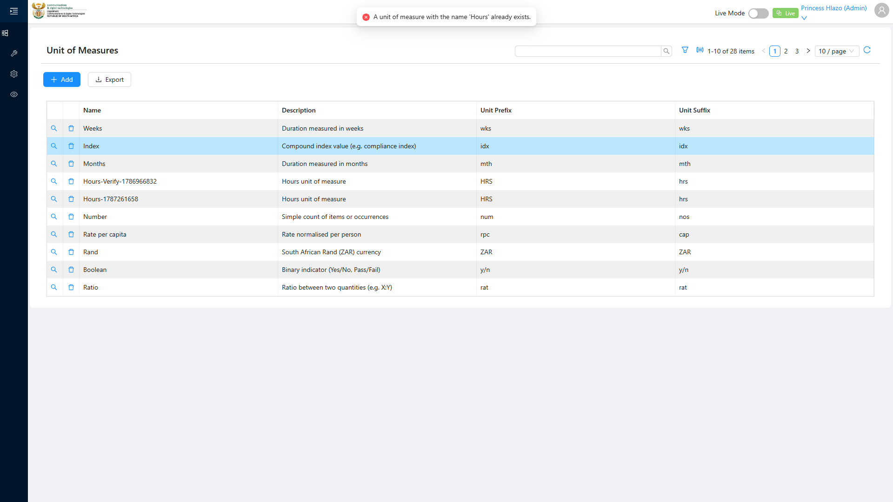
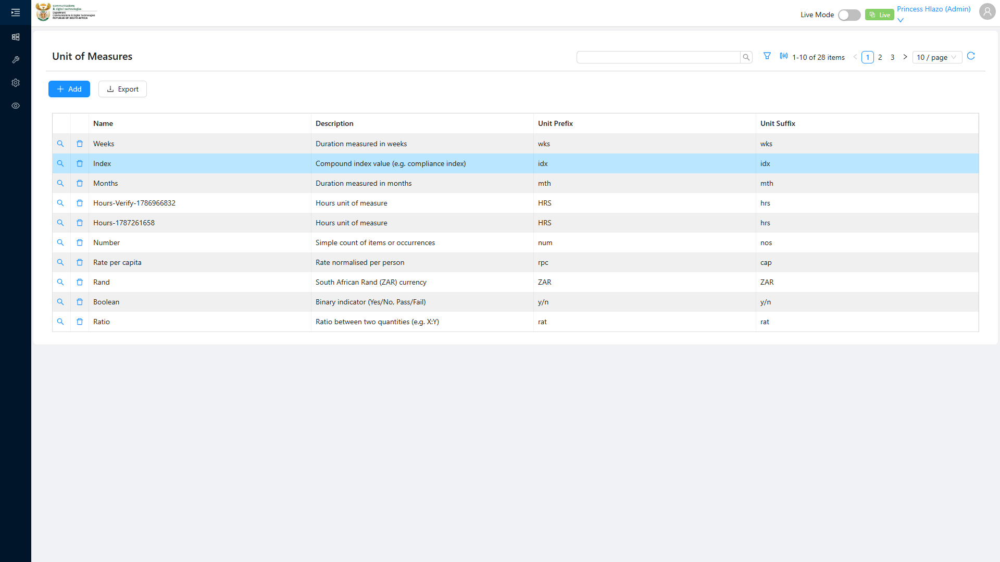

# Report: EPM — TC-109439 Duplicate Unit of Measure Name rejected (EDGE)

**Date:** 2026-08-12 09:32 UTC
**Plan:** test-plans/foundation-reference-data/epm-unit-of-measure-duplicate-name.md
**Spec:** test-plans/foundation-reference-data/epm-unit-of-measure-duplicate-name.spec.ts
**Cases:** TC-109439
**Execution Mode:** playwright-script (headed, bundled Chromium 148.0.7778.96)
**Result:** PASSED
**Duration:** 19.7s (test body) · 20.7s wall — re-verified after the case was split into its own plan/spec pair
**Verdict:** both ADO steps and both expected results met · unique constraint is properly enforced · 0 defects · 1 spec flake found and fixed

**ADO:** org `boxfusion` · project **PD-Epm** · plan **108745** (*EPM-QA — Functional Test Plan v2.0*) ·
suite **109506** · case **109439** · point **31273** · tags `Edge; EPM-Redesign-2026-08-11`
**Environment:** QA — `https://pd-epm-adminportal-qa.shesha.app` · API `https://pd-epm-api-qa.shesha.app`
**Login:** admin.PrincessH / 123qwe → **Princess Hlazo** (`creatorUserId 13`)
**Navigation:** Epm › **Adminstration** › Unit of Measure → `/dynamic/Epm/unit-of-measure`
**Command:** `HEADED=1 HUB_PROJECT=EPM PW_CHANNEL=chromium npx playwright test …epm-unit-of-measure-duplicate-name.spec.ts`

Only test case 109439 was executed — it is the sole test in its own spec, so no `--grep` is needed.
TC-109437 was not re-run; 109440 was not run.

## Summary

| Total Assertions | Passed | Failed | Skipped |
|------------------|--------|--------|---------|
| 7 | 7 | 0 | 0 |

## Step Results

### Precondition — Unit "Hours" already exists
- [PASS] Asserted against `Crud/GetAll` **before** touching the UI, so a missing fixture would report as
  a precondition failure rather than as a bogus "duplicate was allowed":
  `"Hours"` present, `id=da2afc7d-52c5-4a4d-8dd6-48582eb485c2` — the record created by the
  **TC-109437** run earlier today.

### STEP 1 — Attempt Create another "Hours"
Filled the *Add New Unit of Measure* modal with the colliding name and deliberately different other
fields, so that any row that did get written would be unambiguously identifiable:

| Field | Value |
|---|---|
| Name | `Hours` ← collides |
| Description | `Duplicate attempt — TC-109439` |
| Unit Prefix | `DUP` |
| Unit Suffix | `dup` |

- [PASS] `Create` button was enabled (no client-side pre-block — the check is server-side)
- **[PASS] EXPECTED: response returns unique-constraint error** —
  `POST https://pd-epm-api-qa.shesha.app/api/dynamic/Epm/UnitOfMeasure/Crud/Create` → **HTTP 400**

```json
{ "result": null, "success": false,
  "error": { "code": 0, "message": "Your request is not valid!",
    "details": "The following errors were detected during validation.\r\n - A unit of measure with the name 'Hours' already exists.\r\n",
    "validationErrors": [ { "message": "A unit of measure with the name 'Hours' already exists.",
                            "members": ["name"] } ] },
  "__abp": true }
```

- [PASS] The error is surfaced to the user, not swallowed — exactly **1** notification element on
  screen, reading **"A unit of measure with the name 'Hours' already exists."**
- [PASS] `validationErrors[0].members` correctly attributes the failure to `name`

The rejection is a real server-side uniqueness check returning a typed ABP validation error, not a
generic 500 — the field-level attribution means the UI can bind it to the Name input.



### STEP 2 — Confirm no duplicate row
- [PASS] List reloaded from the server (full page reload, not just a client-side refresh)
- **[PASS] EXPECTED: list still has one "Hours" row** — `Crud/GetAll` returns exactly **1** record named
  `Hours`, and its id is unchanged: `da2afc7d-52c5-4a4d-8dd6-48582eb485c2` (asserted identical to the
  pre-step id, so the original was neither duplicated nor silently replaced)
- [PASS] Grid still shows **1-5 of 5 items** — unchanged from before the attempt; no `DUP`/`dup` row exists



## No test data added

Unlike TC-109437, this case writes nothing when it passes — the whole point is that the create is
rejected. The QA record count is **unchanged at 5**. This case is therefore safe to re-run repeatedly,
and it is the one case in the suite that *requires* the literal name `Hours` (`TC_UOM_DUP_NAME` overrides
it, but do not randomise it — a unique name would make the test vacuous).

## Spec flake found and fixed

The first execution of this case passed; an immediate re-run **failed** in navigation, before reaching
any assertion:

```
Locator: locator('.ant-menu-submenu-title').filter({ hasText: /^Adminstration$/ })
         .filter({ visible: true }).first()
Expected: visible — element(s) not found
```

The accessibility snapshot at failure showed only the top-level menu (`menuitem "Epm"`,
`"tool Administration"`, `"setting Configurations"`) — the **Epm flyout had never opened**. A single
`hover()` is a race against rc-menu hydration: a hover that lands too early is silently swallowed, and
no amount of waiting afterwards re-triggers it. Fixed by hovering in a retry loop (up to 6 attempts,
moving the pointer away between tries so antd re-fires `mouseenter`), which then passed.

> **TC-109437 still uses the un-retried single-hover pattern** in its own spec
> (`epm-unit-of-measure.spec.ts`). It has passed four consecutive runs, but it is exposed to exactly this
> flake. It was left untouched so its verified status stands on the code that was actually verified —
> porting the retry helper across is a small change plus a re-run, which would write one more `Hours-*`
> row.

An earlier reading of this run appeared to show the error message twice. That was an artefact of the
assertion locator, not the app: `.ant-message-error` is nested *inside* `.ant-message-notice`, so a union
of both matched one toast twice. The locator now targets only outer containers and the run confirms a
single notification. No duplicate-toast defect exists.

## Azure DevOps publication — BLOCKED (unchanged)

Re-tested with the PAT supplied for this request — it is the same token and still read-only:

| Call | Result |
|---|---|
| `GET /_apis/testplan/Plans/108745/Suites/109506/TestPoint/31273` | **200** |
| `POST /PD-Epm/_apis/test/runs` (api-version 7.0) | **401 Unauthorized** |

Point **31273** cannot be set to **Passed** until the PAT is reissued with **Test Management: Read &
write** (`vso.test_write`).

## Environment note

The API cold-start issue recorded against TC-109437 still applies (~56s cold; pages then take minutes).
The API was warmed with a single `curl` before this run, which is why it completed in 30.5s.
