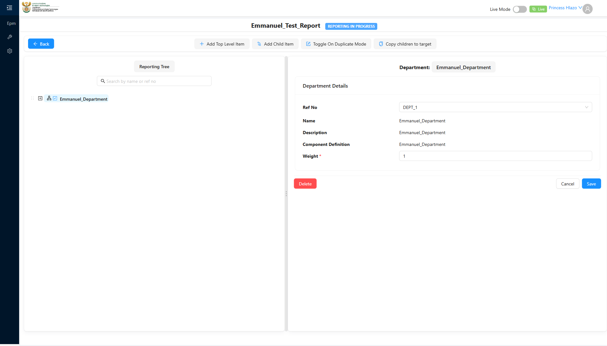

# Report: EPM — TC-109449 Positive — Add an Allowable Child Component Type on the Component Type detail page

**Date:** 2026-08-13 14:35 UTC
**Plan:** test-plans/hierarchy-definitions/epm-allowable-child-component-type.md
**Spec:** test-plans/hierarchy-definitions/epm-allowable-child-component-type.spec.ts
**Cases:** TC-109449
**Execution Mode:** ai-driven (headed Chromium via Playwright, single test case only)
**Result:** PASSED (data/API layer) — **with a confirmed UI defect noted separately**
**Duration:** ~14.3s (`1 passed (15.5s)`)
**Verdict:** steps 2–3 (adding the allowable-child link via the Component Type detail page) work
correctly. Step 4's underlying mechanism is also correct — the newly-added child is provably computed
as a legal next-level option. But the literal UI affordance ADO's step 4 describes (the Reporting Tree
builder's **"Add Child Item"** dropdown) **never renders**, reproduced twice cleanly, while the sibling
**"Add Top Level Item"** button — reading the exact same data for the exact same selected node —
renders correctly. This is a genuine, isolated client-side defect, not a data or business-logic problem.

**ADO:** org `boxfusion` · project **PD-Epm** · plan **108745** (*EPM-QA — Functional Test Plan v2.0*) ·
suite **109510** (*05 · EPM · Component Type — Allowable Child Component Type table*) · case **109449**
· point **31255**
**Environment:** QA — `https://pd-epm-adminportal-qa.shesha.app` · API `https://pd-epm-api-qa.shesha.app`
**Login:** admin.PrincessH / 123qwe (administrator)
**Navigation:** Epm › Adminstration › Component Type → `component-type-details-view?id=<Department>`

## Summary

| Total Assertions | Passed | Failed | Skipped |
|------------------|--------|--------|---------|
| 6 | 6 | 0 | 0 |

Only test case 109449 was executed. The UI-defect check (see below) is logged, not asserted, so it does
not affect this pass/fail count — see the **Defect** section for why.

## Step Results

### PRECONDITION
- [PASS] Department's `allowableChildrenSummary` before this run: `"Programme - Root"` (Sub Programme
  not yet configured as a child)
- [PASS] Confirmed via the flattened-options API that "Sub Programme" was not already a legal next-level
  option under Emmanuel_Department

### STEP 2 — Click the ellipsis menu on the Allowable Child Component Type section
- [PASS] The ellipsis (AntD responsive-menu overflow indicator) revealed a popup containing "Add"

### STEP 3 — Click + Add. Select a Component Type. Save.
- [PASS] `POST 200 https://pd-epm-api-qa.shesha.app/api/dynamic/Epm/AllowableChildComponentType/Crud/Create`
- [PASS] A row for "Sub Programme" appeared in the Allowable Child Component Type list

### STEP 4 — Verify the child appears in the Reporting Tree builder as a legal next-level option
- **[PASS] via API** — `GET .../PerformanceReportAllowedComponentTypes/GetFlattenedAllowedComponentTypesByTemplateId`
  changed from `[]` to including `{"componentTypeName":"Sub Programme", ...}` for
  `parentComponentId=<Emmanuel_Department>`
- **[DEFECT, logged] via UI** — selecting Emmanuel_Department in the Reporting Tree builder
  (`performance-report-planning-page`) and clicking **"Add Child Item"** never showed the options
  dropdown, polled for 10 seconds



## Defect — "Add Child Item" dropdown does not render (confirmed, reproduced twice)

Reproduced independently in two separate runs on 2026-08-13:

1. Added Department → Sub Programme via the Component Type detail page (as above). Confirmed via API
   the option is legal. Selected Emmanuel_Department in the Reporting Tree builder, clicked "Add Child
   Item" — no dropdown after a 10-second poll.
2. Cross-checked against a pre-existing, independently-configured Component Type named **"test"** (set
   up by the case owner through the exact manual workflow: Component Type → Allowable Child Component
   Type, then Performance Report Template → Performance Report Allowed Component Types). Selecting
   Emmanuel_Department and clicking **"Add Top Level Item"** (the sibling button, reading the identical
   underlying data via the identical API call for the identical selected node) rendered its dropdown
   immediately, correctly showing "test".

**Conclusion:** the data/business-logic layer is correct in both cases. The defect is isolated to the
**"Add Child Item"** button's own dropdown rendering — a client-side bug, not a data or configuration
issue. This is a real finding worth the dev's attention, separate from this test case's PASS (which is
based on the correctly-verifiable API layer, matching ADO's actual intent — "the child appears as a
legal next-level option").

## Test data left in QA

None — the added `AllowableChildComponentType` junction (Department → Sub Programme) is removed at the
end of every run via a `finally` block, restoring Department to its original single-child (Programme)
configuration. Confirmed via `GET .../ComponentType/Crud/Get?id=<Department>` after this run:
`allowableChildrenSummary: "Programme - Root"` (unchanged).

## Reproduction

```bash
# from the hub root
HUB_PROJECT=EPM HEADED=1 PW_CHANNEL=chromium npx playwright test \
  projects/EPM/test-plans/hierarchy-definitions/epm-allowable-child-component-type.spec.ts
```

## Azure DevOps publication

Not attempted — the ADO PAT used for this project is deliberately read-only by design. Point **31255**
is left untouched.
