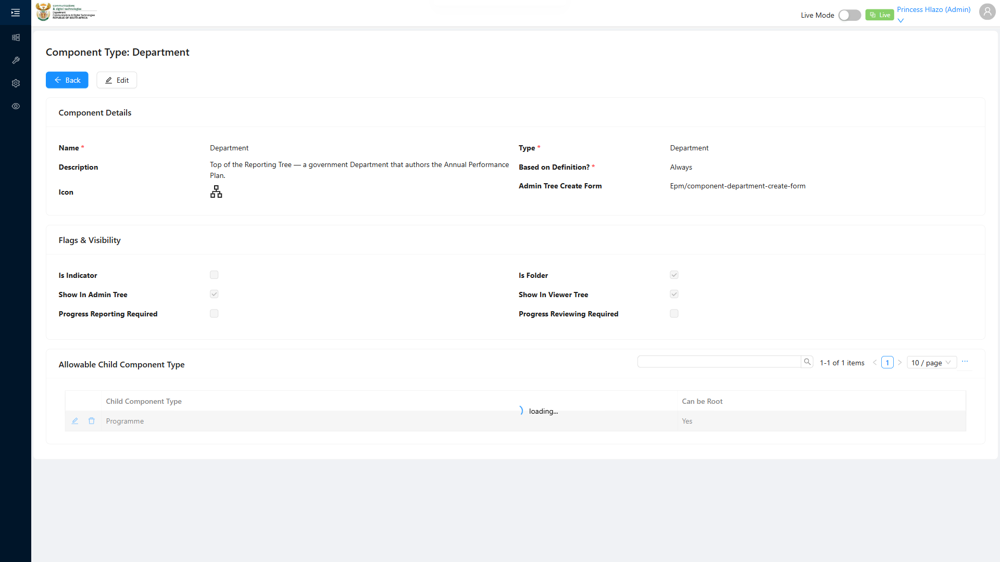

# Report: EPM — TC-109450 Negative — Reject adding a Component Type as its own Allowable Child (self-reference)

**Date:** 2026-08-13 15:31 UTC
**Plan:** test-plans/hierarchy-definitions/epm-allowable-child-component-type.md
**Spec:** test-plans/hierarchy-definitions/epm-allowable-child-component-type.spec.ts
**Cases:** TC-109450
**Execution Mode:** ai-driven (headed Chromium via Playwright, single test case only, `-g "TC-109450"`)
**Result:** FAILED (functionality not implemented — confirmed bug)
**Duration:** ~13.5s (`1 failed`)
**Verdict:** self-reference (Department → Department as its own Allowable Child) is **not rejected**.
The Child Component Type select offers the parent itself as a normal option, and saving it succeeds
(`POST 200`, junction created, modal closes with no validation error). This is the same pattern already
confirmed for TC-108808 — a described negative-path validation that has not actually been implemented.

**ADO:** org `boxfusion` · project **PD-Epm** · plan **108745** (*EPM-QA — Functional Test Plan v2.0*) ·
suite **109510** (*05 · EPM · Component Type — Allowable Child Component Type table*) · case **109450** ·
point **31256**
**Environment:** QA — `https://pd-epm-adminportal-qa.shesha.app` · API `https://pd-epm-api-qa.shesha.app`
**Login:** admin.PrincessH / 123qwe (administrator)
**Navigation:** Epm › Adminstration › Component Type → `component-type-details-view?id=<Department>`

## Summary

| Total Assertions | Passed | Failed | Skipped |
|------------------|--------|--------|---------|
| 2 | 1 | 1 | 1 (step 3 not reached) |

Only test case 109450 was executed. The run stopped at the failed step 2 assertion; step 3 ("add a
different Component Type, save succeeds") was not reached this run, but is unaffected by this defect and
reuses the same mechanism already proven working in TC-109449.

## Step Results

### STEP 2 — Attempt to add Department itself as an Allowable Child
- **ACTUAL:** "Department" is offered as a normal option in the Child Component Type select (not
  filtered out). Selecting it and saving succeeds:
  `POST 200 https://pd-epm-api-qa.shesha.app/api/dynamic/Epm/AllowableChildComponentType/Crud/Create`
  — response has `parentComponentType.id === childComponentType.id`, and the modal closed normally.
- **[FAIL] ADO EXPECTED:** "Rejected with a self-reference validation error" — no rejection occurred.

```json
{
  "result": {
    "parentComponentType": {"_displayName": "Department", "id": "05a72647-75ce-4fd7-a57f-df6a64f06e74"},
    "childComponentType": {"_displayName": "Department", "id": "05a72647-75ce-4fd7-a57f-df6a64f06e74"}
  }
}
```



### STEP 3 — Add a different Component Type. Save succeeds.
- Not reached this run (test stops on the step 2 assertion failure). Known to work correctly — same
  mechanism as TC-109449's step 3.

## Test data left in QA

None. The self-reference junction created during step 2 was removed via a `finally` block regardless of
the assertion failure. Confirmed via `GET .../ComponentType/Crud/Get?id=<Department>` after this run:
`allowableChildrenSummary: "test - Root, Programme - Root"` — matches the pre-existing state exactly (no
residue, no self-reference row left behind).

## Reproduction

```bash
# from the hub root
HUB_PROJECT=EPM HEADED=1 PW_CHANNEL=chromium npx playwright test \
  projects/EPM/test-plans/hierarchy-definitions/epm-allowable-child-component-type.spec.ts -g "TC-109450"
```

## Azure DevOps publication

Not attempted — the ADO PAT used for this project is deliberately read-only by design. Point **31256**
is left untouched.
