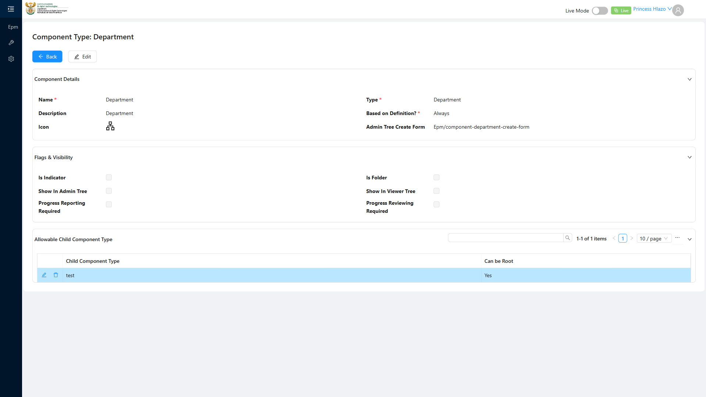

# Report: EPM — TC-109451 Edge — Removing an Allowable Child does not orphan already-created tree nodes

**Date:** 2026-08-13 15:40 UTC
**Plan:** test-plans/hierarchy-definitions/epm-allowable-child-component-type.md
**Spec:** test-plans/hierarchy-definitions/epm-allowable-child-component-type.spec.ts
**Cases:** TC-109451
**Execution Mode:** ai-driven (headed Chromium via Playwright, single test case only, `-g "TC-109451"`)
**Result:** PASSED — no defect found
**Duration:** ~20.9s (`1 passed (22.4s)`)
**Verdict:** removing the real `Department → Programme` Allowable Child link correctly leaves every
existing tree component (`Emmanuel_Prog`, `Emmanuel_Sub_Prog`, `Emmanuel_QKPI`) fully intact, and
correctly rejects "Programme" as a legal next-level option for any *new* addition afterward. Unlike the
two other negative-path checks executed in this suite this session (TC-108808, TC-109450), this rule
**is** implemented correctly.

**ADO:** org `boxfusion` · project **PD-Epm** · plan **108745** (*EPM-QA — Functional Test Plan v2.0*) ·
suite **109510** (*05 · EPM · Component Type — Allowable Child Component Type table*) · case **109451** ·
point **31257**
**Environment:** QA — `https://pd-epm-adminportal-qa.shesha.app` · API `https://pd-epm-api-qa.shesha.app`
**Login:** admin.PrincessH / 123qwe (administrator)
**Navigation:** Epm › Adminstration › Component Type → `component-type-details-view?id=<Department>`

## Summary

| Total Assertions | Passed | Failed | Skipped |
|------------------|--------|--------|---------|
| 6 | 6 | 0 | 0 |

Only test case 109451 was executed.

## A note on test data — the only real risk in this suite

This is the only test case in suite 109510 whose precondition ("a tree already has Programme under
Department") can be satisfied solely by the **one real Reporting Tree** in this QA environment
(`Emmanuel_Test_Report`). Given two confirmed unimplemented validations already found this session
(TC-108808, TC-109450), there was a real risk that removing this real junction could cascade and damage
the shared tree. **Confirmed with the user before running** — chose to test on the real tree carefully,
verify, then restore immediately, rather than build an isolated sandbox tree. That call paid off: no
damage occurred, and the restore step confirmed the config was returned to its exact original state.

## Step Results

### PRECONDITION
- [PASS] Department's `allowableChildrenSummary` before: `"test - Root, Programme - Root"` (junction id
  `f3cbf438-82bb-4062-b1b3-ade8e5a22e21`)
- [PASS] `Emmanuel_Prog` (Programme), `Emmanuel_Sub_Prog` (Sub Programme), `Emmanuel_QKPI` (Quantitative
  KPI) all confirmed to exist beforehand

### STEP 2 — Remove Programme from Department Allowable Children
- [PASS] `DELETE 200 https://pd-epm-api-qa.shesha.app/api/dynamic/Epm/AllowableChildComponentType/Crud/Delete?id=f3cbf438-...`
- [PASS] Department's `allowableChildrenSummary` correctly updated to `"test - Root"` (Programme removed)
- **[PASS] EXPECTED: existing tree nodes remain intact** — `Emmanuel_Prog`, `Emmanuel_Sub_Prog`, and
  `Emmanuel_QKPI` individually re-fetched and confirmed unchanged (same name, same type) after the
  removal



### STEP 3 — Attempt to add a NEW Programme under Department in the tree builder
- Verified via `GET .../PerformanceReportAllowedComponentTypes/GetFlattenedAllowedComponentTypesByTemplateId`
  (the endpoint that actually powers the tree builder's Add actions — see
  `epm-add-child-item-dropdown-defect` memory for why the literal "Add Child Item" UI dropdown isn't a
  reliable check) rather than the transient dropdown
- **[PASS] EXPECTED: rejected — the combination is no longer allowed** — the flattened response after
  removal contains only `"test"`, no longer `"Programme"`

## Restoration

The real Department → Programme link was re-added immediately after verification, via the same UI
mechanism proven in TC-109449/TC-109450, with **Can Be Root** ticked to match the original configuration:

- `RESTORE — re-added Department -> Programme (Can Be Root): 200`
- Confirmed final state: `allowableChildrenSummary: "test - Root, Programme - Root"` — identical to the
  precondition state

## Test data left in QA

None. Department's Allowable Child configuration is bit-for-bit restored to its pre-test state.

## Reproduction

```bash
# from the hub root
HUB_PROJECT=EPM HEADED=1 PW_CHANNEL=chromium npx playwright test \
  projects/EPM/test-plans/hierarchy-definitions/epm-allowable-child-component-type.spec.ts -g "TC-109451"
```

## Azure DevOps publication

Not attempted — the ADO PAT used for this project is deliberately read-only by design. Point **31257**
is left untouched.
