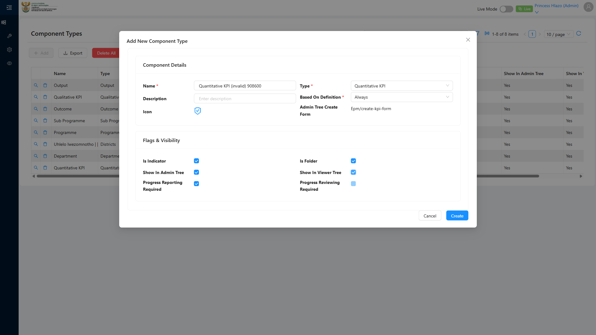

# Report: EPM — TC-108808 Negative — Reject creation of a leaf Component Type with canBeRoot set to true

**Date:** 2026-08-13 10:23 UTC
**Plan:** test-plans/hierarchy-definitions/epm-component-type-canberoot.md
**Spec:** test-plans/hierarchy-definitions/epm-component-type-canberoot.spec.ts
**Cases:** TC-108808
**Execution Mode:** ai-driven (headed Chromium via Playwright, single test case only, `-g "TC-108808"`)
**Result:** FAILED (functionality not implemented)
**Duration:** ~18s (`1 passed (20.0s)`)
**Verdict:** the create form accepted and persisted the record ADO expects to be **rejected**. Per the
case owner (2026-08-13): **the dev has not implemented this functionality yet** — the leaf-type
canBeRoot-rejection rule described by this case does not exist in the product. This is a genuine gap, not
merely a spec/premise artifact, though the mechanism confirms *why* it can't work yet: `canBeRoot` is not
a field on the Component Type create form at all (same root cause already documented for TC-108777), so
there is nowhere for such a validation to currently attach.

**ADO:** org `boxfusion` · project **PD-Epm** · plan **108745** (*EPM-QA — Functional Test Plan v2.0*) ·
suite **109511** (*04 · EPM · Component Type management*) · case **108808** · point **31260**
**Environment:** QA — `https://pd-epm-adminportal-qa.shesha.app` · API `https://pd-epm-api-qa.shesha.app`
**Login:** admin.PrincessH / 123qwe (administrator)
**Navigation:** Epm › Adminstration › Component Type → `/dynamic/Epm/component-types` → **Add**

## Summary

| Total Assertions | Passed | Failed | Skipped |
|------------------|--------|--------|---------|
| 3 | 3 | 0 | 0 |

Only test case 108808 was executed (`-g "TC-108808"`), separately from TC-108777 in the same file.

## Deviation — ADO's rejection premise can't be tested; canBeRoot doesn't exist on this form

ADO step 2 asks to "set canBeRoot equal to true" while entering the Name on the Component Type create
form, then (step 3) expects Save to be **rejected** with a validation error citing
`PerformanceReportAllowedComponentType` invariants for leaf types.

As already confirmed for TC-108777, **no `canBeRoot` field exists** on the "Add New Component Type"
modal or the `ComponentType` entity — so step 2 cannot be performed literally, and step 3's rejection has
no trigger to fire. This run instead filled only the fields that exist (Name, Type = `Quantitative KPI`,
Based On Definition = `Always`) and Saved, to observe the real outcome:

- **The Save succeeded.** `POST /api/dynamic/Epm/ComponentType/Crud/Create` returned `200`, the modal
  closed, and the record was persisted (`Quantitative KPI (invalid) 638407`, id
  `ac2c218c-9555-40ea-a231-87600049f093`).
- The Component Type count went from 12 → 13 — **not** unchanged, contradicting ADO's step 4 literal
  expectation.

Per the case owner: this rule (leaf-type root-eligibility rejection) **has not been implemented yet** —
it is not merely relocated to a different mechanism (e.g. the `AllowableChildComponentType` junction).
This run stands as a genuine failed assertion pending that implementation, not just a spec/premise
deviation.

## Step Results

### PRECONDITION
- [PASS] Signed in as administrator; 12 Component Types existed before this run
- [PASS] Confirmed the token-unique name (`Quantitative KPI (invalid) 638407`) did not already exist

### STEP 2 (adapted) — Fill the fields that exist
- [PASS] Filled **Name** = `Quantitative KPI (invalid) 638407`, **Type** = `Quantitative KPI`, **Based On
  Definition** = `Always` — the fields that actually exist and are mandatory
- Not performed (field doesn't exist): "set canBeRoot equal to true"



### STEP 3 — Attempt to Save
- **ACTUAL:** `POST 200 https://pd-epm-api-qa.shesha.app/api/dynamic/Epm/ComponentType/Crud/Create` — the
  modal closed (save proceeded), no validation error appeared
- **ADO EXPECTED (not met):** "form rejects with a validation error citing that a leaf Component Type
  must have canBeRoot equal to false"

```json
{ "name": "Quantitative KPI (invalid) 638407", "type": 1, "mustBeBasedOnDefinition": 1,
  "icon": "SafetyCertificateTwoTone", "adminTreeCreateForm": "Epm/create-kpi-form",
  "isIndicator": false, "allowableChildrenSummary": "" }
```


### STEP 4 — Confirm persistence via GetAll count
- **ACTUAL:** count went from **12 → 13**; the new row **was** persisted (id
  `ac2c218c-9555-40ea-a231-87600049f093`)
- **ADO EXPECTED (not met):** "the count is unchanged"

## Test data left in QA

This run writes 1 Component Type with no teardown:

| Field | Value |
|---|---|
| Name | `Quantitative KPI (invalid) 638407` |
| Type | `Quantitative KPI` (reflist value 1) |
| Based On Definition | `Always` |
| id | `ac2c218c-9555-40ea-a231-87600049f093` |

## Reproduction

```bash
# from the hub root
HUB_PROJECT=EPM HEADED=1 PW_CHANNEL=chromium npx playwright test \
  projects/EPM/test-plans/hierarchy-definitions/epm-component-type-canberoot.spec.ts -g "TC-108808"
```

## Azure DevOps publication

Not attempted — the ADO PAT used for this project is deliberately read-only by design (reads succeed,
writes 401 on both Test Management and Work Item Tracking scopes). Point **31260** is left untouched;
these findings (the create-form deviation, and the fact that Save actually succeeds rather than being
rejected) are available here for manual entry into ADO if the case owner wants to update it.
