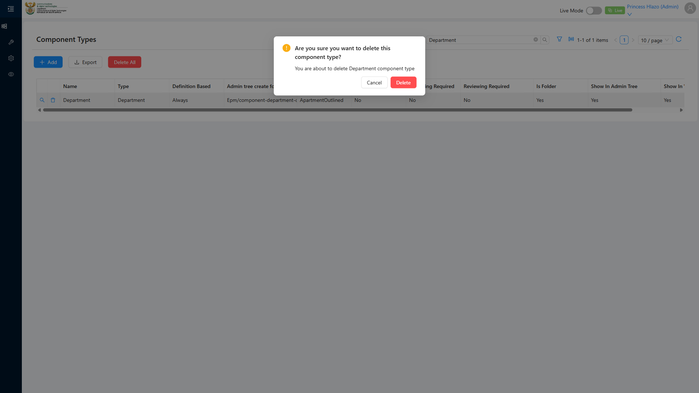
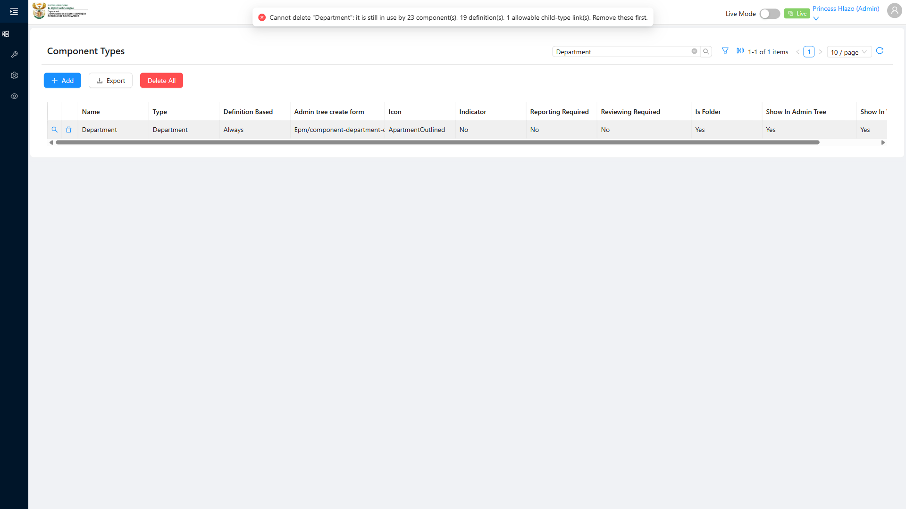

# Report: EPM — TC-108810 Integration — Deleting a Component Type referenced by an Allowable Child Component Type junction is blocked

**Date:** 2026-08-13 11:40 UTC
**Plan:** test-plans/hierarchy-definitions/epm-component-type-canberoot.md
**Spec:** test-plans/hierarchy-definitions/epm-component-type-canberoot.spec.ts
**Cases:** TC-108810
**Execution Mode:** ai-driven (headed Chromium via Playwright, single test case only, `-g "TC-108810"`)
**Result:** PASSED (delete correctly blocked)
**Duration:** ~15.5s (`1 passed (16.7s)`)
**Verdict:** unlike TC-108808, this protection **is implemented** — attempting to delete a Component Type
that's referenced elsewhere (as the parent in an `AllowableChildComponentType` link) is rejected with a
clear, well-formed error message. One discrepancy worth flagging to the dev: the rejection surfaces as
**HTTP 500**, which conventionally signals an unhandled server exception, rather than a **400/409**
client/conflict error a validation failure would normally use.

**ADO:** org `boxfusion` · project **PD-Epm** · plan **108745** (*EPM-QA — Functional Test Plan v2.0*) ·
suite **109511** (*04 · EPM · Component Type management*) · case **108810** · point **31262**
**Environment:** QA — `https://pd-epm-adminportal-qa.shesha.app` · API `https://pd-epm-api-qa.shesha.app`
**Login:** admin.PrincessH / 123qwe (administrator)
**Navigation:** Epm › Adminstration › Component Type → `/dynamic/Epm/component-types`

## Summary

| Total Assertions | Passed | Failed | Skipped |
|------------------|--------|--------|---------|
| 3 | 3 | 0 | 0 |

Only test case 108810 was executed (`-g "TC-108810"`), separately from TC-108777/108808 in the same file.

## Retargeted per case owner — different junction than ADO's literal wording

ADO's precondition names the `PerformanceReportAllowedComponentType` junction (a Component Type
referenced by a Performance Report Template). This run instead targets an existing Component Type
already referenced with **Can be Root = Yes** — `Department (test) 714718` (created by an earlier
TC-108777 run), the parent of "Programme" in the **`AllowableChildComponentType`** junction — per the
case owner's direction, rather than building fresh precondition data.

**Why this substitution matters, and what it does/doesn't prove:** these are two different junction
tables referencing Component Type, and delete-protection turned out to be **implemented for one but not
the other** (see Safety Note below). This run confirms protection works for the
`AllowableChildComponentType` path; it does not by itself confirm protection for the
`PerformanceReportAllowedComponentType` path ADO's case literally names — exploration (not part of this
formal run) found that path is **not** protected.

## Step Results

### PRECONDITION
- [PASS] `Department (test) 714718` exists, `allowableChildrenSummary: "Programme - Root"`, has an
  `AllowableChildComponentType` junction row

### STEP 2 — Click Delete on the referenced row
- **[PASS] EXPECTED: a confirmation dialog appears** — actual text: *"Are you sure you want to delete
  this component type? You are about to delete Department (test) 714718 component type"*



### STEP 3 — Confirm the delete
- **ACTUAL:** `DELETE /api/dynamic/Epm/ComponentType/Crud/Delete?id=03f11b65-...` → **HTTP 500**

```json
{
  "success": false,
  "error": {
    "message": "Cannot delete \"Department (test) 714718\": it is still in use by 1 allowable child-type link(s). Remove these first."
  }
}
```

- **[PASS] EXPECTED (qualitatively met):** rejected with a message referencing the junction ("allowable
  child-type link(s)") — ADO's literal wording says "foreign-key constraint message referencing the
  junction table"; this is a business-phrased equivalent, not a raw DB error, which is a **better**
  outcome than ADO's wording implies
- **Discrepancy:** HTTP **500** rather than 400/409 for what is a legitimate business-rule rejection —
  flagged as a minor API status-code issue, not a functional defect



### STEP 4 — Verify via GetAll that the record is intact
- **[PASS] EXPECTED: no records were deleted** — `Department (test) 714718` confirmed still present via
  `ComponentType/Crud/GetAll`

## Safety note — do not test this against the shared "Emmanuel_template"

The template's real Allowed Component Types (`Emmanuel_template` → Qualitative KPI, Quantitative KPI,
Programme, Sub Programme, Department) are pre-existing **shared reference data**. Ad-hoc exploration
(outside this formal run) confirmed deleting a Component Type referenced via
`PerformanceReportAllowedComponentType` is **not** blocked — the delete succeeds and the junction row is
left **orphaned** (pointing at a deleted `componentType.id`), with no cascade delete either. Testing
against one of the template's 5 real entries directly would have permanently broken shared data used
across the QA environment. That exploration instead created a disposable Component Type, linked it into
`Emmanuel_template`, deleted it, confirmed the orphaned junction via `GetAll`, and cleaned that row up
immediately via its own `Crud/Delete` — see memory `epm-component-type-delete-protection-mixed` for the
full trail and IDs. **This is a real, separate finding worth the dev's attention**, distinct from this
test case's PASS result.

## Reproduction

```bash
# from the hub root — note: Department (test) 714718 is a one-shot target and no longer exists
# after this run's precondition check would fail; use TC108810_TARGET=<name> against a different
# existing Component Type referenced via AllowableChildComponentType to repeat this check.
HUB_PROJECT=EPM HEADED=1 PW_CHANNEL=chromium npx playwright test \
  projects/EPM/test-plans/hierarchy-definitions/epm-component-type-canberoot.spec.ts -g "TC-108810"
```

## Azure DevOps publication

Not attempted — the ADO PAT used for this project is deliberately read-only by design. Point **31262**
is left untouched.
