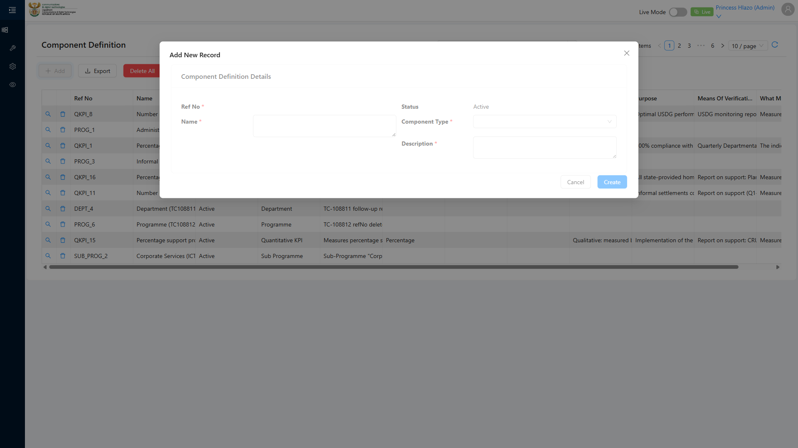
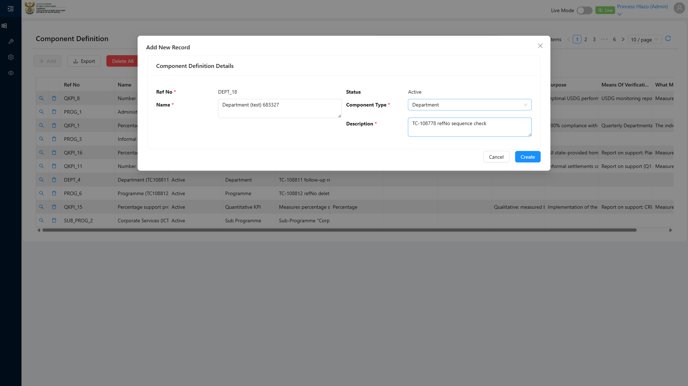
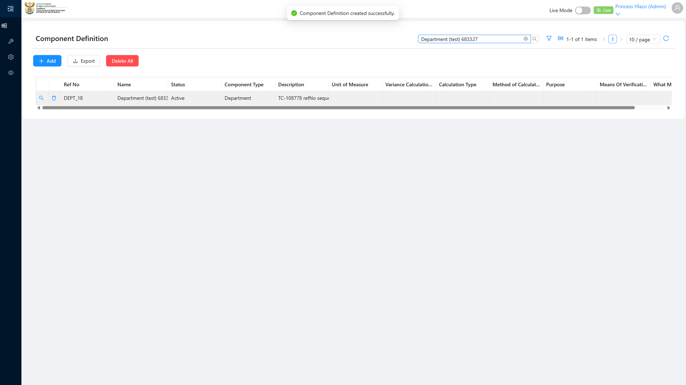

# Report: EPM — TC-108778 Positive — Create Component Definition and confirm canonical refNo sequence per Component Type

**Date:** 2026-08-14 11:20 UTC
**Plan:** test-plans/foundation-reference-data/epm-component-definition-refno-sequence.md
**Spec:** test-plans/foundation-reference-data/epm-component-definition-refno-sequence.spec.ts
**Cases:** TC-108778
**Execution Mode:** ai-driven (headed Chromium via Playwright, single test case only)
**Result:** PASSED
**Duration:** ~24.2s (`1 passed (26.6s)`)
**Verdict:** the Component Definition create form works correctly for the fields that actually exist,
and the refNo assigned on save is well-formed, unique, and strictly greater than every prior refNo for
that Component Type — matching ADO's intent ("sequential... matching the canonical convention"), even
though the exact numeric value can't be predicted from a simple row count (see Deviation below).

**ADO:** org `boxfusion` · project **PD-Epm** · plan **108745** (*EPM-QA — Functional Test Plan v2.0*) ·
suite **109509** (*02 · EPM · Component Definition management*) · case **108778** · point **31249**
**Environment:** QA — `https://pd-epm-adminportal-qa.shesha.app` · API `https://pd-epm-api-qa.shesha.app`
**Login:** admin.PrincessH / 123qwe (administrator)
**Navigation:** Epm › Adminstration › Component Definition → `/dynamic/Epm/component-definition-table` → **+ Add**

## Summary

| Total Assertions | Passed | Failed | Skipped |
|------------------|--------|--------|---------|
| 9 | 9 | 0 | 0 |

Only test case 108778 was executed.

## Deviations — precondition false, and refNo is a real gap-permitting sequence

**ADO's precondition** ("Component Type Department exists with existing count of definitions equal to
zero") **is false** in this QA environment — `Emmanuel_Department` (refNo `DEPT_1`) already existed
before this session, seeded 2026-08-06.

**Further confirmed live** while building this test: the refNo counter is a real monotonic sequence per
Component Type, not `COUNT(existing rows) + 1`. It advances the moment **Component Type** is selected on
the create form, even if the record is never saved. Evidence gathered during this session's own
iterative debugging: with only `DEPT_1` existing, an aborted attempt (bad field values from a locator
bug, later deleted) consumed `DEPT_2`; a separate diagnostic run that only selected Component Type
without saving *also* advanced the counter; by the time of a clean run, the count had reached `DEPT_5`
even though only `DEPT_1, DEPT_3, DEPT_4` were "on the books" (`DEPT_2` having been deleted). **Gaps from
dry runs/aborted attempts are normal sequence behaviour, not a defect** — this is how real DB sequence
objects behave (no rollback on an uncommitted preview). The spec therefore asserts refNo is well-formed
(`DEPT_<n>`), strictly greater than every previously-seen suffix, and not a duplicate — not that it
equals one specific predicted value.

## Step Results

### PRECONDITION
- [PASS] Confirmed the token-unique name did not already exist
- [PASS] Read existing Department refNos live rather than assuming zero

### STEP 2 — Navigate, click Create, select Component Type = Department
- [PASS] ADO's literal route `/dynamic/Epm/ComponentDefinition/` is not used — navigated via the real
  route `/dynamic/Epm/component-definition-table` (Epm › Adminstration › Component Definition)
- [PASS] "Add New Record" modal loaded; Ref No field confirmed present (renders disabled/read-only —
  no bordered input, unlike Name/Description)
- [PASS] Selected Component Type = Department; waited for the async-computed Ref No to render before
  touching any other field (confirmed live: filling Name before this settles gets silently cleared)



### STEP 3 — Enter Name and Save
- [PASS] Filled Name and Description (Description required on this form though ADO's step only
  mentions Name)
- [PASS] `POST 200 https://pd-epm-api-qa.shesha.app/api/dynamic/Epm/ComponentDefinition/Crud/Create`
- [PASS] Toast: *"Component Definition created successfully."*
- [PASS] New row visible in the list after search-filtering by name




### STEP 4 — Verify the refNo matches the canonical sequence
- [PASS] refNo `DEPT_5` matches the `DEPT_<n>` pattern
- [PASS] refNo suffix (5) greater than every pre-existing Department refNo's suffix (highest was 4)
- [PASS] refNo not a duplicate of any existing Department definition's refNo

## A locator lesson worth keeping

This form's DOM order does **not** match its visual 2-column layout, and "Name" (like "Ref No") renders
as a `<textarea>`, not an `<input>` — a generic "next `<input>` after this label" locator silently landed
on the wrong field ("Method Of Calculation", in a completely different section) more than once while
building this spec, since it skipped straight past the real (textarea) Name field. Fixed by targeting
`following::textarea[1]` relative to each label specifically, confirmed via a live DOM dump.

## Test data left in QA

Writes 1 Component Definition per run — no teardown, matching ADO's own steps (none specified).

| Field | Value |
|---|---|
| Name | `Department (test) 212435` |
| Component Type | `Department` |
| refNo | `DEPT_5` |
| id | `56e8ebf3-4b80-4123-8b70-f05e99ad4e02` |

## Reproduction

```bash
# from the hub root
HUB_PROJECT=EPM HEADED=1 PW_CHANNEL=chromium npx playwright test \
  projects/EPM/test-plans/foundation-reference-data/epm-component-definition-refno-sequence.spec.ts
```

## Azure DevOps publication

Not attempted — the ADO PAT used for this project is deliberately read-only by design. Point **31249**
is left untouched.
