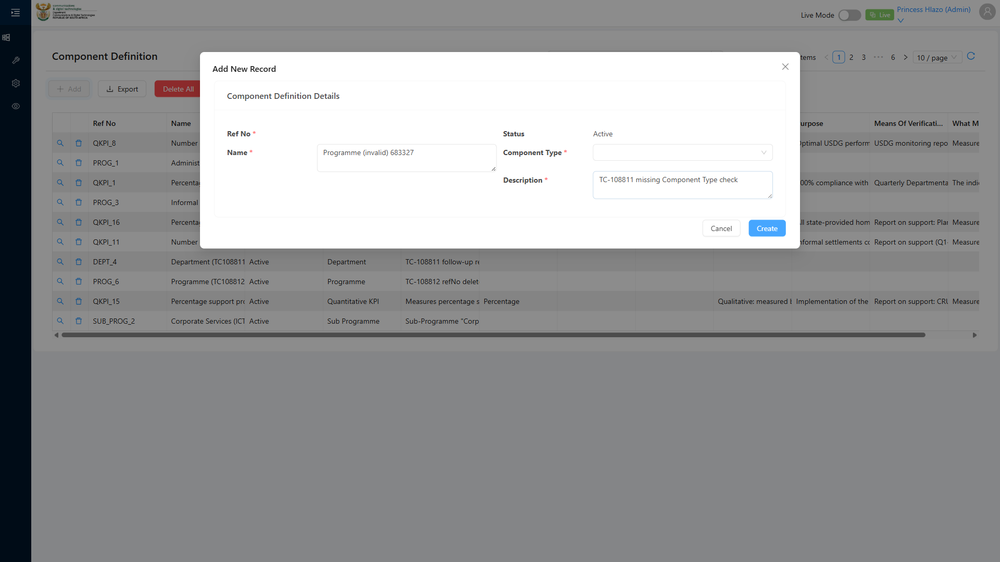
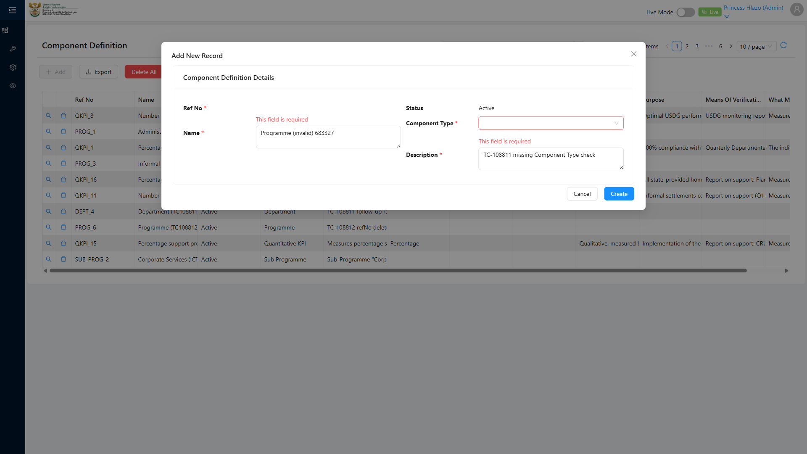

# Report: EPM — TC-108811 Negative — Reject Component Definition creation when the required Component Type is missing

**Date:** 2026-08-14 16:03 UTC
**Plan:** test-plans/foundation-reference-data/epm-component-definition-refno-sequence.md
**Spec:** test-plans/foundation-reference-data/epm-component-definition-refno-sequence.spec.ts
**Cases:** TC-108811
**Execution Mode:** ai-driven (headed Chromium via Playwright, single test case only, `-g "TC-108811"`)
**Result:** PASSED
**Duration:** ~25.9s (`1 passed (27.3s)`)
**Verdict:** the create form correctly blocks submission when Component Type is left empty, no record is
persisted, and — the more interesting claim — leaving Component Type empty does not consume a refNo
sequence value. A real follow-up creation immediately afterward got exactly the value the sequence
would have produced anyway, confirming the failed attempt left no trace.

**ADO:** org `boxfusion` · project **PD-Epm** · plan **108745** (*EPM-QA — Functional Test Plan v2.0*) ·
suite **109509** (*02 · EPM · Component Definition management*) · case **108811** · point **31250**
**Environment:** QA — `https://pd-epm-adminportal-qa.shesha.app` · API `https://pd-epm-api-qa.shesha.app`
**Login:** admin.PrincessH / 123qwe (administrator)
**Navigation:** Epm › Adminstration › Component Definition → `/dynamic/Epm/component-definition-table`

## Summary

| Total Assertions | Passed | Failed | Skipped |
|------------------|--------|--------|---------|
| 8 | 8 | 0 | 0 |

Only test case 108811 was executed. This case builds directly on TC-108778's own discovery (in the same
file/suite) that the refNo sequence advances on Component Type *selection*, not on save — this case
tests the converse: no selection, no advance.

## Step Results

### PRECONDITION
- [PASS] Recorded 9 existing Component Definitions and the current Department refNos before this run

### STEP 2 — Leave Component Type empty. Enter Name. Save.
- [PASS] No POST request observed — client-side validation blocked submission entirely
- [PASS] Modal remained open (save rejected)
- **[PASS] EXPECTED: validation error citing the missing Component Type field** — the message text
  itself is a generic "This field is required" (confirmed live: it never names the field), so verified
  via the Component Type select's own error-state CSS class (`ant-select-status-error`) instead of
  searching the modal's text for the field's name
- Note: "Ref No" showed the same generic required-error too — expected, since its value is never
  computed without a Component Type selected (corroborates STEP 4's premise directly)




### STEP 3 — Confirm no ComponentDefinition record was created
- **[PASS] EXPECTED: GetAll count is unchanged** — 9 before, 9 after

### STEP 4 — Confirm no refNo was consumed from the sequence counter
- Performed a real follow-up creation (Component Type = Department) immediately after the failed attempt
- **[PASS] EXPECTED: the next successful creation uses the same refNo the sequence would have produced
  before the failed attempt** — got exactly `DEPT_7`, matching the pre-recorded highest suffix + 1
  precisely (not skipped)

## A note on assertion style vs. TC-108778

TC-108778 (sibling case, same file) intentionally asserts refNo is merely "sequential and unique" rather
than an exact predicted value, since other activity (dry runs, other testers) can create gaps. TC-108811
uses an **exact** match instead — correct here because proving *zero* consumption is the entire point of
step 4, and the test tightly controls the "before" reading and the "after" follow-up itself with nothing
else run in between.

## Test data left in QA

Writes 1 Component Definition per run (the follow-up creation needed to verify step 4) — no teardown,
matching this suite's established convention.

| Field | Value |
|---|---|
| Name | `Department (TC108811 followup) 584036` |
| Component Type | `Department` |
| refNo | `DEPT_7` |
| id | `0308a890-0aaa-41ce-b170-f08a66a1cc77` |

## Reproduction

```bash
# from the hub root
HUB_PROJECT=EPM HEADED=1 PW_CHANNEL=chromium npx playwright test \
  projects/EPM/test-plans/foundation-reference-data/epm-component-definition-refno-sequence.spec.ts -g "TC-108811"
```

## Azure DevOps publication

Not attempted — the ADO PAT used for this project is deliberately read-only by design. Point **31250**
is left untouched.
