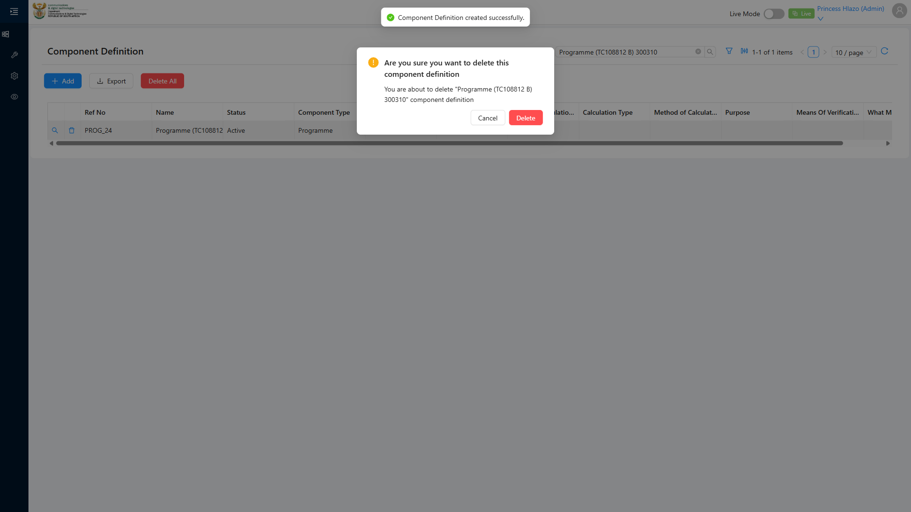
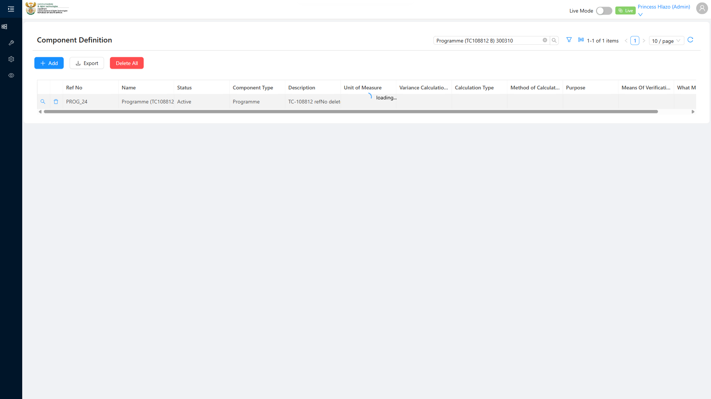

# Report: EPM — TC-108812 Edge — RefNo counter is monotonically increasing and NOT decremented on delete (framework gap TG-006)

**Date:** 2026-08-14 16:20 UTC
**Plan:** test-plans/foundation-reference-data/epm-component-definition-refno-sequence.md
**Spec:** test-plans/foundation-reference-data/epm-component-definition-refno-sequence.spec.ts
**Cases:** TC-108812
**Execution Mode:** ai-driven (headed Chromium via Playwright, single test case only, `-g "TC-108812"`)
**Result:** PASSED
**Duration:** ~35.3s (`1 passed (36.9s)`)
**Verdict:** deleting a mid-sequence Component Definition does not free its refNo suffix for reuse — the
next creation continues forward from the highest surviving suffix, confirming the counter is a true
monotonic sequence, not backfilled on delete. Matches ADO's expected outcome exactly.

**ADO:** org `boxfusion` · project **PD-Epm** · plan **108745** (*EPM-QA — Functional Test Plan v2.0*) ·
suite **109509** (*02 · EPM · Component Definition management*) · case **108812** · point **31251**
**Environment:** QA — `https://pd-epm-adminportal-qa.shesha.app` · API `https://pd-epm-api-qa.shesha.app`
**Login:** admin.PrincessH / 123qwe (administrator)
**Navigation:** Epm › Adminstration › Component Definition → `/dynamic/Epm/component-definition-table`

## Summary

| Total Assertions | Passed | Failed | Skipped |
|------------------|--------|--------|---------|
| 6 | 6 | 0 | 0 |

Only test case 108812 was executed.

## Deviation from ADO precondition (confirmed live)

ADO's literal precondition — "A Component Type has three Component Definitions with refNos PROG_1,
PROG_2, PROG_3" — does not hold. `GetAll` before this run showed only **one** live Programme Component
Definition: `Emmanuel_Prog`, refNo `PROG_1` (real, in-use tree data). `PROG_2` and `PROG_3` do not exist —
consistent with the user's own note that `PROG_2` was likely deleted manually at some point, and `PROG_3`
appears to have never existed at all.

Rather than manufacture the exact `PROG_1/2/3` state against `Emmanuel_Prog` (real tree data, out of
scope for this suite to touch), the spec reconstructed an equivalent disposable 3-in-a-row scenario:
create three fresh Programme Component Definitions back-to-back (**A**, **B**, **C** standing in for
PROG_1/2/3), delete the middle one (**B**), then create a fourth (**D**) and confirm it continues forward
from **C**'s suffix rather than backfilling **B**'s freed one. This is the same underlying claim ADO's
steps test, independent of which specific numbers happen to be free live.

## Step Results

### PRECONDITION (reconstructed)
- [PASS] Confirmed live: only `PROG_1` exists (Emmanuel_Prog); `PROG_2`/`PROG_3` absent
- Created A = `PROG_2`, B = `PROG_3`, C = `PROG_4` (continuing live from `PROG_1`, not the ADO-literal
  numbers — expected, per this suite's established finding that refNo is a real advancing sequence, not
  reset per test)

### STEP 2 — Delete the middle record (B) via the list Delete action. Confirm.
- **[PASS] EXPECTED: delete succeeds** — `DELETE .../ComponentDefinition/Crud/Delete?id=...` → HTTP 200
- **[PASS] EXPECTED: B is deleted, A and C remain** — confirmed via `GetAll`: B absent, A and C both
  still present




### STEP 3 — Create a new Programme Component Definition (D).
- **[PASS] EXPECTED: refNo matches canonical `PROG_<n>` pattern** — got `PROG_5`
- **[PASS] EXPECTED: D's suffix continues forward from C (not backfilled)** — `5 > 4` ✓
- **[PASS] EXPECTED: D does not reuse B's freed refNo** — `PROG_5 ≠ PROG_3` ✓ — this is the direct
  equivalent of ADO's literal "assigned PROG_4, not PROG_2" claim

### STEP 4 — Framework-gap register (TG-006) alignment
- Logged as informational only. TG-006 is an external framework-gap register this session has no
  API/document access to independently verify — the in-app behaviour it's quoted as documenting (delete
  does not decrement/backfill the counter) is exactly what steps 2–3 above proved directly.

## Test data left in QA

None. All 4 disposable Component Definitions created this run (A, B, C, D) were deleted — B mid-test as
the case's own subject, A/C/D in a `finally` cleanup block regardless of pass/fail. `Emmanuel_Prog`
(`PROG_1`, the real tree record) was never touched.

| Name | refNo | id | Fate |
|---|---|---|---|
| Programme (TC108812 A) 193887 | PROG_2 | 273f78ae-b0b1-4135-8cc5-acb979f122b4 | deleted (cleanup) |
| Programme (TC108812 B) 193887 | PROG_3 | d0594988-d40d-40c1-98a7-7bbb89f84bfa | deleted (STEP 2, the test subject) |
| Programme (TC108812 C) 193887 | PROG_4 | c25a2344-3c85-4356-9c0f-1431beb17320 | deleted (cleanup) |
| Programme (TC108812 D) 193887 | PROG_5 | a095582e-e17f-41c9-97cc-9f79a2035c27 | deleted (cleanup) |

## Reproduction

```bash
# from the hub root
HUB_PROJECT=EPM HEADED=1 PW_CHANNEL=chromium npx playwright test \
  projects/EPM/test-plans/foundation-reference-data/epm-component-definition-refno-sequence.spec.ts -g "TC-108812"
```

## Azure DevOps publication

Not attempted — the ADO PAT used for this project is deliberately read-only by design. Point **31251**
is left untouched.
