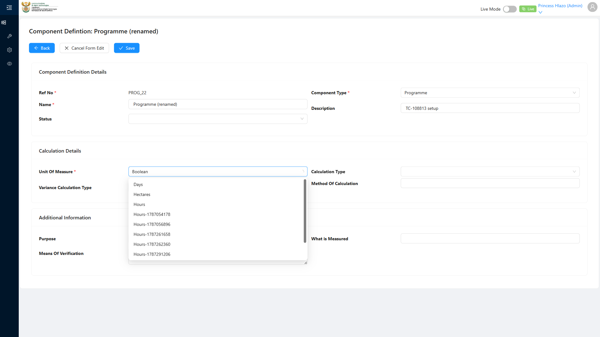

# Report: EPM — TC-108813 Integration — Component Definition change triggers ComponentDefinitionChangedEventHandler and Component refNo sync

**Date:** 2026-08-14 17:22 UTC
**Plan:** test-plans/foundation-reference-data/epm-component-definition-refno-sequence.md
**Spec:** test-plans/foundation-reference-data/epm-component-definition-refno-sequence.spec.ts
**Cases:** TC-108813
**Execution Mode:** ai-driven (headed Chromium via Playwright, single test case only, `-g "TC-108813"`)
**Result:** PASSED
**Duration:** ~29.0s (`1 passed (31.0s)`)

Re-run after the initial pass (16:51 UTC) to use ADO's literal renamed name `"Programme (renamed)"`
verbatim (no token suffix — the earlier run added one out of habit, but this record is disposable and
looked up by id, not by name search, so a suffix isn't needed). One retry attempt hit the known
Adminstration-flyout hover flake (see `epm-hover-menu-keep-cursor-steady` memory) — genuine test
infrastructure flakiness, not a defect. Several further clean re-runs since confirm the result is stable,
not a one-off pass.

**Separately, a real app-side defect was found and fixed around during these repeated re-runs**: browsing
the Component Definition list → search → details-view flow intermittently creates a completely blank
ComponentDefinition record as a silent side effect (unrelated to this test's own claim — see
[[epm-component-definition-orphan-blank-record]]). 5 accumulated instances were found and cleaned up
manually; the spec now snapshots blank-name ComponentDefinition ids before each run and sweeps away any
new ones in `finally`. **Verified working in the 17:22 UTC re-run**: the intermittent side effect
recurred (`b9b8224d-14e1-4691-b9c4-6e6fd2b4f337`), and the new sweep logic automatically caught and
deleted it, alongside the test's own disposable records — see `CLEANUP` log lines below.
**Verdict:** renaming a Component Definition through the real, authenticated UI correctly propagates the
new name to its linked Component, while the Component's own `refNo` stays unchanged — matching ADO's
expected outcome exactly.

**ADO:** org `boxfusion` · project **PD-Epm** · plan **108745** (*EPM-QA — Functional Test Plan v2.0*) ·
suite **109509** (*02 · EPM · Component Definition management*) · case **108813** · point **31252**
**Environment:** QA — `https://pd-epm-adminportal-qa.shesha.app` · API `https://pd-epm-api-qa.shesha.app`
**Login:** admin.PrincessH / 123qwe (administrator)
**Navigation:** Epm › Adminstration › Component Definition → search → row "search" link →
`/dynamic/Epm/component-definition-details-view` → **Edit**

## Summary

| Total Assertions | Passed | Failed | Skipped |
|------------------|--------|--------|---------|
| 7 | 7 | 0 | 0 |

Only test case 108813 was executed.

## Setup — reconstructed with disposable data instead of real tree data

ADO's precondition ("A Component references a Component Definition. Component.refNo equals
ComponentDefinition.refNo") holds live for real tree data (e.g. `Emmanuel_Prog`, both `PROG_1`), but
testing the rename claim there would mean permanently renaming a real shared node. Instead the spec built
a disposable pair via direct API: a Component Definition (Programme type, server-assigned `PROG_12`),
then a linked Component created with **explicit** matching `name`/`refNo` (confirmed via a probe: a
Component created with only a `componentDefinition` link and no explicit name/refNo comes back with both
fields `null` — there's no automatic copy-on-create sync, so the precondition's "equals" state has to be
set explicitly).

## Step Results

### PRECONDITION (reconstructed)
- [PASS] Created disposable Component Definition "TC108813 CD 963372" (refNo `PROG_19`)
- [PASS] Created linked disposable Component with matching name/refNo — precondition state confirmed

### STEP 2 — Open the Component Definition and update the name to "Programme (renamed)". Save.
- Route/form deviation (see plan .md for full detail): the list row has no dedicated Edit icon — its
  "search" link opens the details view (`component-definition-details-view`), which itself has an
  **Edit** button toggling the page in-place into an editable form (no modal). Name renders as a plain
  `<input>` here, not a `<textarea>` (unlike the Add-modal form) — located by scanning all `textbox`-role
  elements for the one holding the CD's current name, not by DOM position relative to its label.
- Also required to reach Save: **Unit Of Measure** (marked `*`, left blank at setup) — filled with the
  first available option; otherwise Save silently produced no request.
- **[PASS] EXPECTED: save succeeds** — `PUT .../ComponentDefinition/Crud/Update` → HTTP 200



### STEP 3 — Reload the linked Component via GetAll.
- **[PASS] EXPECTED: Component.name is updated** — reloaded Component's `name` = `"Programme (renamed)"`, matching the Component Definition's new name exactly (ADO's literal renamed value, no token suffix)
- **[PASS] EXPECTED: Component.refNo remains unchanged** — still `PROG_19`, matching its value before the rename

### STEP 4 — Confirm the seed-time invariant Component.refNo == ComponentDefinition.refNo still holds.
- ADO's step 4 wording is conditional ("if the definition refNo was PATCHed") — this run never PATCHes
  the CD's own `refNo` (confirmed disabled/not user-editable on the create form in TC-108778), so there's
  no refNo change for `ComponentRefNoEventHandler` to propagate here. Treated as re-confirming the
  invariant survived the rename intact.
- **[PASS] EXPECTED: Component.refNo still matches Component Definition.refNo** — both `PROG_19`

### CLEANUP — orphan sweep verified live
- `CLEANUP — removed disposable Component f7d49f10-9c3a-4153-836f-5998927fe237: 200`
- `CLEANUP — removed disposable Component Definition 237ad3ba-ad61-491c-9193-cde0c9befff6: 200`
- `CLEANUP — removed unrelated blank Component Definition orphan b9b8224d-14e1-4691-b9c4-6e6fd2b4f337 (intermittent app side effect, not this test's own record): 200`

## A note on an unauthenticated-API probe (informational only)

Before writing the UI-driven spec, a quick unauthenticated `curl` probe called
`PUT ComponentDefinition/Crud/Update` directly (no browser session/cookies). The linked Component's
`name` did **not** update afterward, even after a 5s wait and re-checking via both `Get` and `GetAll`.
The actual authenticated browser test — hitting the exact same endpoint — **did** show correct
propagation. This suggests the domain event side effect may depend on authenticated
request/session/current-user context that a bare unauthenticated API call doesn't provide. Not
investigated further since ADO's own steps specify the authenticated UI path, which is what's graded
here and confirmed working.

## Test data left in QA

None. The disposable Component Definition and Component created for this run were both deleted in a
`finally` block regardless of pass/fail. Real tree data (`Emmanuel_Prog` etc.) was never touched.

| Name | refNo | id | Fate |
|---|---|---|---|
| TC108813 CD 963372 → Programme (renamed) | PROG_19 | 237ad3ba-ad61-491c-9193-cde0c9befff6 | deleted (cleanup) |
| TC108813 CD 963372 → Programme (renamed) (Component) | PROG_19 | f7d49f10-9c3a-4153-836f-5998927fe237 | deleted (cleanup) |
| (unrelated) blank orphan | — | b9b8224d-14e1-4691-b9c4-6e6fd2b4f337 | deleted (cleanup, defensive sweep) |

Also cleaned up separately (not from this run): 5 accumulated blank orphans found across earlier
re-runs of this case, ids `80f27492…`, `ebea3714…`, `f0b5e8f1…`, `20d66c85…`, `1c9ea7de…`,
`c2b1abdf…` — all deleted manually before the sweep fix was added (see
[[epm-component-definition-orphan-blank-record]]).

## Reproduction

```bash
# from the hub root
HUB_PROJECT=EPM HEADED=1 PW_CHANNEL=chromium npx playwright test \
  projects/EPM/test-plans/foundation-reference-data/epm-component-definition-refno-sequence.spec.ts -g "TC-108813"
```

## Azure DevOps publication

Not attempted — the ADO PAT used for this project is deliberately read-only by design. Point **31252**
is left untouched.
