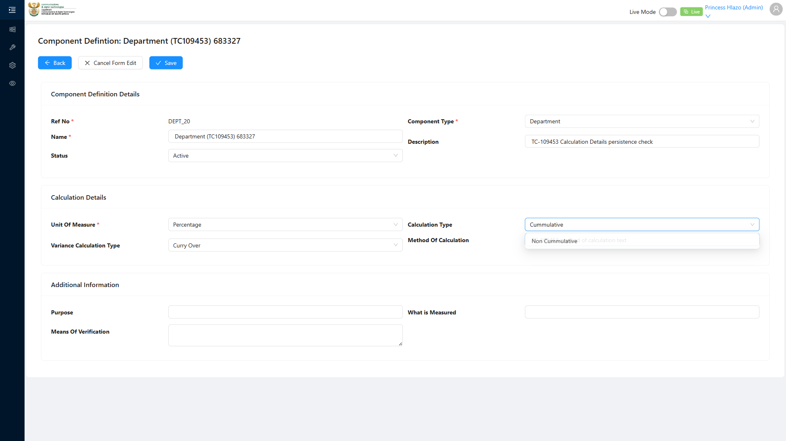

# Report: EPM — TC-109453 Positive — Component Definition Calculation Details persist

**Date:** 2026-08-14 17:30 UTC
**Plan:** test-plans/foundation-reference-data/epm-component-definition-refno-sequence.md
**Spec:** test-plans/foundation-reference-data/epm-component-definition-refno-sequence.spec.ts
**Cases:** TC-109453
**Execution Mode:** ai-driven (headed Chromium via Playwright, single test case only, `-g "TC-109453"`)
**Result:** PASSED
**Duration:** ~21.1s (`1 passed (22.8s)`)
**Verdict:** all four Calculation Details fields (Unit Of Measure, Variance Calculation Type, Calculation
Type, Method Of Calculation) accept input on the Component Definition create form, persist on Save, and
return the entered values on reload via `GetAll` — exactly as ADO expects.

**ADO:** org `boxfusion` · project **PD-Epm** · plan **108745** (*EPM-QA — Functional Test Plan v2.0*) ·
suite **109509** (*02 · EPM · Component Definition management*) · case **109453** · point **31253**
**Environment:** QA — `https://pd-epm-adminportal-qa.shesha.app` · API `https://pd-epm-api-qa.shesha.app`
**Login:** admin.PrincessH / 123qwe (administrator)
**Navigation:** Epm › Adminstration › Component Definition → `/dynamic/Epm/component-definition-table` → **+ Add**

## Summary

| Total Assertions | Passed | Failed | Skipped |
|------------------|--------|--------|---------|
| 5 | 5 | 0 | 0 |

Only test case 109453 was executed.

## Mechanism

ADO only specifies a concrete value for **Unit of Measure** ("Percentage" — already existed live, seeded
by TC-109440's own fixture). **Variance Calculation Type** and **Calculation Type** render as plain
enum-backed selects with no ADO-specified value, so the spec picks whichever option is first in each
dropdown and records the label for comparison, rather than guessing an option name. **Method Of
Calculation** is a plain free-text `<input>` (confirmed in TC-108778 — a stray locator once landed on it
by accident, proving it's an input, not a textarea).

## Step Results

### PRECONDITION
- [PASS] "Percentage" Unit of Measure already existed (no seeding needed this run)
- [PASS] Component Definition create form opened with Component Type = Department selected (refNo computed before proceeding)

### STEP 2 — Fill Calculation Details section.
- **[PASS] EXPECTED: fields accept the input** — Unit Of Measure = "Percentage"; Variance Calculation
  Type = "Curry Over" (first dropdown option); Calculation Type = "Cummulative" (first dropdown option);
  Method Of Calculation = free text, all accepted without validation errors



### STEP 3 — Save.
- **[PASS] EXPECTED: record persists with all four Calculation Details fields** — `POST
  .../ComponentDefinition/Crud/Create` → HTTP 200, id `66a3859e-506a-4415-b38d-1742b455fd5c` returned, modal closed

### STEP 4 — Reload and verify via GetAll.
- **[PASS] EXPECTED: all four fields return the entered values**:
  - `unitOfMeasure._displayName` = `"Percentage"` ✓
  - `varianceCalculationType` = `1` (enum code for "Curry Over") ✓ (non-null/truthy)
  - `calculationType` = `1` (enum code for "Cummulative") ✓ (non-null/truthy)
  - `methodOfCalculation` = `"TC-109453 method of calculation text"` ✓ (exact match)

No blank-record orphan side effect (see `epm-component-definition-orphan-blank-record` memory)
reproduced this run — consistent with it being intermittent, not deterministic.

## Test data left in QA

Writes 1 Component Definition per run — no teardown, matching this suite's established convention (ADO's
steps specify none).

| Field | Value |
|---|---|
| Name | `Department (TC109453) 436016` |
| Component Type | `Department` |
| Unit Of Measure | `Percentage` |
| Variance Calculation Type | `Curry Over` (enum 1) |
| Calculation Type | `Cummulative` (enum 1) |
| Method Of Calculation | `TC-109453 method of calculation text` |
| id | `66a3859e-506a-4415-b38d-1742b455fd5c` |

## Reproduction

```bash
# from the hub root
HUB_PROJECT=EPM HEADED=1 PW_CHANNEL=chromium npx playwright test \
  projects/EPM/test-plans/foundation-reference-data/epm-component-definition-refno-sequence.spec.ts -g "TC-109453"
```

## Azure DevOps publication

Not attempted — the ADO PAT used for this project is deliberately read-only by design. Point **31253**
is left untouched.
