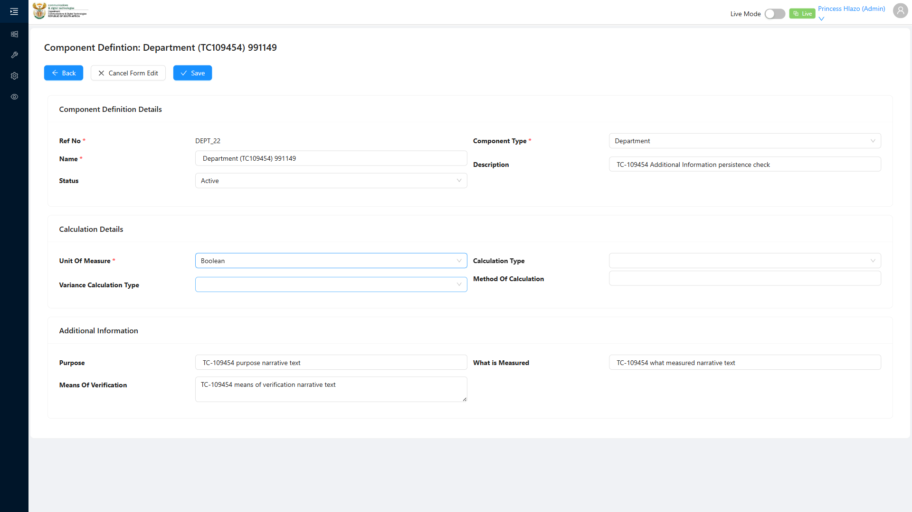
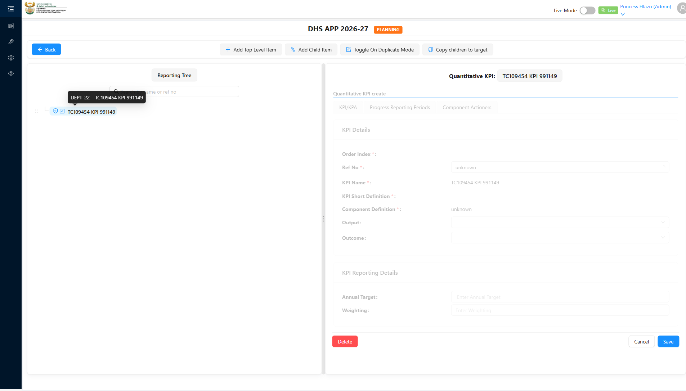

# Report: EPM — TC-109454 Integration — Component Definition Additional Information persists and feeds the reporting form

**Date:** 2026-08-14 18:46 UTC
**Plan:** test-plans/foundation-reference-data/epm-component-definition-refno-sequence.md
**Spec:** test-plans/foundation-reference-data/epm-component-definition-refno-sequence.spec.ts
**Cases:** TC-109454
**Execution Mode:** ai-driven (headed Chromium via Playwright, single test case only, `-g "TC-109454"`)
**Result:** FAILED (by design — one confirmed bug against ADO's expected behavior)
**Duration:** ~39.0s (`1 failed (40.6s)`)
**Verdict:** Purpose and What Measured fill, persist, and reload correctly, but **Means Of Verification is
silently dropped from the Create request entirely** — a genuine, deterministic bug, reproduced identically
across every run. The reporting-form half of ADO's step 4 (the linked Component Definition persisting and
being correctly retrievable from the reporting form) **passes** — an initial reading of that half as a
second gap was a false negative (checking for raw narrative text instead of the reference itself),
corrected after user feedback.

**ADO:** org `boxfusion` · project **PD-Epm** · plan **108745** (*EPM-QA — Functional Test Plan v2.0*) ·
suite **109509** (*02 · EPM · Component Definition management*) · case **109454** · point **31254**
**Environment:** QA — `https://pd-epm-adminportal-qa.shesha.app` · API `https://pd-epm-api-qa.shesha.app`
**Login:** admin.PrincessH / 123qwe (administrator)
**Navigation:** Epm › Adminstration › Component Definition → `/dynamic/Epm/component-definition-table` → **+ Add**; also `/dynamic/Epm/performance-report-planning-page?id=<reportId>` for the Reporting Tree check

## Summary

| Total Assertions | Passed | Failed | Skipped |
|------------------|--------|--------|---------|
| 9 | 8 | 1 (soft) | 0 |

Only test case 109454 was executed.

## Investigation trail

1. First attempt hit a locator bug on my own end: "Purpose" and "What Measured" render as plain
   single-line `<input>` fields on this form (no resize handle), while "Means Of Verification" renders as
   a `<textarea>` — a `<textarea>`-only locator silently missed Purpose (left it empty) and hung entirely
   on What Measured. Fixed with a combined input-or-textarea locator anchored from each field's own label.
2. Second attempt: Purpose and What Measured filled and persisted correctly, but Means Of Verification
   came back `null`. Suspected the known "field cleared by a later async remount" pattern (seen on Name in
   TC-108778) — added an explicit re-check-immediately-before-submit safety net.
3. Third attempt: the safety net found **nothing to re-fill** (the field held its value right up to
   submit) — yet Means Of Verification still came back `null`. This ruled out timing/remount entirely.
4. Logged the actual outgoing POST request body directly: `{"name":"...","description":"...",
   "componentType":"...","purpose":"...","whatMeasured":"...","status":1}` — **no `meansOfVerification`
   key present at all.** Confirmed deterministic across every run with this logging in place.
5. STEP 4b initially checked whether the raw Purpose/Means Of Verification/What Measured *text* rendered
   verbatim on the Reporting Tree node's tabs, found nothing across all three (KPI/KPA, Progress Reporting
   Periods, Component Actioners), and logged that as a tentative second gap.
6. **User feedback corrected this**: the actual claim is only that the linked Component Definition itself
   persists and is correctly retrievable from the reporting form — not that its narrative field values get
   duplicated inline. Investigated via a disposable probe on the real `Emmanuel_Department` node: its
   "Department Details" panel does correctly show a "Component Definition" field naming
   "Emmanuel_Department" (confirming the reference-persistence pattern). Also discovered along the way:
   the "Ref No" field there is a separate, independent reference-select (searchable across all Component
   Definitions of that type — options included `DEPT_1`, `DEPT_10`, `DEPT_11`, etc.) and shows a literal
   `"unknown"` placeholder when unset — not to be confused with the "Component Definition" field.
7. Rewrote STEP 4b to check for the Component Definition reference persisting (rather than raw text) —
   passes correctly.

## Step Results

### PRECONDITION
- [PASS] Component Definition create form opened with Component Type = Department selected

### STEP 2 — Fill Additional Information section.
- **[PASS] EXPECTED: fields accept the input** — all three fields (Purpose, Means Of Verification, What
  Measured) visibly accepted narrative text, confirmed via `toHaveValue` immediately after filling and
  again right before Save



### STEP 3 — Save the record. Reload.
- **[PASS] EXPECTED: save succeeds** — `POST .../ComponentDefinition/Crud/Create` → HTTP 200, id
  `f7b6eefd-3d73-40c5-87b5-1f8cd9e9c9fc` returned, modal closed
- Outgoing request body logged for evidence: `{"name":"Department (TC109454) 899677","description":
  "TC-109454 Additional Information persistence check","componentType":"05a72647-75ce-4fd7-a57f-
  df6a64f06e74","purpose":"TC-109454 purpose narrative text","whatMeasured":"TC-109454 what measured
  narrative text","status":1}` — no `meansOfVerification` key

### STEP 4a — Reload and verify via GetAll.
- **[PASS] EXPECTED: Purpose returns the entered value** — `"TC-109454 purpose narrative text"` ✓
- **[FAIL, CONFIRMED BUG — soft] EXPECTED: Means Of Verification returns the entered value** — returned
  `null`; the field is silently dropped from the Create request payload entirely (see investigation
  trail above and [[epm-component-definition-additional-information-gaps]])
- **[PASS] EXPECTED: What Measured returns the entered value** — `"TC-109454 what measured narrative text"` ✓

### STEP 4b — Confirm the Component Definition persists and is retrievable from the reporting form.
- Created a disposable top-level **Quantitative KPI** Component (`TC109454 KPI 899677`) linked to the new
  Component Definition, directly via API (no server-side allowable-child check on Component/Crud/Create,
  so a top-level node of any type can be created without a legal parent — see
  [[epm-component-create-no-server-side-allowable-child-check]])
- Navigated to `/dynamic/Epm/performance-report-planning-page?id=32de39ae-5bdb-40ee-b53d-d2c9bb5dc906`,
  expanded the tree, found and clicked the new node
- **[PASS] EXPECTED: the linked Component Definition should be correctly referenced/retrievable somewhere
  on the reporting form** — found on the **KPI/KPA** tab, correctly naming
  "Department (TC109454) 899677" (the exact linked catalog record)



## Test data left in QA

The Component Definition itself is left in QA (no teardown, matching TC-109453's convention). The
disposable linked Component was deleted in `finally` regardless of outcome.

| Field | Value | Fate |
|---|---|---|
| Component Definition | `Department (TC109454) 899677` (id `f7b6eefd-3d73-40c5-87b5-1f8cd9e9c9fc`) | left in QA |
| Disposable Component | `TC109454 KPI 899677` (id `3dc9bd13-6843-4f02-b6ee-143a46a350ad`) | deleted (cleanup) |

## Reproduction

```bash
# from the hub root
HUB_PROJECT=EPM HEADED=1 PW_CHANNEL=chromium npx playwright test \
  projects/EPM/test-plans/foundation-reference-data/epm-component-definition-refno-sequence.spec.ts -g "TC-109454"
```

## Azure DevOps publication

Not attempted — the ADO PAT used for this project is deliberately read-only by design. Point **31254**
is left untouched.
