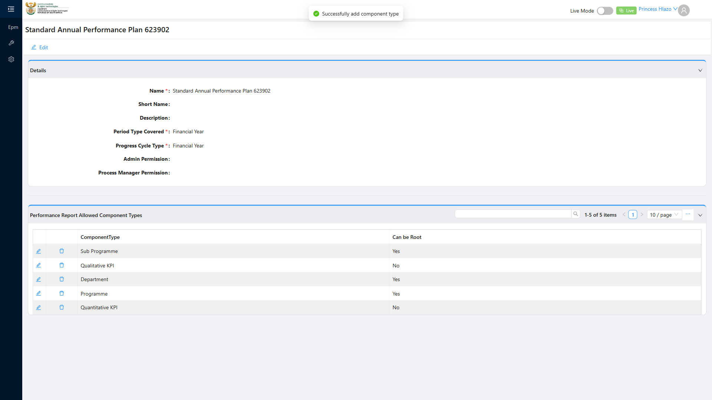

# Report: EPM — TC-108779 Positive — Configure Performance Report Template with allowed Component Type and canBeRoot invariants

**Date:** 2026-08-14 19:30 UTC
**Plan:** test-plans/hierarchy-definitions/epm-performance-report-template-allowed-component-types.md
**Spec:** test-plans/hierarchy-definitions/epm-performance-report-template-allowed-component-types.spec.ts
**Cases:** TC-108779
**Execution Mode:** ai-driven (headed Chromium via Playwright, single test case only)
**Result:** PASSED
**Duration:** ~56.5s (`1 passed (57.7s)`)
**Verdict:** creating a new Performance Report Template, adding all five Allowed Component Type rows via
the UI (Department/Programme/Sub Programme with `canBeRoot=Yes`; Quantitative KPI/Qualitative KPI with
`canBeRoot=No`), and reloading all persist and display correctly — exactly matching ADO's expected
outcome. Confirmed both via the UI grid and via a direct
`PerformanceReportAllowedComponentType/Crud/GetAll` filtered on the new template id, as ADO's step 4
specifies.

**ADO:** org `boxfusion` · project **PD-Epm** · plan **108745** (*EPM-QA — Functional Test Plan v2.0*) ·
suite **109508** (*03 · EPM · Performance Report Template — allowed Component Type + canBeRoot invariants*) ·
case **108779**
**Environment:** QA — `https://pd-epm-adminportal-qa.shesha.app` · API `https://pd-epm-api-qa.shesha.app`
**Login:** admin.PrincessH / 123qwe (administrator)
**Navigation:** Epm › Adminstration › Performance Report Template → `/dynamic/Epm/perfomance-report-template` → **+ Add** → details view

## Summary

| Total Assertions | Passed | Failed | Skipped |
|------------------|--------|--------|---------|
| 14 | 14 | 0 | 0 |

Only test case 108779 was executed.

## Investigation trail (before landing on the final passing spec)

1. **Route confirmed live**: ADO's literal path `/dynamic/Epm/PerformanceReportTemplate/` is not real —
   the real one, matching the `epm-performance-report-tree-navigation` memory's prediction, is
   `/dynamic/Epm/perfomance-report-template` (misspelled "perfomance").
2. **The grid's own "Add" action is hidden behind a responsive overflow menu.** A plain "Add" button
   elsewhere on the details page turned out to be an unrelated page-builder toolbar control (does
   nothing when clicked, even forced) — the real functional Add action lives behind
   `ul[class*="sha-responsive-button-gr"] .ant-menu-submenu-title`, matching the same pattern documented
   for the flyout-menu ellipsis affordance elsewhere in this project.
3. **The Component Type select in the "Add New Performance Report Allowed Component Type" modal is a
   searchable/paginated reference-picker** — its default (unfiltered) option list only shows a handful
   of items alphabetically, cutting off before reaching later types like "Sub Programme". Typing the
   exact type name to filter before selecting fixed this.
4. **The Allowed Component Types grid's own data fetch after a page reload is noticeably slower than the
   page's own loading spinner clearing.** A fixed short wait sometimes caught the grid mid-load (showing
   0 or 4 of 5 rows even though all 5 were already correctly persisted server-side, confirmed via a
   direct API diagnostic both immediately after adding and via later screenshots taken seconds later).
   Neither `[role="row"]` nor the standard AntD `.ant-table-tbody`/`.ant-table-row` classes matched this
   grid's actual DOM (both came back with a 0 count even after a 60s poll, despite a screenshot at that
   exact moment showing all 5 rows rendered) — this is a custom Shesha grid component with different
   internals. Fixed by checking each Component Type's exact visible text directly (each with its own
   generous timeout) instead of guessing table/row class names.
5. **A user comment during investigation flagged the correct scope**: ADO's own step 4 wording
   ("verify... via the PerformanceReportAllowedComponentType API GetAll for the new template
   identifier") confirms these rows are scoped per-template — a different mechanism from
   `AllowableChildComponentType.canBeRoot` used in suite 109511's TC-108777/108808.
6. **A manual test run by the user** (template literally named "Standard Annual Performance Plan",
   `creatorUserId 13` = admin.PrincessH) was found live mid-investigation with all 5 rows already correctly
   configured — left untouched since it's the user's own work, not this session's. The automated spec
   creates and cleans up its own separate disposable template instead.

## Step Results

### PRECONDITION
- [PASS] At least one Component Type exists per hierarchy level — confirmed live via API before
  building this spec (Department/Programme/Sub Programme/Quantitative KPI/Qualitative KPI all exist)

### STEP 2 — Navigate to the template list. Create a new template named "Standard Annual Performance Plan".
- **[PASS] EXPECTED: the template is saved** — `POST .../PerformanceReportTemplate/Crud/Create` → HTTP 200
- **[PASS] EXPECTED: the Allowed Component Types grid is visible** — confirmed on the details view

### STEP 3 — Add Department/Programme/Sub Programme (canBeRoot=Yes) and Quantitative/Qualitative KPI (canBeRoot=No).
- **[PASS]** all five `POST .../PerformanceReportAllowedComponentType/Crud/Create` requests succeeded
- **[PASS] EXPECTED: five Allowed Component Type rows are visible with the correct canBeRoot values** —
  confirmed after reload



### STEP 4 — Reload and verify via the PerformanceReportAllowedComponentType API GetAll.
- **[PASS] EXPECTED: the API returns exactly five rows with the expected canBeRoot values**:
  - Department: `canBeRoot=true` ✓
  - Programme: `canBeRoot=true` ✓
  - Sub Programme: `canBeRoot=true` ✓
  - Quantitative KPI: `canBeRoot=false` ✓
  - Qualitative KPI: `canBeRoot=false` ✓

## Test data left in QA

None. The disposable template and all 5 junction rows created this run were deleted in a `finally` block
regardless of pass/fail. `Emmanuel_template` (the one real, in-use template) was never touched, and the
user's own manually-created "Standard Annual Performance Plan" template was left untouched (a separate,
differently-named record from this run's own — this run's template names include a unique token suffix).

## Reproduction

```bash
# from the hub root
HUB_PROJECT=EPM HEADED=1 PW_CHANNEL=chromium npx playwright test \
  projects/EPM/test-plans/hierarchy-definitions/epm-performance-report-template-allowed-component-types.spec.ts
```

## Azure DevOps publication

Not attempted — the ADO PAT used for this project is deliberately read-only by design.
