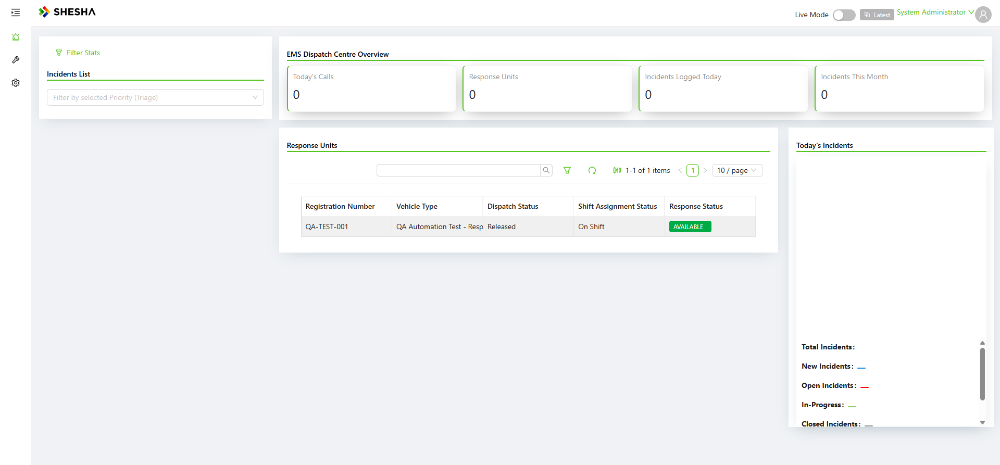

# PD-Dispatch — Administrative Functions Smoke (post-outage)

**Date:** 2026-07-13 (Mon)
**App:** PD-Dispatcher V2 Admin Portal (QA) — https://pd-dispatcher-v2-adminportal-qa.shesha.app
**Driver:** Live via Playwright MCP (headed), as **Admin**
**Scope:** Read-path health check of all 17 Administrative Functions after the outage — confirm each table/dashboard loads and its data persisted. (Read-only; no records created.)

---

## Summary

**All 17 Administrative Functions load cleanly with their data intact.** No errors, no blank grids, no data loss from the outage.

| # | Function | URL (module/slug) | Result |
|---|---|---|---|
| 1 | All Incidents | `Boxfusion.Ems/incidents-table` | ✅ 46 items |
| 2 | Incident Types | `Boxfusion.Ems/incident-types` | ✅ 164 items |
| 3 | Upcoming Transfers | `Boxfusion.Ems/upcoming-transfers-table` | ✅ 3 items |
| 4 | Vehicles | `Boxfusion.Ems/vehicles` | ✅ 4 items |
| 5 | Vehicle Types | `Boxfusion.Ems/vehicle-types` | ✅ 21 items |
| 6 | Site Types | `Boxfusion.Dispatcher/site-types` | ✅ 20 items |
| 7 | Points of Interest | `Boxfusion.Ems/emergency-site` | ✅ 28 items |
| 8 | Areas | `Boxfusion.Dispatcher/areas` | ✅ 21 items |
| 9 | Stations | `Boxfusion.Dispatcher/dispatch-base` | ✅ 27 items |
| 10 | Devices | `Boxfusion.Dispatcher/mobile-devices` | ✅ 3 items |
| 11 | Resources | `Boxfusion.Ems/resources` | ✅ 7 items |
| 12 | Crews | `Boxfusion.Ems/EmsDispatchTeam-Table` | ✅ 5 items |
| 13 | Agents | `Boxfusion.Dispatcher/agent-roles-table` | ✅ 10 items |
| 14 | Shifts | `boxfusion.shiftmanagement/shift-table` | ✅ 3 items |
| 15 | Shift Assignments | `Boxfusion.Dispatcher/dispatch-shift-assignment-table` | ✅ 7 items |
| 16 | Completed Vehicles | `Boxfusion.Dispatcher/completed-check-list-table` | ✅ loads, 0 items (empty by design) |
| 17 | Incident Stats | `Boxfusion.Ems/incident-stats-dashboard` | ✅ dashboard renders (stat tiles + charts) |

Both backend modules (`Boxfusion.Ems`, `Boxfusion.Dispatcher`, `boxfusion.shiftmanagement`) are serving.

## Notes

- **Method:** each function opened by direct URL (sidebar flyouts collapse under automation); waited for the grid/dashboard to render, then read the "X items found / 1-N of M items" indicator. Read-only — no CRUD performed, so no new records.
- **Completed Vehicles** shows 0 items — expected; no vehicle checklists have ever been completed on this QA site. The grid itself loads without error.
- **Incident Stats** renders the "EMS Dispatch Centre Overview" (Today's Calls / Response Units / Incidents Logged Today / Incidents This Month) with charts. Today's counters read 0, consistent with a fresh day.
- Our previously-created QA records survived the outage across every entity (Vehicles incl. QA-TEST-001, Crews, Resources, Stations, POIs incl. QA Automation Test POI - Clinic, Agents, Shifts, Shift Assignments).

