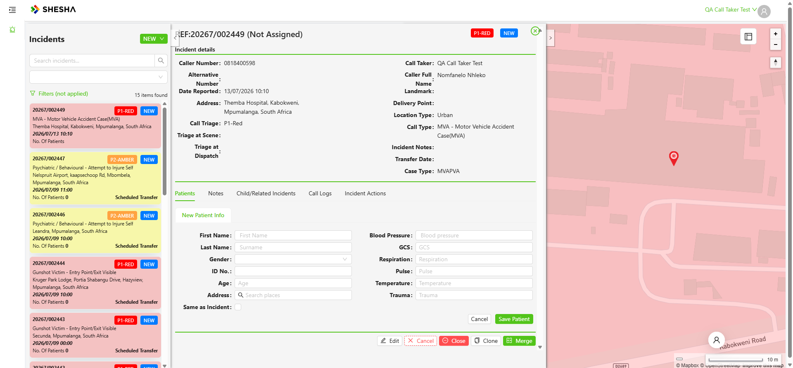
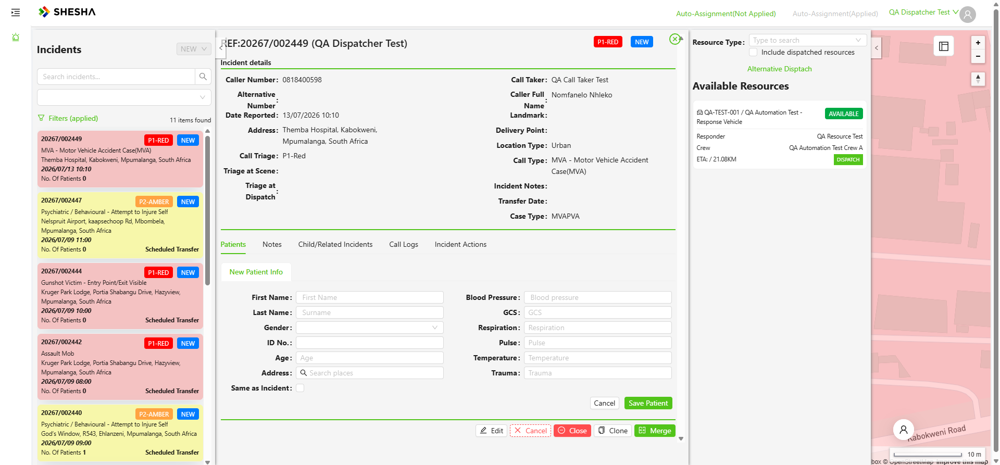
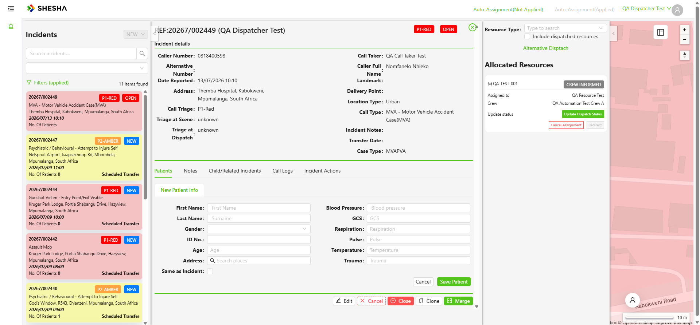
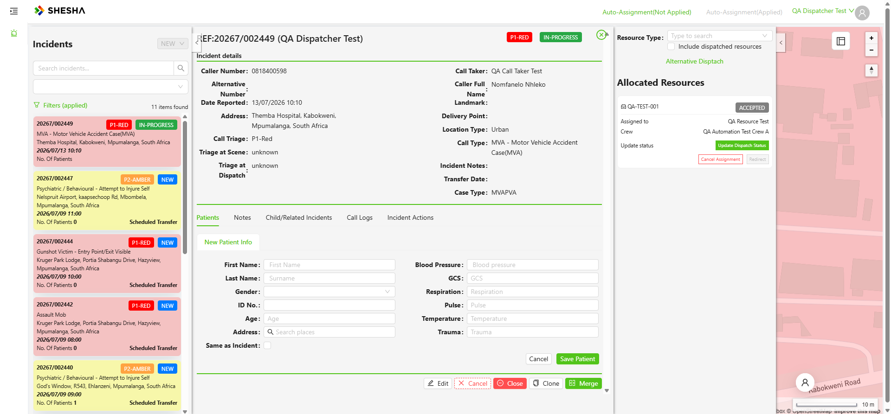
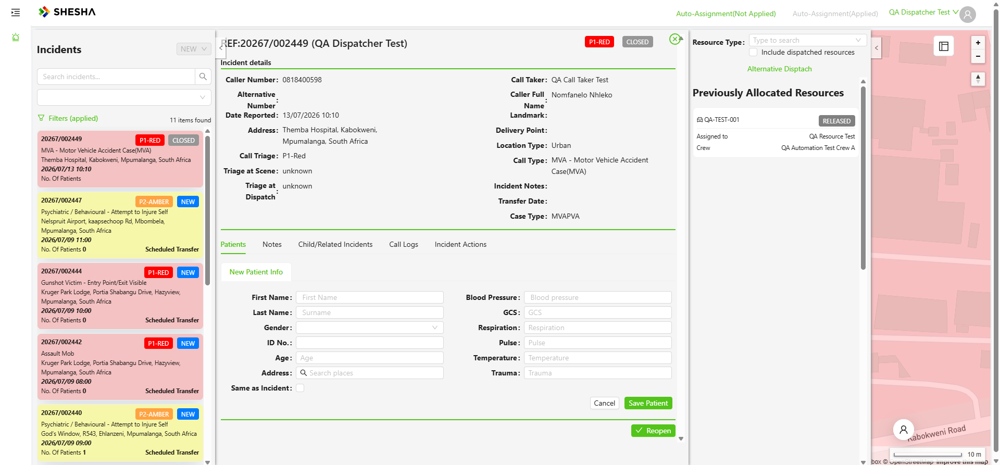

# PD-Dispatch — Post-Outage Lifecycle Re-run

**Date:** 2026-07-13 (Mon)
**App:** PD-Dispatcher V2 Admin Portal (QA) — https://pd-dispatcher-v2-adminportal-qa.shesha.app
**Driver:** Live via Playwright MCP (headed), Admin / QACallTaker / QADispatcher
**Reason:** eLeave (HCM) down; PD-Dispatch had also been down. Re-ran the core flows to confirm the site recovered cleanly before continuing coverage.

---

## Summary

PD-Dispatch is **back up and fully healthy**. All previously-created data survived the outage, and the complete Call-Taker → Dispatcher operational lifecycle runs green end-to-end. **All three operational write-paths confirmed working.**

| Phase | Result |
|---|---|
| Read-path smoke (login, dashboard, map, admin tables) | ✅ PASS |
| Create incident (Call Taker) | ✅ PASS — `20267/002449` |
| Dispatch (Dispatcher) | ✅ PASS — CREW INFORMED, status → OPEN |
| Full status chain → auto-CLOSE | ✅ PASS — Accepted → … → Released → CLOSED |
| SMS delivery to 0818400598 | ✅ VERIFIED — user confirmed multiple SMSes received |

---

## 1. Read-path smoke (Admin)

- **Login** (Admin / Password@1) ✅
- **Incidents dashboard** renders with the Mapbox map and **14 incidents intact** (20267/002430 → 002447) ✅
- **View-mode toggle** Live → Latest ✅
- **Vehicles** admin table (`Boxfusion.Ems`) loads with **4 vehicles intact** incl. our `QA-TEST-001` ✅

Both backend modules (`Boxfusion.Ems`, `Boxfusion.Dispatcher`) serving; no data loss from the outage.

## 2. Create incident — Call Taker (`QACallTaker`)

- Opened **NEW → Incident** (sidebar pointer-events workaround; rc-dropdown portal click).
- **Caller Number** = `0818400598` (my number, for SMS verification). This triggered the reporter-number lookup, which now returns an **"Existing Reporter Number"** modal recognising the caller **Nomfanelo Nhleko** — *note: this lookup previously returned HTTP 500 (07-07); it now works and auto-fills caller details.* Accepted → First/Last name auto-populated.
- Accepting the existing caller **auto-populated the Address** to the caller's stored address **"Themba Hospital, Kabokweni, Mpumalanga"** (overwrote the manually-typed "Riverside Mall" — legitimate reuse-caller behaviour).
- **Call Type** = MVA – Motor Vehicle Accident Case(MVA) → **Call Triage auto-set to P1-Red** ✅
- **Case Type** = MVAPVA, **Location Type** = Urban (default).
- **Save Incident** → created **`20267/002449`** (P1-RED, NEW). Dashboard count 14 → **15**. No validation errors.

## 3. Dispatch — Dispatcher (`QADispatcher`)

- Opened incident 002449 → **cancelled** the auto-popped "Auto Assign Incidents" modal → **Take Ownership** (confirm dialog) ✅.
- **Initial state:** no dispatchable resources — Manual Dispatching resource list showed **"No data"**. Root cause = the **active-shift-assignment dependency**: no vehicle was on an in-window shift assignment for today (existing assignments were dated the week of 07-06). *Expected gating, not an app fault.*
- **Fix (as Admin):** edited **our** QA shift assignment (QA-TEST-001 / QA Automation Test Shift 08:00–17:00 / QA Automation Test Crew A / QA Resource Test) — changed Assignment Day to **13/07/2026**. Current time 10:15 SAST is within the Day window.
- Back as Dispatcher: **QA-TEST-001 now appears as AVAILABLE with an enabled DISPATCH button** (in-area).

- Clicked **DISPATCH** → **Allocated Resources**: `QA-TEST-001` — **CREW INFORMED**, Assigned to **QA Resource Test**, Crew **QA Automation Test Crew A**. Incident status **NEW → OPEN**. Actions Update Dispatch Status / Cancel Assignment / Redirect live.

## 4. Full status lifecycle → auto-CLOSE

Drove every dispatch-status transition via **Update Dispatch Status** (Status* + Time "Now" → Update), confirming the `UpdateDispatchStatus` write-path at each step:

| # | Status set | Resource badge | Incident status |
|---|---|---|---|
| 1 | Accepted | ACCEPTED | OPEN → IN-PROGRESS |
| 2 | Mobile To Scene | MOBILE TO SCENE | IN-PROGRESS |
| 3 | On Scene | ON-SCENE | IN-PROGRESS |
| 4 | Mobile From Scene | MOBILE FROM SCENE | IN-PROGRESS |
| 5 | At Hospital | AT HOSPITAL | IN-PROGRESS |
| 6 | **Released** | **RELEASED** | **auto → CLOSED** |

On Released, the resource section relabels to **"Previously Allocated Resources"** and the incident **auto-closes** (P1-RED **CLOSED**). Auto-close fired reliably.

---

## SMS

**VERIFIED** — user confirmed multiple dispatch/status SMSes arrived on **0818400598** during the 002449 lifecycle. SMS delivery is working on PD-Dispatch post-outage.

## Notes / observations

- **Positive change:** the reporter-number lookup (`GetIncidentByReporterNumber`) that returned 500 on 07-07 now succeeds and drives the existing-caller reuse flow.
- Accepting an existing caller overwrites the address field with the caller's stored address — worth flagging to the team as intended-vs-surprising UX, but not a defect.
- Records used are all **our QA-created** entities (QA-TEST-001, QA Automation Test Shift/Station/Crew A, QA Resource Test), per standing guidance.

## Records created / touched

- Incident **`20267/002449`** — P1-RED MVA @ Themba Hospital, Kabokweni; full lifecycle → **CLOSED**; resource QA-TEST-001 RELEASED.
- Shift assignment `78342667-…` (QA-TEST-001 / QA Automation Test Shift) re-dated to 13/07/2026.
