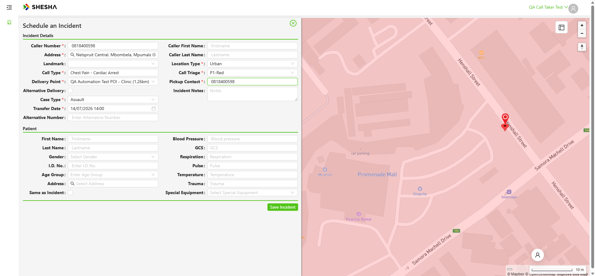
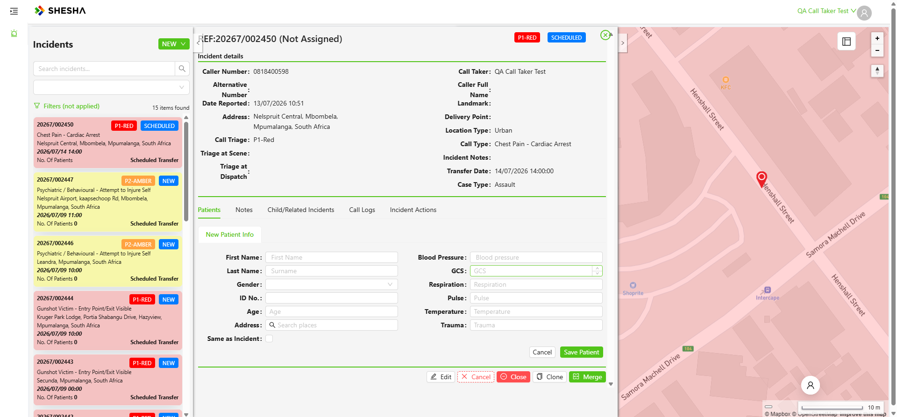
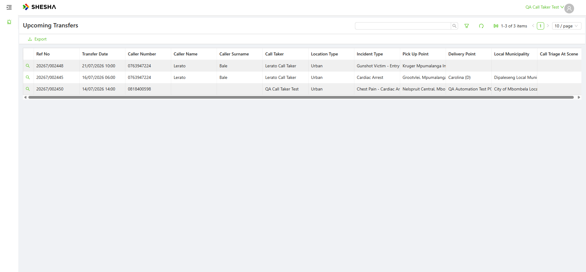

# PD-Dispatch — Scheduled Transfer Re-run

**Date:** 2026-07-13 (Mon)
**App:** PD-Dispatcher V2 Admin Portal (QA) — https://pd-dispatcher-v2-adminportal-qa.shesha.app
**Driver:** Live via Playwright MCP (headed), as Call Taker `QACallTaker`
**Scope:** Re-run the "Schedule an Incident" (Scheduled Transfer) flow post-outage to confirm it's still healthy.

---

## Summary

The Scheduled Transfer flow runs **green end-to-end**. Created **`20267/002450`** with status **SCHEDULED**, and it correctly surfaces in the **Upcoming Transfers** grid with consistent Ref numbering. Both known PD-vs-NC fixes still hold.

| Check | Result |
|---|---|
| NEW → Scheduled Transfer opens "Schedule an Incident" form | ✅ |
| All required fields (incl. Delivery Point / Transfer Date / Pickup Contact) | ✅ |
| Save → status **SCHEDULED** (not "New") | ✅ `20267/002450` |
| Appears in Upcoming Transfers grid w/ matching Ref | ✅ |

---

## Flow

Opened **NEW → Scheduled Transfer** (sidebar pointer-events workaround; dispatched-event menu click) → form heading **"Schedule an Incident"**.

Field values entered:

| Field | Value |
|---|---|
| Caller Number* | 0818400598 |
| Address* | Nelspruit Central, Mbombela, Mpumalanga |
| Call Type* | Chest Pain - Cardiac Arrest |
| Call Triage* | P1-Red (auto from Call Type) |
| Case Type* | Assault (fixed trauma set) |
| Location Type* | Urban |
| **Delivery Point*** | **QA Automation Test POI - Clinic (1.26km)** — our own POI |
| **Transfer Date*** | 14/07/2026 14:00 (tomorrow, within Upcoming window) |
| **Pickup Contact*** | 0818400598 |

- On entering the caller number, the **"Existing Reporter Number"** modal fired (caller Nomfanelo Nhleko) — **Cancelled** it this time to keep control of the address (so our QA POI would show as a nearby Delivery Point).
- Delivery Point list is distance-ranked from the address; our **QA Automation Test POI - Clinic** showed at 1.26 km and was selected.
- **Transfer Date picker gotcha confirmed:** day cell commits via dispatched events, but the **hour/minute cells need a real click** (tagged `.ant-picker-time-panel-cell-inner` → real MCP click) — value resolved to `14/07/2026 14:00`, then picker **OK**.

## Result

- **Save Incident** → detail opens as **`20267/002450`**, status badge **SCHEDULED** (blue), P1-RED, Chest Pain - Cardiac Arrest, pickup Nelspruit Central. No validation errors.

## Upcoming Transfers grid — verified

`/dynamic/Boxfusion.Ems/upcoming-transfers-table` (opened by Call Taker via direct URL) shows **1-3 of 3 items**, including our transfer with **Ref No = `20267/002450`** (matching the incident ref) and all fields correct:

| Ref No | Transfer Date | Caller Number | Call Taker | Location | Incident Type | Pick Up Point | Delivery Point | Local Municipality |
|---|---|---|---|---|---|---|---|---|
| 20267/002450 | 14/07/2026 14:00 | 0818400598 | QA Call Taker Test | Urban | Chest Pain - Cardiac Arrest | Nelspruit Central, Mbombela | QA Automation Test POI - Clinic | City of Mbombela Local Municipality |

## PD-vs-NC fixes still holding

1. **Status = SCHEDULED** (on NC the same flow saved as "New").
2. **Appears in Upcoming Transfers with consistent ref numbering** (on NC the dashboard-created transfer didn't surface and used a different ref prefix).

## Records created

- Scheduled Transfer incident **`20267/002450`** — P1-RED, status SCHEDULED, Transfer Date 14/07/2026 14:00, Delivery Point QA Automation Test POI - Clinic.
